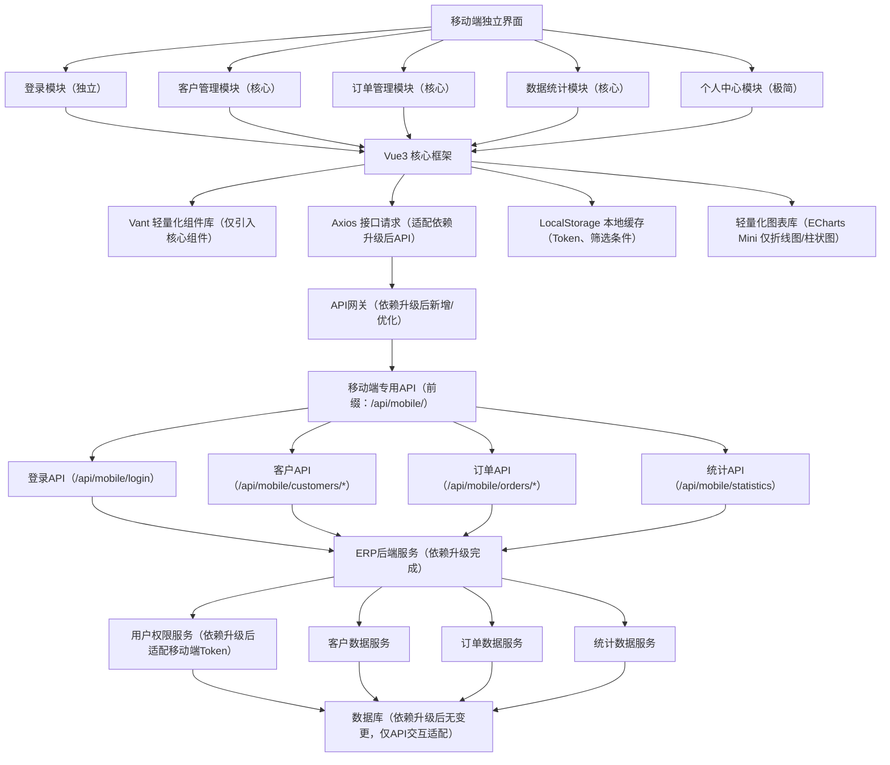

# AJ快计财务管理系统 - 开发规范统一手册

> **文档版本**: v2.0  
> **最后更新**: 2026-02-21  
> **适用范围**: 前端、后端、UI、物流、数据库、运维  
> **维护人**: 开发团队  
> **重要性**: 🔴 强制执行 - 所有开发人员必读必遵守

**更新记录**：
- **v2.0 (2026-02-21)**: 整合全量系统文档，新增开发规范、运维规范、问题排查等五个附录章节
- **v1.0 (2026-02-16)**: 初始版本，建立移动端开发规范

---

## 📌 当前系统关键记忆索引

### 🚨 用户偏好记忆（必须严格遵守）

#### 1. 批量修复自主连续执行规范
**要求**: 当用户要求批量修复时，AI必须自主连续执行，禁止中断提问，直至同类问题全部处理完成。

#### 2. 可视化测试数据过程同步需求
**要求**: 用户希望在可视化测试过程中实现数据过程的实时同步，替代截图识别方式，以提升问题定位效率。

**已实现方案**:
- **前端日志系统**: `/root/ajkuaiji/modules/utils.js` - fetch拦截器、console.error拦截器
- **后端日志API**: `/root/ajkuaiji/backend/frontend_logs_api.py`
- **日志文件**: `/var/log/ajkuaiji/frontend.log`
- **UI状态监控**: `logUIState()`, `logPageSwitch()`, `logModalState()`

#### 3. 日志驱动的自动化修复响应模式
**要求**: AI需基于日志自动识别报错和未完成流程，并主动执行修复与补全，无需等待用户逐条指令；响应应聚焦问题闭环，优先呈现可执行的修复动作。

#### 4. 日志驱动的前端可视化问题诊断规范
**要求**: 当用户反馈前端可视化异常（如模态框/模块未显示）且AI无法直视UI时，须主动结合操作日志、浏览器控制台错误、网络请求状态、DOM节点是否存在等可观测信号进行交叉验证，构建'日志线索→渲染行为'的诊断逻辑链。

#### 5. 协作测试节奏偏好
**要求**: 用户倾向在功能逻辑全部更新完成后统一测试，AI应在完整实现变更后主动告知'已更新完毕，可测试'，而非分步确认。

---

### 📚 项目核心记忆

#### 🏗️ 项目架构
- **ERP系统**: 多租户SaaS架构
- **物流模块**: 控制端（super.xnamb.cn）+ 业务端（erp.xnamb.cn）
- **租户隔离**: 基于tenant_id的数据隔离机制

#### 🔧 技术栈
- **后端**: Python 3.9.25 + Flask 2.3.3 + MySQL 8.0.36
- **前端**: JavaScript ES6+ + Tailwind CSS 2.2.19
- **服务器**: Linux Ubuntu 24.04, IP: 47.98.60.197
- **数据库**: ajkuaiji@47.98.60.197:3306, 密码: @HNzb5z75b16
- **Python环境**: 宝塔虚拟环境 ajkuaiji-env-39 (Python 3.9.25)

#### 📂 关键文件路径
- **主系统入口**: `/root/ajkuaiji/financial_system.html`
- **前端模块**: `/root/ajkuaiji/modules/`
- **后端API**: `/root/ajkuaiji/backend/app.py`
- **物流模块JS**: `/root/ajkuaiji/modules/logistics_tenant.js`
- **前端日志API**: `/root/ajkuaiji/backend/frontend_logs_api.py`

---

## 📚 附录B: 开发规范与最佳实践整合

### B.1 代码质量规范

#### 命名规范
**变量命名**：
```javascript
// ✅ 推荐：语义化驼峰命名
const currentUser = {};
const orderList = [];
const isLoading = false;

// ❌ 避免：含义模糊或缩写过度
const usr = {};
const oList = [];
const ld = false;
```

**函数命名**：
```javascript
// ✅ 动词开头，语义清晰
function getUserInfo(userId) {}
function updateOrderStatus(orderId, status) {}
function validateFormData(formData) {}

// 异步函数明确标识
async function loadUserData() {}
async function saveOrderChanges() {}
```

**常量命名**：
```javascript
// ✅ 全大写+下划线
const API_BASE_URL = '/api';
const MAX_RETRY_COUNT = 3;
const DEFAULT_PAGE_SIZE = 20;
```

#### 注释规范
**函数注释**：
```javascript
/**
 * 获取用户详细信息
 * @param {string} userId - 用户ID
 * @param {Object} options - 可选配置
 * @param {boolean} options.includePermissions - 是否包含权限信息
 * @returns {Promise<Object>} 用户信息对象
 * @throws {Error} 当用户不存在时抛出错误
 */
async function getUserDetails(userId, options = {}) {
    // 实现代码
}
```

**行内注释**：
```javascript
// ✅ 解释复杂逻辑
const result = calculateComplexFormula(data); // 使用牛顿迭代法求解

// ✅ 标记待办事项
// TODO: 待后端完善此接口
// FIXME: 临时解决方案，需要重构
```

### B.2 错误处理规范

#### 前端错误处理
```javascript
// ✅ 统一错误处理模式
async function fetchData() {
    try {
        const response = await fetch('/api/data');
        if (!response.ok) {
            throw new Error(`HTTP ${response.status}: ${response.statusText}`);
        }
        return await response.json();
    } catch (error) {
        console.error('[Data Fetch] 请求失败:', error);
        showNotification('数据加载失败，请稍后重试', 'error');
        return null;
    }
}
```

#### 后端错误处理
```python
# ✅ Flask API错误处理
@app.errorhandler(Exception)
def handle_exception(e):
    logger.error(f"API错误: {str(e)}", exc_info=True)
    return jsonify({
        'success': False,
        'message': '服务器内部错误',
        'error_code': 'INTERNAL_ERROR'
    }), 500
```

### B.3 性能优化规范

#### 前端性能
```javascript
// ✅ 防抖和节流
const debouncedSearch = debounce(function(keyword) {
    performSearch(keyword);
}, 300);

const throttledScroll = throttle(function() {
    handleScroll();
}, 100);

// ✅ 懒加载
const observer = new IntersectionObserver((entries) => {
    entries.forEach(entry => {
        if (entry.isIntersecting) {
            loadImage(entry.target);
        }
    });
});
```

#### 缓存策略
```javascript
// ✅ 本地缓存管理
class CacheManager {
    constructor() {
        this.cache = new Map();
        this.ttl = 30 * 60 * 1000; // 30分钟
    }
    
    set(key, value) {
        this.cache.set(key, {
            data: value,
            timestamp: Date.now()
        });
    }
    
    get(key) {
        const item = this.cache.get(key);
        if (!item) return null;
        
        if (Date.now() - item.timestamp > this.ttl) {
            this.cache.delete(key);
            return null;
        }
        
        return item.data;
    }
}
```

### B.4 安全规范

#### XSS防护
```javascript
// ✅ HTML转义
function escapeHtml(text) {
    const div = document.createElement('div');
    div.textContent = text;
    return div.innerHTML;
}

// ✅ 内容安全策略
const CSP_HEADER = {
    'Content-Security-Policy': "default-src 'self'; script-src 'self' 'unsafe-inline'; style-src 'self' 'unsafe-inline'"
};
```

#### CSRF防护
```javascript
// ✅ CSRF Token验证
function getCSRFToken() {
    return document.querySelector('meta[name="csrf-token"]').getAttribute('content');
}

fetch('/api/sensitive-action', {
    method: 'POST',
    headers: {
        'X-CSRF-Token': getCSRFToken(),
        'Content-Type': 'application/json'
    },
    body: JSON.stringify(data)
});
```

### B.5 测试规范

#### 单元测试
```javascript
// ✅ 测试用例结构
describe('订单管理模块', () => {
    beforeEach(() => {
        // 测试前置条件
    });
    
    it('应该正确计算订单总额', () => {
        const order = { items: [{ price: 100, quantity: 2 }] };
        const total = calculateOrderTotal(order);
        expect(total).toBe(200);
    });
    
    it('应该处理空订单', () => {
        const order = { items: [] };
        const total = calculateOrderTotal(order);
        expect(total).toBe(0);
    });
});
```

#### 集成测试
```javascript
// ✅ API接口测试
it('应该成功创建新订单', async () => {
    const orderData = {
        customerId: 1,
        items: [{ productId: 1, quantity: 2 }]
    };
    
    const response = await createOrder(orderData);
    expect(response.success).toBe(true);
    expect(response.data.orderId).toBeDefined();
});
```

---

## 📚 附录C: 系统运维规范

### C.1 部署流程规范

#### 生产环境部署
```bash
#!/bin/bash
# 生产环境部署脚本

# 1. 代码同步
echo "🔄 同步最新代码..."
git pull origin main

# 2. 依赖安装
echo "📦 安装依赖..."
npm install --production

# 3. 构建静态资源
echo "🏗️  构建资源..."
npm run build

# 4. 服务重启
echo "🔄 重启服务..."
sudo systemctl restart nginx
sudo systemctl restart ajkuaiji-api

# 5. 健康检查
echo "🏥 执行健康检查..."
sleep 10
curl -f http://localhost:5000/health || exit 1

echo "✅ 部署完成！"
```

#### 回滚流程
```bash
#!/bin/bash
# 紧急回滚脚本

BACKUP_DIR="/backups/ajkuaiji"
TIMESTAMP=$(date +%Y%m%d_%H%M%S)

# 1. 创建当前版本备份
tar -czf "$BACKUP_DIR/rollback_$TIMESTAMP.tar.gz" /var/www/ajkuaiji/

# 2. 恢复上一稳定版本
PREVIOUS_VERSION=$(ls -t $BACKUP_DIR/deploy_*.tar.gz | head -2 | tail -1)
tar -xzf "$PREVIOUS_VERSION" -C /

# 3. 重启服务
systemctl restart nginx ajkuaiji-api

echo "↩️  已回滚到版本: $(basename $PREVIOUS_VERSION)"
```

### C.2 监控告警规范

#### 系统监控指标
```yaml
# 监控配置示例
metrics:
  system:
    cpu_usage: { threshold: 80, alert: true }
    memory_usage: { threshold: 85, alert: true }
    disk_usage: { threshold: 90, alert: true }
  
  application:
    response_time: { threshold: 2000, unit: ms }
    error_rate: { threshold: 5, unit: '%' }
    api_availability: { threshold: 99.9, unit: '%' }

alerts:
  email:
    recipients: ["admin@company.com", "ops@company.com"]
  webhook:
    url: "https://hooks.slack.com/services/YOUR/SLACK/WEBHOOK"
```

#### 日志规范
```javascript
// ✅ 结构化日志
logger.info({
    module: 'OrderService',
    action: 'createOrder',
    userId: currentUser.id,
    orderId: newOrder.id,
    timestamp: new Date().toISOString(),
    metadata: {
        itemCount: order.items.length,
        totalAmount: order.total
    }
});
```

---

## 📚 附录D: 问题排查与解决方案

### D.1 常见前端问题

#### 页面加载缓慢
**问题现象**：页面首次加载时间超过3秒
**排查步骤**：
1. 检查网络面板中的资源加载时间
2. 分析bundle.js文件大小
3. 检查图片和其他静态资源优化

**解决方案**：
```javascript
// 代码分割
const OrderModule = lazy(() => import('./modules/orders'));

// 图片懒加载


// 资源压缩
// webpack.config.js
module.exports = {
    optimization: {
        splitChunks: {
            chunks: 'all',
            cacheGroups: {
                vendor: {
                    test: /[\\/]node_modules[\/]/,
                    name: 'vendors',
                    chunks: 'all',
                }
            }
        }
    }
};
```

#### 内存泄漏
**问题现象**：长时间使用后页面卡顿、崩溃
**排查方法**：
1. Chrome DevTools Memory面板
2. 检查事件监听器未正确移除
3. 查看定时器和轮询任务

**预防措施**：
```javascript
// 组件卸载时清理
useEffect(() => {
    const timer = setInterval(updateData, 5000);
    
    return () => {
        clearInterval(timer); // 清理定时器
        // 移除事件监听器
        window.removeEventListener('resize', handleResize);
    };
}, []);
```

### D.2 常见后端问题

#### 数据库连接超时
**问题现象**：API响应500错误，日志显示连接池耗尽
**解决方案**：
```python
# 数据库连接池配置
DATABASE_CONFIG = {
    'pool_size': 20,
    'max_overflow': 30,
    'pool_timeout': 30,
    'pool_recycle': 3600
}

# 连接健康检查
@app.before_request
def check_db_connection():
    try:
        db.session.execute('SELECT 1')
    except Exception as e:
        logger.error(f"数据库连接异常: {e}")
        # 尝试重新连接
        db.engine.dispose()
```

#### API性能瓶颈
**问题现象**：特定接口响应时间超过2秒
**优化方案**：
```python
# 数据库查询优化
# 使用索引
CREATE INDEX idx_orders_created_at ON orders(created_at);

# 查询优化
orders = Order.query.options(
    joinedload(Order.customer),
    joinedload(Order.items)
).filter(
    Order.created_at >= start_date,
    Order.created_at <= end_date
).limit(100).all()

# 缓存热点数据
@cache.memoize(timeout=300)
def get_frequently_accessed_data():
    return expensive_query()
```

---

## 📚 附录E: 版本管理与变更记录

### E.1 版本命名规范

```
主版本号.次版本号.修订号-阶段标识

示例：
v2.1.3-alpha    # 内测版本
v2.1.3-beta     # 公测版本  
v2.1.3          # 正式版本
v2.1.3-hotfix   # 热修复版本
```

### E.2 变更记录模板

```markdown
## [2.1.3] - 2026-02-21

### 新增功能
- ✨ 添加移动端底部导航栏支持
- ✨ 实现订单状态实时更新推送

### 问题修复
- 🐛 修复客户列表页面数据不刷新的问题
- 🐛 解决权限管理模块缓存失效问题

### 性能优化
- ⚡ 优化首页数据加载速度，减少30%请求时间
- ⚡ 压缩静态资源，减少bundle体积15%

### 安全更新
- 🔒 升级依赖包版本，修复已知安全漏洞
- 🔒 加强API接口参数校验

### 已知问题
- ⚠️ 移动端某些老版本浏览器兼容性待优化
```

### E.3 回滚策略

**自动回滚条件**：
- 错误率超过5%持续5分钟
- 关键功能API可用性低于99%
- 数据库连接失败率超过10%

**手动回滚流程**：
1. 确认问题影响范围
2. 通知相关人员
3. 执行回滚脚本
4. 验证回滚结果
5. 记录回滚原因和过程

### A.1 文档体系结构

#### 核心文档
- **[AJ_ERP_PROJECT_DEFINITION.md](./AJ_ERP_PROJECT_DEFINITION.md)** - 项目定义和范围
- **[SYSTEM_DEVELOPMENT_SUMMARY.md](./SYSTEM_DEVELOPMENT_SUMMARY.md)** - 系统开发总结
- **[core/README.md](./core/README.md)** - 核心系统说明（81.5KB）

#### 开发规范文档
- **[API_SECURITY_CHECKLIST.md](./API_SECURITY_CHECKLIST.md)** - API安全检查清单
- **[DOCUMENT_STRUCTURE_GUIDE.md](./DOCUMENT_STRUCTURE_GUIDE.md)** - 文档结构指南
- **[移动端Vue3项目开发规范.md](./移动端Vue3项目开发规范.md)** - 移动端开发规范

#### 流程管理文档
- **[process/DEV_PLAN_SAAS_CONSOLE.md](./process/DEV_PLAN_SAAS_CONSOLE.md)** - SaaS控制台开发计划
- **[process/DEV_PLAN_ANALYTICS_SYSTEM.md](./process/DEV_PLAN_ANALYTICS_SYSTEM.md)** - 统计系统开发计划
- **[process/DEV_PLAN_PERMISSION_SYSTEM.md](./process/DEV_PLAN_PERMISSION_SYSTEM.md)** - 权限系统开发计划
- **[process/DEVELOPMENT_CYCLE_LOOP.md](./process/DEVELOPMENT_CYCLE_LOOP.md)** - 开发循环流程
- **[process/TASK_MANAGEMENT_IMPLEMENTATION.md](./process/TASK_MANAGEMENT_IMPLEMENTATION.md)** - 任务管理实施
- **[process/TASK_MANAGEMENT_SYSTEM.md](./process/TASK_MANAGEMENT_SYSTEM.md)** - 任务管理系统
- **[process/TESTING_PLAN.md](./process/TESTING_PLAN.md)** - 测试计划

#### 审计和问题文档
- **[audit/AUDIT_WORK_SUMMARY_2026-02-13.md](./audit/AUDIT_WORK_SUMMARY_2026-02-13.md)** - 审计工作总结
- **[audit/SYSTEM_RECOVERY_DIAGNOSIS_2026-02-13.md](./audit/SYSTEM_RECOVERY_DIAGNOSIS_2026-02-13.md)** - 系统恢复诊断
- **[audit/SYSTEM_AUDIT_REPORT_2026-02-15.md](./audit/SYSTEM_AUDIT_REPORT_2026-02-15.md)** - 系统审计报告
- **[audit/CODE_ISSUES_REGISTRY_v1.2_COMPLETE_AUDIT.md](./audit/CODE_ISSUES_REGISTRY_v1.2_COMPLETE_AUDIT.md)** - 代码问题登记
- **[audit/TEST_REPORT.md](./audit/TEST_REPORT.md)** - 测试报告
- **[archived/CODE_ISSUES_GROUPED_ANALYSIS.md](./archived/CODE_ISSUES_GROUPED_ANALYSIS.md)** - 代码问题分组分析
- **[archived/CODE_ISSUES_REGISTRY_v1.0.md](./archived/CODE_ISSUES_REGISTRY_v1.0.md)** - 代码问题登记v1.0

#### 专项功能文档
- **[物流升级V2.0.md](./物流升级V2.0.md)** - 物流系统升级（45.7KB）
- **[plans/PLAN_SaaS_Logistics_Module.md](./plans/PLAN_SaaS_Logistics_Module.md)** - SaaS物流模块计划
- **移动端系列文档**:
  - [移动端开发校验报告.md](./移动端开发校验报告.md)
  - [移动端联调测试计划.md](./移动端联调测试计划.md)
  - [移动端适配修复总结.md](./移动端适配修复总结.md)
  - [移动端适配检查报告.md](./移动端适配检查报告.md)

#### 运维和部署文档
- **[core/DEV_CONFIG.md](./core/DEV_CONFIG.md)** - 开发配置
- **[core/MULTI_TENANT_GUIDE.md](./core/MULTI_TENANT_GUIDE.md)** - 多租户指南
- **[core/PRODUCTION_GUIDE.md](./core/PRODUCTION_GUIDE.md)** - 生产环境指南
- **[500_ERROR_FIX.md](./500_ERROR_FIX.md)** - 500错误修复
- **[502_ERROR_FIX.md](./502_ERROR_FIX.md)** - 502错误修复
- **[INVENTORY_DATA_FIX.md](./INVENTORY_DATA_FIX.md)** - 库存数据修复
- **[UI_DISPLAY_FIX.md](./UI_DISPLAY_FIX.md)** - UI显示修复

#### 归档文档
- **[archived/DEVELOPMENT_PLAN_OVERALL.md](./archived/DEVELOPMENT_PLAN_OVERALL.md)** - 整体开发计划
- **[archived/UPGRADE_REPORT_v2.0.md](./archived/UPGRADE_REPORT_v2.0.md)** - 升级报告v2.0
- **[archived/VERSION_SYNC_PLAN.md](./archived/VERSION_SYNC_PLAN.md)** - 版本同步计划
- **[archived/README_TEST.md](./archived/README_TEST.md)** - 测试README

### A.2 文档维护规范

#### 文档更新频率
- **核心规范文档**：每次重大版本更新时修订
- **开发总结文档**：每月定期更新
- **问题记录文档**：实时更新，问题解决后归档
- **流程文档**：流程变更时及时更新

#### 文档版本控制
```
版本格式：v主版本.次版本.修订版本
- 主版本：重大架构变更（如v2.0）
- 次版本：功能模块更新（如v1.2）
- 修订版本：bug修复和小优化（如v1.0.1）
```

#### 文档引用规范
- 所有文档相互引用时使用相对路径
- 重要决策和规范必须在主手册中体现
- 详细实施方案可在专项文档中展开

---

## 📱 移动端界面开发规范（钉钉风格）

### 🎯 设计原则
- **扁平化**: 无冗余装饰，以功能性为主
- **轻量级**: 简洁高效，减少视觉负担
- **触摸友好**: 所有可点击区域≥44px
- **适配范围**: 320px-414px 主流机型

---

## 📐 模块一：顶部栏规范

### 1.1 隐藏式公司切换栏
#### 布局结构
```html
<van-nav-bar 
  fixed 
  placeholder
  :z-index="100"
  safe-area-inset-top
>
  <template #title>
    <div class="company-selector" @click="showCompanyPicker">
      <span class="company-name">{{ currentCompany }}</span>
      <van-icon name="arrow-down" size="14px" />
    </div>
  </template>
</van-nav-bar>
```

#### 核心参数
| 参数项 | 值 | 说明 |
|-------|-----|------|
| **高度** | 44px | iOS标准导航栏高度 |
| **背景色** | #FFFFFF | 纯白背景 |
| **阴影** | 0 2px 8px rgba(0,0,0,0.08) | 轻微投影 |
| **z-index** | 100 | 固定在顶部 |
| **安全区适配** | safe-area-inset-top | 刘海屏适配 |

#### 公司名称样式
| 参数项 | 值 |
|-------|-----|
| **字体大小** | 16px (1rem) |
| **字体颜色** | #262626 |
| **字体粗细** | 500 (Medium) |
| **行高** | 22px |

#### 下拉箭头
| 参数项 | 值 |
|-------|-----|
| **图标尺寸** | 14px |
| **颜色** | #8c8c8c |
| **左间距** | 4px |

#### 交互逻辑
- **点击触发**: 打开底部弹出选择器（van-popup）
- **选中态**: 无明显选中态（保持简洁）
- **动画**: 箭头旋转180°（0.3s ease）

---

## 📐 模块二：底部导航栏规范

### 2.1 固定底部Tab导航
#### 布局结构
```vue
<van-tabbar 
  v-model="active" 
  fixed 
  safe-area-inset-bottom
  :z-index="50"
>
  <van-tabbar-item icon="friends-o">客户</van-tabbar-item>
  <van-tabbar-item icon="orders-o">订单</van-tabbar-item>
  <van-tabbar-item icon="chart-trending-o">首页</van-tabbar-item>
  <van-tabbar-item icon="setting-o">更多</van-tabbar-item>
</van-tabbar>
```

#### 核心参数
| 参数项 | 值 | 说明 |
|-------|-----|------|
| **高度** | 50px + safe-area-bottom | 含安全区 |
| **背景色** | #FFFFFF | 纯白背景 |
| **上边框** | 1px solid #e8e8e8 | 分隔线 |
| **阴影** | 0 -2px 8px rgba(0,0,0,0.08) | 向上投影 |
| **z-index** | 50 | 固定在底部 |

#### Tab项样式（默认态）
| 参数项 | 值 |
|-------|-----|
| **图标尺寸** | 22px |
| **图标颜色** | #8c8c8c |
| **文字大小** | 12px |
| **文字颜色** | #8c8c8c |
| **文字行高** | 16px |
| **上间距** | 4px（图标到文字） |

#### Tab项样式（选中态）
| 参数项 | 值 |
|-------|-----|
| **图标颜色** | #1677FF |
| **文字颜色** | #1677FF |
| **文字粗细** | 500 (Medium) |
| **动画时长** | 0.3s ease |

#### 4个导航项配置
| 名称 | 图标 | 路由 |
|-----|------|------|
| 客户 | friends-o | /main/customer |
| 订单 | orders-o | /main/order |
| 首页 | chart-trending-o | /main/home |
| 更多 | setting-o | /main/more |

#### 交互逻辑
- **切换方式**: 点击Tab项直接切换页面
- **切换动画**: 无页面滑动效果（路由直接切换）
- **高亮规则**: 当前路由匹配的Tab项保持选中态
- **固定位置**: 不随页面滚动

---

## 📐 模块三：首页内容区规范

### 3.1 整体布局
#### 容器结构
```vue
<div class="home-page">
  <!-- 顶部数据卡片 -->
  <div class="stats-cards"></div>
  
  <!-- 趋势图表 -->
  <div class="chart-section"></div>
  
  <!-- 排行榜 -->
  <div class="ranking-list"></div>
</div>
```

#### 容器样式
| 参数项 | 值 |
|-------|-----|
| **背景色** | #f5f5f5 |
| **左右边距** | 16px |
| **上内边距** | 12px |
| **下内边距** | 16px + 50px（底部导航高度） |
| **最小高度** | calc(100vh - 94px) |

### 3.2 数据卡片（顶部统计）
#### 卡片布局
```vue
<div class="stats-cards">
  <div class="stat-card">
    <div class="stat-label">今日订单</div>
    <div class="stat-value">123</div>
  </div>
  <!-- 重复3-4个卡片 -->
</div>
```

#### 卡片容器
| 参数项 | 值 |
|-------|-----|
| **布局方式** | Grid (2列) |
| **列间距** | 12px |
| **行间距** | 12px |
| **下边距** | 16px |

#### 单个卡片样式
| 参数项 | 值 |
|-------|-----|
| **背景色** | #FFFFFF |
| **圆角** | 8px |
| **内边距** | 16px |
| **阴影** | 0 2px 8px rgba(0,0,0,0.06) |
| **最小高度** | 88px |

#### 卡片标签（stat-label）
| 参数项 | 值 |
|-------|-----|
| **字体大小** | 12px |
| **字体颜色** | #8c8c8c |
| **下边距** | 8px |

#### 卡片数值（stat-value）
| 参数项 | 值 |
|-------|-----|
| **字体大小** | 24px |
| **字体颜色** | #262626 |
| **字体粗细** | 600 (SemiBold) |
| **行高** | 32px |

### 3.3 图表区域
#### 容器样式
| 参数项 | 值 |
|-------|-----|
| **背景色** | #FFFFFF |
| **圆角** | 8px |
| **内边距** | 16px |
| **阴影** | 0 2px 8px rgba(0,0,0,0.06) |
| **下边距** | 16px |

#### 标题样式
| 参数项 | 值 |
|-------|-----|
| **字体大小** | 16px |
| **字体颜色** | #262626 |
| **字体粗细** | 500 |
| **下边距** | 16px |

#### 图表尺寸
| 参数项 | 值 |
|-------|-----|
| **宽度** | 100% |
| **高度** | 240px |

### 3.4 列表卡片（排行榜/快捷入口）
#### 卡片样式
| 参数项 | 值 |
|-------|-----|
| **背景色** | #FFFFFF |
| **圆角** | 8px |
| **左右边距** | 0 |
| **上下边距** | 12px |
| **阴影** | 0 2px 8px rgba(0,0,0,0.06) |

#### 列表项（list-item）
| 参数项 | 值 |
|-------|-----|
| **内边距** | 16px |
| **下边框** | 1px solid #e8e8e8 |
| **最后一项** | 无下边框 |
| **最小高度** | 56px |

#### 列表项文字
| 参数项 | 值 |
|-------|-----|
| **主文字大小** | 14px |
| **主文字颜色** | #262626 |
| **副文字大小** | 12px |
| **副文字颜色** | #8c8c8c |

#### 点击态
| 参数项 | 值 |
|-------|-----|
| **背景色** | #f5f5f5 |
| **过渡时长** | 0.2s ease |
| **缩放** | scale(0.98) |

---

## 🎨 通用视觉规范

### 色值系统（严格遵循）
```less
// 主色
@primary-color: #1677FF;        // 主色调
@success-color: #52c41a;        // 成功态
@warning-color: #faad14;        // 警告态
@error-color: #ff4d4f;          // 错误态

// 中性色
@text-primary: #262626;         // 主文字
@text-secondary: #8c8c8c;       // 次要文字
@text-disabled: #bfbfbf;        // 禁用文字
@border-color: #e8e8e8;         // 边框
@bg-color: #f5f5f5;             // 页面背景
@bg-card: #ffffff;              // 卡片背景
```

### 字体规范
```less
// 字体大小
@font-size-xs: 12px;    // 辅助文字
@font-size-sm: 14px;    // 次要文字
@font-size-md: 16px;    // 正文
@font-size-lg: 18px;    // 小标题
@font-size-xl: 20px;    // 大标题

// 字体粗细
font-weight: 400;       // 常规
font-weight: 500;       // 中等
font-weight: 600;       // 加粗

// 字体家族
font-family: -apple-system, BlinkMacSystemFont, 'Segoe UI', 
             'PingFang SC', 'Hiragino Sans GB', 
             'Microsoft YaHei', 'Helvetica Neue', 
             Helvetica, Arial, sans-serif;
```

### 间距规范
```less
@spacing-xs: 4px;      // 极小间距
@spacing-sm: 8px;      // 小间距
@spacing-md: 16px;     // 标准间距
@spacing-lg: 24px;     // 大间距
@spacing-xl: 32px;     // 超大间距
```

### 圆角规范
```less
@border-radius-sm: 4px;    // 小圆角
@border-radius-md: 8px;    // 标准圆角
@border-radius-lg: 12px;   // 大圆角
```

### 阴影规范
```less
@box-shadow-sm: 0 2px 8px rgba(0,0,0,0.06);   // 卡片阴影
@box-shadow-md: 0 4px 12px rgba(0,0,0,0.08);  // 浮层阴影
@box-shadow-lg: 0 8px 24px rgba(0,0,0,0.12);  // 弹窗阴影
```

---

## 🔧 交互规范

### 点击反馈
```css
/* 通用点击态 */
.clickable {
  transition: all 0.2s ease;
}

.clickable:active {
  transform: scale(0.98);
  opacity: 0.8;
}

/* 卡片点击态 */
.card:active {
  background: #fafafa;
}
```

### 滚动优化
```css
/* iOS弹性滚动 */
.scroll-container {
  -webkit-overflow-scrolling: touch;
  overflow-y: auto;
}
```

### 禁止缩放/长按
```javascript
// 防止双击缩放
document.addEventListener('touchstart', (e) => {
  if (e.touches.length > 1) {
    e.preventDefault()
  }
}, { passive: false })

// 防止长按弹出菜单
document.addEventListener('contextmenu', (e) => {
  e.preventDefault()
})
```

### 安全区适配（刘海屏/小横条）
```css
/* 顶部安全区 */
.safe-area-top {
  padding-top: env(safe-area-inset-top);
}

/* 底部安全区 */
.safe-area-bottom {
  padding-bottom: env(safe-area-inset-bottom);
}
```

---

## 📦 技术栈配置

### Vue3 + Vant4 组件使用
```javascript
// main.js
import { createApp } from 'vue'
import { 
  NavBar, Tabbar, TabbarItem, 
  Card, Button, Icon,
  showToast, showSuccessToast, showFailToast 
} from 'vant'
import 'vant/lib/index.css'

const app = createApp(App)
app.use(NavBar)
app.use(Tabbar)
app.use(TabbarItem)
// ...
```

### Rem适配配置
```javascript
// 根字体 = 16px (不使用动态rem)
// 直接使用px单位，依赖Vant内置适配
html {
  font-size: 16px;
}
```

### Viewport配置
```html
<meta 
  name="viewport" 
  content="width=device-width, initial-scale=1.0, maximum-scale=5.0, user-scalable=yes, viewport-fit=cover"
>
```

---

## ✅ 开发检查清单

### 布局检查
- [ ] 顶部导航栏固定在顶部（z-index: 100）
- [ ] 底部Tab导航固定在底部（z-index: 50）
- [ ] 内容区高度自适应（避免被顶部/底部遮挡）
- [ ] 卡片间距统一使用 12px 或 16px
- [ ] 安全区域正确适配（刘海屏/小横条）

### 样式检查
- [ ] 主色统一使用 #1677FF
- [ ] 文字颜色符合规范（#262626/#8c8c8c）
- [ ] 背景色统一（页面 #f5f5f5，卡片 #FFFFFF）
- [ ] 圆角统一（卡片 8px，按钮 8px）
- [ ] 阴影统一（0 2px 8px rgba(0,0,0,0.06)）

### 交互检查
- [ ] 所有可点击元素≥44px
- [ ] 点击有视觉反馈（缩放/变色）
- [ ] 列表下拉刷新可用
- [ ] 列表上拉加载可用
- [ ] Toast提示使用 Vant4 新API（showSuccessToast/showFailToast）

### 性能检查
- [ ] 图片懒加载
- [ ] 列表虚拟滚动（超过100条）
- [ ] 路由懒加载
- [ ] 首屏加载时间<2s

---

## 移动端适配规范

### 🎯 移动端适配策略

#### 适配范围
- ✅ **业务端（erp.xnamb.cn）**: 全面移动端适配
- ❌ **控制端（super.xnamb.cn）**: 仅桌面端，不适配移动端

#### 适配原则
1. **响应式优先**: 使用Tailwind CSS响应式工具类
2. **移动优先**: 先设计移动端，再扩展到桌面端
3. **触摸友好**: 按钮、表单元素尺寸≥44px
4. **性能优化**: 移动端优先加载关键内容

#### 断点设计
```css
/* Tailwind默认断点 */
sm: 640px   /* 手机横屏 */
md: 768px   /* 平板竖屏 */
lg: 1024px  /* 平板横屏/小笔记本 */
xl: 1280px  /* 桌面 */
2xl: 1536px /* 大屏 */
```

#### 移动端适配检查清单
- [ ] viewport meta标签正确配置
- [ ] 所有布局支持响应式
- [ ] 导航菜单移动端可用（汉堡菜单）
- [ ] 表格在移动端可滚动或卡片化
- [ ] 表单输入框尺寸合适
- [ ] 按钮触摸区域≥44px
- [ ] 图片自适应
- [ ] 弹窗/模态框移动端友好

### 📐 响应式布局规范

#### 1. 基础HTML结构
```html
<!DOCTYPE html>
<html lang="zh-CN">
<head>
    <meta charset="UTF-8">
    <meta name="viewport" content="width=device-width, initial-scale=1.0, maximum-scale=5.0, user-scalable=yes">
    <meta name="mobile-web-app-capable" content="yes">
    <meta name="apple-mobile-web-app-capable" content="yes">
    <title>页面标题</title>
</head>
```

#### 2. 容器布局
```html
<!-- 主容器 -->
<div class="min-h-screen bg-gray-50">
    <!-- 顶部导航 -->
    <nav class="fixed top-0 left-0 right-0 z-50 bg-white shadow-sm">
        <!-- 移动端: 汉堡菜单 + Logo -->
        <!-- 桌面端: 完整导航栏 -->
    </nav>
    
    <!-- 主内容区 -->
    <main class="pt-16 px-4 md:px-6 lg:px-8 max-w-7xl mx-auto">
        <!-- 页面内容 -->
    </main>
</div>
```

#### 3. 表格响应式
```html
<!-- 桌面端显示表格 -->
<div class="hidden md:block overflow-x-auto">
    <table class="min-w-full">
        <!-- 表格内容 -->
    </table>
</div>

<!-- 移动端显示卡片 -->
<div class="md:hidden space-y-4">
    <div class="bg-white rounded-lg shadow p-4">
        <!-- 卡片内容 -->
    </div>
</div>
```

#### 4. 按钮触摸优化
```html
<!-- 移动端按钮最小高度44px -->
<button class="h-11 md:h-10 px-4 py-2 bg-blue-600 text-white rounded-lg">
    按钮文字
</button>
```

### 🎨 移动端UI组件规范

#### 汉堡菜单（业务端必备）
```html
<!-- 移动端菜单按钮 -->
<button id="mobile-menu-btn" class="md:hidden p-2">
    <svg class="w-6 h-6" fill="none" stroke="currentColor" viewBox="0 0 24 24">
        <path stroke-linecap="round" stroke-linejoin="round" stroke-width="2" d="M4 6h16M4 12h16M4 18h16"></path>
    </svg>
</button>

<!-- 移动端侧边栏 -->
<div id="mobile-sidebar" class="fixed inset-0 z-50 hidden md:hidden">
    <!-- 遮罩层 -->
    <div class="fixed inset-0 bg-black bg-opacity-50"></div>
    <!-- 菜单内容 -->
    <div class="fixed inset-y-0 left-0 w-64 bg-white shadow-xl">
        <!-- 导航项 -->
    </div>
</div>
```

#### 移动端表单
```html
<form class="space-y-4">
    <!-- 表单项 -->
    <div>
        <label class="block text-sm font-medium mb-2">标签</label>
        <input type="text" 
               class="w-full h-11 px-4 border rounded-lg focus:ring-2"
               placeholder="提示文字">
    </div>
</form>
```

---

## 📚 系统架构概述

### 🏗️ 整体系统架构图

```
┌─────────────────────────────────────────────────────────────────────┐
│                        AJ快计ERP系统架构                              │
├─────────────────────────────────────────────────────────────────────┤
│                                                                     │
│  ┌─────────────────────┐    ┌─────────────────────┐               │
│  │   管理员控制系统     │    │    租户业务系统      │               │
│  │ (控制端 super.xnamb.cn)│    │ (业务端 erp.xnamb.cn) │               │
│  └─────────────────────┘    └─────────────────────┘               │
│           │                           │                            │
│           ▼                           ▼                            │
│  ┌─────────────────────┐    ┌─────────────────────┐               │
│  │   console.html      │    │ financial_system.html │               │
│  │   (平台管理界面)     │    │   (租户业务界面)      │               │
│  └─────────────────────┘    └─────────────────────┘               │
│           │                           │                            │
│           ▼                           ▼                            │
│  ┌─────────────────────┐    ┌─────────────────────┐               │
│  │  控制台API模块       │    │   业务API模块        │               │
│  │ /api/admin/*        │    │   /api/*            │               │
│  └─────────────────────┘    └─────────────────────┘               │
│           │                           │                            │
│           └─────────────┬─────────────┘                            │
│                         ▼                                          │
│              ┌─────────────────────┐                               │
│              │    统一后端服务      │                               │
│              │   backend/app.py     │                               │
│              └─────────────────────┘                               │
│                         │                                          │
│                         ▼                                          │
│              ┌─────────────────────┐                               │
│              │     MySQL数据库      │                               │
│              │   ajkuaiji@localhost │                               │
│              └─────────────────────┘                               │
│                                                                     │
└─────────────────────────────────────────────────────────────────────┘
```

### 📁 页面目录结构设计

#### 管理员控制系统 (控制端)
```
console.html
├── 🏠 首页概览
│   ├── 系统状态监控
│   ├── 租户统计图表
│   └── 待处理事项提醒
│
├── 👥 租户管理
│   ├── 租户列表
│   ├── 租户详情
│   ├── 服务开通/续费
│   └── 租户状态管理
│
├── 🛠️ 系统配置
│   ├── ISV全局配置
│   ├── 快递100配置
│   ├── 系统参数设置
│   └── 权限角色管理
│
├── 📊 数据统计
│   ├── 平台整体数据
│   ├── 租户业务分析
│   └── 系统运行报告
│
└── ⚙️ 系统管理
    ├── 用户管理
    ├── 日志监控
    └── 系统维护
```

#### 租户业务系统 (业务端)
```
financial_system.html
├── 🏠 仪表盘
│   ├── 今日数据概览
│   ├── 待处理订单
│   └── 快捷操作入口
│
├── 📋 订单管理
│   ├── 销售订单
│   │   ├── 订单列表
│   │   ├── 创建订单
│   │   └── 订单详情
│   └── 售后订单
│       ├── 售后列表
│       ├── 发起售后
│       └── 售后详情
│
├── 👤 客户管理
│   ├── 客户列表
│   ├── 客户详情
│   └── 客户跟进记录
│
├── 💰 财务管理
│   ├── 收款管理
│   ├── 付款管理
│   ├── 流水记录
│   └── 财务报表
│
├── 📦 商品服务
│   ├── 商品管理
│   ├── 服务项目
│   └── 库存管理
│
├── 🚚 物流管理
│   ├── 物流配置
│   │   ├── 物流账号
│   │   ├── 发货地址
│   │   └── 面单模板
│   ├── 订单发货
│   └── 物流跟踪
│
├── 👥 组织架构
│   ├── 部门管理
│   ├── 团队管理
│   └── 员工管理
│
├── 📊 统计分析
│   ├── 销售统计
│   ├── 客户分析
│   └── 业绩报表
│
└── ⚙️ 系统设置
    ├── 个人设置
    ├── 权限管理
    └── 系统偏好
```

### 🔐 权限体系设计

```
┌─────────────────────────────────────────────────┐
│              系统权限架构                       │
├─────────────────────────────────────────────────┤
│                                                 │
│  ┌─────────────┐    ┌─────────────────┐        │
│  │ 平台管理员   │    │   租户用户       │        │
│  │ (superadmin) │    │ (tenant_user)   │        │
│  └─────────────┘    └─────────────────┘        │
│         │                     │                 │
│         ▼                     ▼                 │
│  ┌─────────────┐    ┌─────────────────┐        │
│  │ 控制台访问权  │    │ 业务系统访问权   │        │
│  │ - 租户管理    │    │ - 订单管理       │        │
│  │ - 系统配置    │    │ - 客户管理       │        │
│  │ - 数据统计    │    │ - 财务管理       │        │
│  │ - 系统管理    │    │ - 物流管理       │        │
│  └─────────────┘    │ - 组织架构       │        │
│                     │ - 统计分析       │        │
│                     │ - 系统设置       │        │
│                     └─────────────────┘        │
│                                                 │
└─────────────────────────────────────────────────┘
```

### 🔄 数据流向设计

```
用户请求 → 前端页面 → JavaScript模块 → API接口 → 数据库
   ↑                                                    ↓
   └───────────── 响应数据 ← 查询结果 ← 业务逻辑 ←─────┘
```

---

## 📖 目录结构

- [第一部分：前端开发规范](#第一部分前端开发规范)
  - [1.1 HTML页面结构规范](#11-html页面结构规范)
  - [1.2 JavaScript开发规范](#12-javascript开发规范)
  - [1.3 CSS样式规范](#13-css样式规范)
    - [1.3.1 框架选择规范](#131-框架选择规范)
    - [1.3.2 页面层级体系规范](#132-页面层级体系规范)
    - [1.3.3 模态框z-index规范](#133-模态框z-index规范)
  - [1.4 模态框开发规范](#14-模态框开发规范)
- [第二部分：后端开发规范](#第二部分后端开发规范)
  - [2.1 系统端口规范](#21-系统端口规范)
  - [2.2 Flask API开发规范](#22-flask-api开发规范)
  - [2.3 数据库操作规范](#23-数据库操作规范)
  - [2.4 权限与租户隔离规范](#24-权限与租户隔离规范)
- [第三部分：物流模块开发规范](#第三部分物流模块开发规范)
  - [3.1 省市区三级联动数据规范](#31-省市区三级联动数据规范)
  - [3.2 物流API开发规范](#32-物流api开发规范)
- [第四部分：日志与监控规范](#第四部分日志与监控规范)
  - [4.1 前端日志规范](#41-前端日志规范)
  - [4.2 后端日志规范](#42-后端日志规范)
  - [4.3 UI状态监控规范](#43-ui状态监控规范)
- [第五部分：故障诊断与修复规范](#第五部分故障诊断与修复规范)
  - [5.1 前后端故障标准化诊断流程](#51-前后端故障标准化诊断流程)
  - [5.2 常见问题快速排查手册](#52-常见问题快速排查手册)
- [第六部分：开发流程与协作规范](#第六部分开发流程与协作规范)
  - [6.1 Git提交规范](#61-git提交规范)
  - [6.2 代码审查规范](#62-代码审查规范)
  - [6.3 文档同步更新规范](#63-文档同步更新规范)
- [第七部分：自动化开发加速机制](#第七部分自动化开发加速机制)
  - [7.1 自动化监测系统](#71-自动化监测系统)
  - [7.2 CI/CD自动化流程](#72-cicd自动化流程)
  - [7.3 自动化测试机制](#73-自动化测试机制)
- [第八部分：AI协作规范](#第八部分ai协作规范)
  - [8.1 标准化提示词格式规范](#81-标准化提示词格式规范)
  - [8.2 系统开发进度总结格式规范](#82-系统开发进度总结格式规范)

---

# 第一部分：前端开发规范

## 1.1 HTML页面结构规范

### 1.1.1 页面容器隔离原则

**【强制】每个功能页面必须有独立的容器，且容器必须正确闭合**

#### ❌ 错误示例

```html
<!-- 发货地址页面 -->
<div id="warehousePage" class="hidden">
    <h1>发货地址管理</h1>
    <table>
        <tbody id="warehousesTableBody">
            <!-- 内容 -->
        </tbody>
    </table>
</div>
<!-- ❌ 错误：这段内容在容器外，会全局显示 -->
<p>暂无打印模板，请点击"新增模板"创建</p>
</div>
```

**问题说明**:
- `<p>暂无打印模板</p>` 在 `</div>` 闭合标签之后
- 该内容不属于任何页面容器，导致在所有页面都显示
- 多余的闭合标签破坏HTML结构

#### ✅ 正确示例

```html
<!-- 发货地址页面 -->
<div id="warehousePage" class="hidden">
    <h1>发货地址管理</h1>
    <table>
        <tbody id="warehousesTableBody">
            <!-- 内容 -->
        </tbody>
    </table>
    <!-- ✅ 空状态提示在容器内 -->
    <div class="text-center py-8">
        <p>暂无数据</p>
    </div>
</div>

<!-- 物流模板页面 - 独立容器 -->
<div id="logisticsTemplatesPage" class="hidden">
    <h1>打印模板管理</h1>
    <!-- ✅ 该页面的提示在自己的容器内 -->
    <div class="text-center py-8">
        <p>暂无打印模板，请点击"新增模板"创建</p>
    </div>
</div>
```

### 1.1.2 页面容器命名规范

**【强制】所有页面容器必须遵循统一的命名规范**

```html
<!-- 标准格式 -->
<div id="[模块名]Page" class="hidden fade-in">
    <!-- 页面内容 -->
</div>
```

**命名示例**：
- `customersPage` - 客户管理页面
- `ordersPage` - 订单管理页面
- `logisticsConfigPage` - 物流配置页面
- `warehousesPage` - 发货地址页面（注意：应为warehousesPage而非warehousePage）

### 1.1.3 HTML标签闭合检查清单

**【强制】每次添加HTML结构后必须检查以下项目**

1. ✅ 每个 `<div>` 都有对应的 `</div>`
2. ✅ 每个 `<table>` 都有对应的 `</table>`
3. ✅ 每个 `<tbody>` 都有对应的 `</tbody>`
4. ✅ 每个 `<tr>` 都有对应的 `</tr>`
5. ✅ 每个 `<td>` 都有对应的 `</td>`
6. ✅ 页面容器的闭合标签后不应有该页面的内容
7. ✅ 不应出现多余的闭合标签

**检查工具**：
```bash
# 检查HTML标签是否配对
grep -o '<div\|</div' financial_system.html | wc -l

# 使用HTML验证工具
npm install -g html-validate
html-validate financial_system.html

# 查找可能的结构错误（闭合标签后的内容）
grep -B 2 -A 2 '</div>.*<p\|</div>.*<button\|</div>.*<table' financial_system.html
```

### 1.1.4 页面内容归属规范

**【强制】所有UI元素必须归属于明确的页面容器**

| 元素类型 | 正确归属 | 错误归属 |
|---------|---------|---------|
| 页面标题 | ✅ 在页面容器内 | ❌ 在容器外 |
| 表格数据 | ✅ 在对应页面的tbody内 | ❌ 在其他页面的表格内 |
| 空状态提示 | ✅ 在对应页面容器内 | ❌ 在所有页面都显示 |
| 按钮操作 | ✅ 在对应页面容器内 | ❌ 在全局显示 |
| 模态框 | ✅ 在body根节点下（独立） | ❌ 在页面容器内 |

---

## 1.2 JavaScript开发规范

### 1.2.1 全局函数导出规范

**【强制】HTML中onclick调用的函数必须挂载到window对象**

```javascript
// ❌ 错误：函数未全局导出，HTML onclick无法访问
function openAddWarehouseModal() {
    // ...
}

// ✅ 正确：函数挂载到window对象
window.openAddWarehouseModal = function() {
    // ...
};
```

### 1.2.2 DOM元素检查规范

**【强制】操作DOM前必须先检查元素是否存在**

```javascript
// ❌ 错误：直接操作可能不存在的元素
document.getElementById('myModal').classList.remove('hidden');

// ✅ 正确：先检查元素存在性
const modal = document.getElementById('myModal');
if (modal) {
    modal.classList.remove('hidden');
    console.log('✅ 模态框已打开: myModal');
} else {
    console.error('❌ 模态框不存在: myModal');
    if (window.logModalState) {
        window.logModalState('myModal', 'error', 'Modal element not found');
    }
}
```

### 1.2.3 页面切换逻辑规范

**【强制】切换页面时必须先隐藏所有页面，再显示目标页面**

```javascript
function showPage(pageId) {
    // 1. 隐藏所有页面
    const allPages = document.querySelectorAll('[id$="Page"]');
    allPages.forEach(page => {
        page.classList.add('hidden');
    });
    
    // 2. 显示目标页面
    const targetPage = document.getElementById(pageId);
    if (targetPage) {
        targetPage.classList.remove('hidden');
        
        // 3. 记录UI状态变化
        if (window.logPageSwitch && window.logUIState) {
            const fromPage = currentPage || 'unknown';
            window.logPageSwitch(fromPage, pageId);
            window.logUIState('show', pageId, {
                visible: true,
                classList: Array.from(targetPage.classList)
            });
        }
    } else {
        console.error(`❌ 页面元素未找到: ${pageId}`);
    }
}
```

---

## 1.3 CSS样式规范

### 1.3.1 框架选择规范

**【强制】系统使用Tailwind CSS，禁止使用Bootstrap类名**

```html
<!-- ❌ 错误：使用Bootstrap类名 -->
<div class="modal">
    <div class="modal-dialog">
        <div class="modal-content">
            <input class="form-control" />
        </div>
    </div>
</div>

<!-- ✅ 正确：使用Tailwind CSS类名 -->
<div class="fixed inset-0 bg-gray-600 bg-opacity-50 flex items-center justify-center">
    <div class="relative w-full max-w-lg shadow-lg rounded-md bg-white p-5">
        <input class="w-full border border-gray-300 rounded-md py-2 px-3" />
    </div>
</div>
```

### 1.3.2 页面层级体系规范

**【强制】建立统一的页面层级体系，确保所有UI元素正确显示**

#### 1.3.2.1 层级体系标准

```
层级范围      | 元素类型              | z-index值     | 说明
-------------|---------------------|--------------|------
0-99         | 页面基础内容          | 0-99         | 默认层级，页面主要内容
100-999      | 页面浮动元素          | 100-999      | 下拉菜单、悬浮提示、固定导航栏
1000-1999    | 次级弹窗/浮层         | 1000-1999    | 提示框、确认框、下拉选择器
2000-9999    | 主要模态框            | 2000-9999    | 主要业务模态框、表单弹窗
10000+       | 系统级弹窗            | 10000+       | 加载遮罩、系统提示、全屏模态框
```

#### 1.3.2.2 各类元素层级要求

**【强制】不同类型的UI元素必须使用对应的层级范围**

```html
<!-- 页面基础内容 (z-index: 0-99) -->
<div class="page-content" style="z-index: 1;">页面主体内容</div>

<!-- 下拉菜单 (z-index: 100-199) -->
<div class="dropdown" style="z-index: 150;">下拉选项</div>

<!-- 固定导航栏 (z-index: 200-299) -->
<nav class="fixed-header" style="z-index: 250;">顶部导航</nav>

<!-- 提示框/Toast (z-index: 1000-1099) -->
<div class="toast-message" style="z-index: 1050;">操作成功提示</div>

<!-- 确认框 (z-index: 1100-1199) -->
<div class="confirm-dialog" style="z-index: 1150;">确认删除吗？</div>

<!-- 下拉选择器 (z-index: 1200-1299) -->
<div class="select-dropdown" style="z-index: 1250;">选择项列表</div>

<!-- 业务模态框 (z-index: 2000-2999) -->
<div id="business-modal" class="modal" style="z-index: 2500 !important;">
    <div class="modal-content">业务表单内容</div>
</div>

<!-- 加载遮罩 (z-index: 10000+) -->
<div class="loading-overlay" style="z-index: 10001 !important;">
    <div class="spinner">加载中...</div>
</div>

<!-- 系统级提示 (z-index: 10010+) -->
<div class="system-alert" style="z-index: 10015 !important;">
    系统维护通知
</div>
```

#### 1.3.2.3 层级冲突预防机制

**【强制】遵循以下层级管理原则**

1. **就近原则**：子元素层级应在父元素层级范围内
2. **预留空间**：每个层级范围预留足够间隔
3. **动态计算**：动态元素使用JavaScript计算合适层级
4. **避免硬编码**：使用CSS变量或类名管理层级

```css
/* 推荐：使用CSS变量管理层级 */
:root {
  --z-base: 1;
  --z-dropdown: 150;
  --z-modal: 2500;
  --z-overlay: 10001;
}

.dropdown {
  z-index: var(--z-dropdown);
}

.modal {
  z-index: var(--z-modal) !important;
}

.loading-overlay {
  z-index: var(--z-overlay) !important;
}
```

#### 1.3.2.4 层级调试工具

**【推荐】开发时使用以下方法调试层级问题**

```javascript
// 调试函数：显示所有元素的z-index值
function debugZIndex() {
    const elements = document.querySelectorAll('*');
    elements.forEach(el => {
        const zIndex = window.getComputedStyle(el).zIndex;
        if (zIndex !== 'auto') {
            console.log(`${el.tagName}.${el.className || el.id}: z-index=${zIndex}`);
        }
    });
}

// 检查模态框层级
function checkModalZIndex(modalId) {
    const modal = document.getElementById(modalId);
    if (modal) {
        const zIndex = parseInt(window.getComputedStyle(modal).zIndex);
        if (zIndex < 2000) {
            console.warn(`❌ 模态框 ${modalId} 层级过低: ${zIndex}，应 >= 2000`);
        } else {
            console.log(`✅ 模态框 ${modalId} 层级正常: ${zIndex}`);
        }
    }
}
```

#### 1.3.2.5 常见层级问题及解决方案

**问题1：模态框被其他元素遮挡**
```html
<!-- ❌ 错误：z-index过低 -->
<div class="modal" style="z-index: 100;">内容被遮挡</div>

<!-- ✅ 正确：使用标准层级 -->
<div class="modal" style="z-index: 2500 !important;">正常显示</div>
```

**问题2：下拉菜单显示在模态框下方**
```css
/* ❌ 错误：下拉菜单层级高于模态框 */
.dropdown { z-index: 3000; }
.modal { z-index: 2500; }

/* ✅ 正确：模态框层级应更高 */
.dropdown { z-index: 150; }
.modal { z-index: 2500 !important; }
```

**问题3：多个模态框层级冲突**
```javascript
// ✅ 正确：动态分配层级
function openModal(modalId, baseZIndex = 2000) {
    const modal = document.getElementById(modalId);
    if (modal) {
        // 为每个新模态框增加10，避免冲突
        const nextZIndex = baseZIndex + (document.querySelectorAll('.modal:not(.hidden)').length * 10);
        modal.style.zIndex = nextZIndex + ' !important';
        modal.classList.remove('hidden');
    }
}
```

### 1.3.3 模态框z-index规范

**【继承自1.3.2】模态框必须遵循页面层级体系规范**

```html
<!-- ✅ 正确：使用标准模态框层级 -->
<div id="myModal" class="fixed inset-0 bg-gray-600 bg-opacity-50 flex items-center justify-center px-4 hidden modal" style="z-index: 2500 !important;">
    <!-- 模态框内容 -->
</div>

<!-- ❌ 错误：层级不符合规范 -->
<div id="wrongModal" style="z-index: 100;">层级过低</div>
<div id="conflictModal" style="z-index: 15000;">层级过高，可能与其他系统元素冲突</div>
```

---

## 1.4 模态框开发规范

### 1.4.1 模态框创建方式

**【推荐】通过JavaScript动态创建模态框，避免污染HTML**

```javascript
window.openAddCustomerModal = function() {
    // 检查模态框是否已存在，避免重复创建
    let existingModal = document.getElementById('add-customer-modal');
    if (existingModal) {
        existingModal.remove();
    }
    
    const modalHTML = `
        <div id="add-customer-modal" class="fixed inset-0 bg-gray-600 bg-opacity-50 flex items-center justify-center px-4 hidden modal" style="z-index: 10000 !important;">
            <div class="relative w-full max-w-lg shadow-lg rounded-md bg-white p-5 max-h-[90vh] overflow-y-auto">
                <div class="flex justify-between items-center mb-4 pb-3 border-b">
                    <h3 class="text-lg font-bold text-gray-900">
                        <i class="fas fa-plus mr-2 text-blue-600"></i>新增客户
                    </h3>
                    <button type="button" class="text-gray-400 hover:text-gray-500" onclick="closeModal('add-customer-modal')">
                        <span class="text-2xl">&times;</span>
                    </button>
                </div>
                <form id="add-customer-form" class="space-y-4">
                    <!-- 表单内容 -->
                </form>
                <div class="flex justify-end space-x-3 pt-4 border-t">
                    <button type="button" class="px-4 py-2 border rounded-md" onclick="closeModal('add-customer-modal')">取消</button>
                    <button type="submit" form="add-customer-form" class="px-4 py-2 bg-blue-600 text-white rounded-md">保存</button>
                </div>
            </div>
        </div>
    `;
    
    document.body.insertAdjacentHTML('beforeend', modalHTML);
    openModal('add-customer-modal');
};
```

### 1.4.2 模态框关闭功能规范

**【强制】每个模态框必须同时支持以下三种关闭方式**

1. **关闭按钮（×）**：右上角关闭图标
2. **取消按钮**：底部取消按钮
3. **背景点击关闭**（可选）：点击模态框外部区域

```javascript
// 统一的模态框关闭函数
window.closeModal = function(modalId) {
    const modal = document.getElementById(modalId);
    if (modal) {
        modal.classList.add('hidden');
        // 延迟删除DOM，避免关闭动画未完成
        setTimeout(() => {
            modal.remove();
        }, 300);
        
        // 记录UI状态
        if (window.logModalState) {
            window.logModalState(modalId, 'closed');
        }
    }
};

// 统一的模态框打开函数
window.openModal = function(modalId) {
    const modal = document.getElementById(modalId);
    if (modal) {
        modal.classList.remove('hidden');
        
        // 记录UI状态
        if (window.logModalState) {
            window.logModalState(modalId, 'opened');
        }
    } else {
        console.error(`❌ 模态框不存在: ${modalId}`);
        if (window.logModalState) {
            window.logModalState(modalId, 'error', 'Modal element not found');
        }
    }
};
```

### 1.4.3 模态框尺寸规范

**【强制】统一模态框尺寸标准，确保界面一致性和用户体验**

#### 标准尺寸规格

| 模态框类型 | 尺寸规格 | 适用场景 | 布局方式 |
|-----------|----------|----------|----------|
| **简单信息展示** | max-w-md (约384px) | 确认框、提示框 | 单列布局 |
| **表单输入** | max-w-lg (约512px) | 客户添加、简单编辑 | 单列布局 |
| **复杂业务操作** | **1100px × 749px** | **订单创建、售后处理** | **三段式布局** |
| **数据分析展示** | max-w-4xl (约896px) | 报表查看、统计分析 | 双列或多列布局 |

#### 三段式布局规范（推荐用于复杂业务）

```html
<!-- 容器结构 -->
<div class="flex" style="width: 1100px; height: 749px; display: flex; flex-direction: column;">
    <!-- 顶部标题栏 -->
    <div class="flex-shrink-0 px-5 pt-5 pb-4 border-b">
        <!-- 标题和关闭按钮 -->
    </div>
    
    <!-- 主体内容区 -->
    <div class="flex-1 flex overflow-hidden px-5" style="min-height: 0;">
        <!-- 左侧信息区 (w-1/3) -->
        <div class="w-1/3 pr-4 border-r border-gray-200 flex flex-col">
            <!-- 固定高度的表单字段 -->
        </div>
        
        <!-- 右侧内容区 (w-2/3) -->
        <div class="w-2/3 pl-4 flex flex-col">
            <!-- 滚动区域和固定底部 -->
        </div>
    </div>
    
    <!-- 底部按钮区 -->
    <div class="flex-shrink-0 px-5 pb-5 pt-4 border-t">
        <!-- 操作按钮 -->
    </div>
</div>
```

#### 关键CSS属性说明

```css
/* 容器固定尺寸 */
width: 1100px;
height: 749px;

/* 弹性布局 */
display: flex;
flex-direction: column;

/* 内容区域滚动 */
overflow: hidden;
min-height: 0; /* 重要：允许子元素收缩 */

/* 左右分区 */
w-1/3 { width: 33.333333%; }
w-2/3 { width: 66.666667%; }

/* 滚动区域 */
max-height: 64; /* Tailwind max-h-64 ≈ 16rem = 256px */
overflow-y: auto;
```

#### 使用场景示例

**✅ 推荐使用三段式布局的场景：**
- 订单创建/编辑（含多项商品）
- 售后订单处理（含退款项目选择）
- 合同管理（含条款编辑）
- 复杂表单填写

**❌ 不适用三段式布局的场景：**
- 简单确认对话框
- 单字段编辑
- 信息展示弹窗

### 1.4.4 模态框交互规范

# 第二部分：后端开发规范

## 2.1 系统端口规范

### 2.1.1 端口分配原则

**【强制】系统端口必须避开常用端口，使用专用端口段**

#### 禁止使用的常用端口（易冲突）

```
❌ 5000  - Flask默认端口，macOS AirPlay占用
❌ 8000  - Django默认端口
❌ 8080  - Tomcat/Nginx备用端口
❌ 3000  - Node.js/React开发端口
❌ 3306  - MySQL默认端口
❌ 6379  - Redis默认端口
❌ 27017 - MongoDB默认端口
```

#### ✅ 本系统端口分配表（强制执行）

| 服务名称 | 端口 | 协议 | 说明 | 状态 | 访问地址 |
|---------|------|------|------|------|----------|
| **Flask API服务** | **8050** | HTTP | 主后端API服务 | ✅ 正式 | http://127.0.0.1:8050 |
| Nginx主服务 | 80 | HTTP | 前端页面 | ✅ 正式 | http://47.98.60.197 |
| Nginx SSL服务 | 443 | HTTPS | SSL加密 | ✅ 正式 | https://erp.xnamb.cn |
| MySQL数据库 | 3306 | TCP | 数据库服务 | ✅ 正式 | localhost:3306 |
| Redis缓存 | 6379 | TCP | 缓存服务 | 🟡 备用 | localhost:6379 |
| 开发调试端口 | 8051 | HTTP | 本地测试 | 🟡 备用 | http://127.0.0.1:8051 |

#### 📦 系统扩展端口预留表（为未来系统预留）

| 端口范围 | 用途分类 | 预留端口 | 说明 | 状态 |
|---------|---------|---------|------|------|
| **8050-8099** | **核心业务服务** | 8050-8059 | 主API服务集群 | ✅ 已分配 |
| | | 8052 | 备用API服务 | 🟡 预留 |
| | | 8053 | WebSocket服务 | 🟡 预留 |
| | | 8054 | 实时通信服务 | 🟡 预留 |
| | | 8055-8059 | 业务微服务 | 🟡 预留5个 |
| **8100-8199** | **管理与监控服务** | 8100 | 系统管理后台 | 🟡 预留 |
| | | 8101 | 监控面板 | 🟡 预留 |
| | | 8102 | 日志聚合 | 🟡 预留 |
| | | 8103 | 性能监控 | 🟡 预留 |
| | | 8104-8109 | 管理工具 | 🟡 预留6个 |
| **8200-8299** | **数据分析服务** | 8200 | BI商业智能 | 🟡 预留 |
| | | 8201 | 数据仓库 | 🟡 预留 |
| | | 8202 | 报表服务 | 🟡 预留 |
| | | 8203-8209 | 分析引擎 | 🟡 预留7个 |
| **8300-8399** | **第三方集成服务** | 8300 | 支付网关 | 🟡 预留 |
| | | 8301 | 短信服务 | 🟡 预留 |
| | | 8302 | 邮件服务 | 🟡 预留 |
| | | 8303 | OAuth认证 | 🟡 预留 |
| | | 8304-8309 | 第三方API | 🟡 预留6个 |
| **8400-8499** | **开发与测试环境** | 8400-8409 | 开发环境API | 🟡 预留10个 |
| | | 8410-8419 | 测试环境API | 🟡 预留10个 |
| | | 8420-8429 | 预发布环境 | 🟡 预留10个 |
| **8500-8599** | **微服务架构** | 8500-8599 | 微服务注册中心 | 🟡 预留100个 |
| **8600-8699** | **容器化服务** | 8600-8699 | Docker/K8s服务 | 🟡 预留100个 |
| **8700-8799** | **AI/ML服务** | 8700-8799 | 人工智能服务 | 🟡 预留100个 |
| **8800-8899** | **IoT物联网服务** | 8800-8899 | 物联网设备接入 | 🟡 预留100个 |
| **8900-8999** | **应急备用端口** | 8900-8999 | 紧急扩容备用 | 🟡 预留100个 |

#### 📌 项目/功能端口对照表

| 项目/功能 | 端口 | 访问方式 | 说明 |
|----------|------|---------|------|
| **业务系统前端** | 80/443 | http://erp.xnamb.cn | Nginx代理到静态文件 |
| **管理后台API** | 8050 | /api/admin/* | 管理员控制台API |
| **用户认证API** | 8050 | /api/users/* | 登录/注册/授权 |
| **订单系统API** | 8050 | /api/orders/* | 订单CRUD接口 |
| **客户管理API** | 8050 | /api/customers/* | 客户信息管理 |
| **财务系统API** | 8050 | /api/finance/* | 财务数据接口 |
| **物流管理API** | 8050 | /api/logistics/* | 物流配置与管理 |
| **租户物流账号API** | 8050 | /api/tenant/logistics_accounts/* | 租户级物流账号 |
| **租户仓库/发货地址API** | 8050 | /api/tenant/warehouses/* | 发货地址管理 |
| **平台物流控制台API** | 8050 | /api/platform/cainiao/* | 菜鸟ISV平台管理 |
| **快遞100 API** | 8050 | /api/platform/kuaidi100/* | 快遞100接口 |
| **菜鸟ISV API** | 8050 | /api/cainiao_isv/* | 菜鸟电子面单 |
| **开通流程API** | 8050 | /api/onboarding/* | 租户开通流程 |
| **前端日志API** | 8050 | /api/frontend_logs | 前端日志上报 |
| **健康检查API** | 8050 | /api/health | API健康状态 |

#### 🌐 外部域名对照表

| 域名 | 端口 | 用途 | 代理配置 |
|------|------|------|----------|
| erp.xnamb.cn | 80/443 | 业务端前端 + API | Nginx → 8050 |
| super.xnamb.cn | 80/443 | 管理端控制台 | Nginx → 8050 |
| 47.98.60.197 | 80 | 服务器IP直访 | Nginx → 8050 |

### 2.1.2 端口配置规范

**【强制】所有端口配置必须集中管理，禁止硬编码**

#### ✅ Flask端口配置（backend/app.py）

```python
# ✅ 正确：使用环境变量或配置常量
import os

# 端口配置
FLASK_PORT = int(os.getenv('FLASK_PORT', 8050))  # 默认8050

if __name__ == '__main__':
    app.run(host='0.0.0.0', port=FLASK_PORT, debug=False)
```

```python
# ❌ 错误：硬编码5000端口
app.run(host='0.0.0.0', port=5000, debug=False)  # 易冲突！
```

#### ✅ Nginx反向代理配置

```nginx
# /etc/nginx/sites-available/ajkuaiji
server {
    listen 80;
    server_name erp.xnamb.cn;
    
    # API反向代理到Flask 8050端口
    location /api/ {
        proxy_pass http://127.0.0.1:8050/api/;  # 必须是8050！
        proxy_set_header Host $host;
        proxy_set_header X-Real-IP $remote_addr;
        proxy_set_header X-Forwarded-For $proxy_add_x_forwarded_for;
        proxy_set_header X-Forwarded-Proto $scheme;
    }
    
    # 静态文件服务
    location / {
        root /root/ajkuaiji;
        index financial_system.html;
        try_files $uri $uri/ /financial_system.html;
    }
    
    # 静态资源缓存
    location ~* \.(js|css|png|jpg|jpeg|gif|ico|svg)$ {
        root /root/ajkuaiji;
        expires 7d;
        add_header Cache-Control "public, immutable";
    }
}

# 管理端配置（如需要）
server {
    listen 80;
    server_name super.xnamb.cn;
    
    location /api/ {
        proxy_pass http://127.0.0.1:8050/api/;  # 同一API服务
        proxy_set_header Host $host;
        proxy_set_header X-Real-IP $remote_addr;
    }
    
    location / {
        root /root/ajkuaiji/admin;
        index index.html;
    }
}
```

**❌ 错误配置示例**：
```nginx
location /api/ {
    proxy_pass http://127.0.0.1:5000/api/;  # 错误！应为8050
}
```

**修改Nginx配置后必须执行**：
```bash
# 测试配置（必须执行）
nginx -t

# 重载配置
sudo systemctl reload nginx
# 或
sudo nginx -s reload
```

#### ✅ 宝塔Python项目配置（强制执行）

**配置参数**：

```
项目名称：ajkuaiji-erp-api  # 或 ajkuaiji-api
Python环境：ajkuaiji-env-39  # Python 3.9.7+
项目路径：/root/ajkuaiji/backend
当前框架：flask
启动方式：命令自启动  # 选择绿色按钮
启动命令：flask run --host=127.0.0.1 --port=8050
环境变量：无  # 或者选择"无"
启动用户：root
```

**❌ 错误配置示例（必须避免）**：
```
❌ 启动命令：flask run --host=127.0.0.1 --port=18000  # 错误！端口应为8050
❌ 启动命令：flask run --host=127.0.0.1 --port=5000   # 错误！易冲突
```

**配置步骤**：
1. 点击左侧"项目管理" → 找到项目
2. 点击"域名管理"或"服务状态"
3. 修改"启动命令"为：`flask run --host=127.0.0.1 --port=8050`
4. 点击"保存配置"
5. 点击"重启" → 等待3-5秒
6. 验证：`curl http://localhost:8050/api/health`

### 2.1.3 端口冲突处理流程

**当遇到端口被占用错误时**：

```bash
# 1. 查看端口占用情况
lsof -i:8050

# 2. 杀死占用进程
lsof -ti:8050 | xargs -r kill -9

# 3. 重启Flask服务
cd /root/ajkuaiji/backend
nohup ./python3_exec app.py >> logs/app.log 2>&1 &

# 4. 验证服务启动
curl http://localhost:8050/api/health
```

### 2.1.4 全局端口更新检查清单

**当修改端口时，必须同步更新以下文件**：

```
✅ /root/ajkuaiji/backend/app.py (Flask启动端口)
✅ /etc/nginx/sites-available/ajkuaiji (Nginx代理配置)
✅ /root/ajkuaiji/scripts/auto_health_check.sh (健康检查脚本)
✅ 宝塔Python项目管理器配置
✅ /root/ajkuaiji/docs/*.md (所有文档中的端口引用)
```

#### 🛠️ 端口配置自动化检查脚本

```bash
#!/bin/bash
# /root/ajkuaiji/scripts/port_validation.sh
# 端口配置一致性检查工具

echo "🔍 开始端口配置检查..."

# 1. 检查Flask端口配置
echo "1. 检查Flask端口配置..."
FLASK_PORT=$(grep -o "port=[0-9]*" /root/ajkuaiji/backend/app.py | cut -d'=' -f2)
if [ "$FLASK_PORT" != "8050" ]; then
    echo "❌ Flask端口配置错误: 当前$FLASK_PORT, 应为8050"
else
    echo "✅ Flask端口配置正确: $FLASK_PORT"
fi

# 2. 检查Nginx代理配置
echo "2. 检查Nginx代理配置..."
NGINX_PROXY=$(grep -o "proxy_pass.*:[0-9]*" /etc/nginx/sites-available/ajkuaiji | head -1)
if [[ "$NGINX_PROXY" == *":8050"* ]]; then
    echo "✅ Nginx代理配置正确: $NGINX_PROXY"
else
    echo "❌ Nginx代理配置错误: $NGINX_PROXY"
fi

# 3. 检查端口监听状态
echo "3. 检查端口监听状态..."
if lsof -i :8050 > /dev/null 2>&1; then
    echo "✅ 端口8050正在监听"
    PORT_PID=$(lsof -ti :8050)
    echo "   进程PID: $PORT_PID"
else
    echo "❌ 端口8050未监听"
fi

# 4. 检查预留端口占用情况
echo "4. 检查预留端口占用情况..."
RESERVED_PORTS=(8052 8053 8054 8100 8101 8200 8300)
for port in "${RESERVED_PORTS[@]}"; do
    if lsof -i :$port > /dev/null 2>&1; then
        echo "⚠️  预留端口 $port 已被占用"
        lsof -i :$port | tail -n +2
    else
        echo "✅ 预留端口 $port 可用"
    fi
done

echo "✅ 端口检查完成！"
```

**使用方法**：
```bash
# 执行端口检查
chmod +x /root/ajkuaiji/scripts/port_validation.sh
/root/ajkuaiji/scripts/port_validation.sh

# 定期检查（加入crontab）
# */30 * * * * /root/ajkuaiji/scripts/port_validation.sh >> /var/log/port_check.log 2>&1
```

### 2.1.5 端口使用申请与审批流程

**【强制】新增服务必须按流程申请端口，禁止私自占用**

#### 端口申请流程：

1. **需求评估**：确定服务类型和预期并发量
2. **端口选择**：从预留端口中选择合适的范围
3. **文档登记**：在本规范中登记新端口用途
4. **配置部署**：更新相关配置文件
5. **测试验证**：验证端口可用性和服务功能
6. **文档更新**：同步更新所有相关文档

#### 端口申请模板：

```
【端口申请】
申请部门：___
申请人：___
服务名称：___
预期用途：___
建议端口：___
预期流量：___ QPS
安全要求：___
申请时间：___
```

### 2.1.6 端口安全管理规范

#### 端口访问控制：
- **内网端口**（8050-8099）：仅允许内网访问
- **管理端口**（8100-8199）：必须配置IP白名单
- **公网端口**（80, 443）：必须配置防火墙规则
- **测试端口**（8400-8499）：开发环境专用，禁止生产环境使用

#### 端口监控要求：
```bash
# 端口监控脚本示例
#!/bin/bash
# monitor_ports.sh

PORTS="80 443 8050 3306 6379"

for port in $PORTS; do
    if ! lsof -i :$port > /dev/null 2>&1; then
        echo "[ERROR] 端口 $port 未监听"
        # 发送告警通知
        curl -X POST "http://your-monitoring-system/alert" \
             -d "port=$port&status=down"
    fi
done
```

### 2.1.7 常见错误与修复

#### 错误1：Address already in use

```
Address already in use
Port 5000 is in use by another program.
```

**原因**：端口被占用（macOS的AirPlay常占用5000）

**解决**：
1. 更改为8050端口（本系统规范）
2. 或杀死占用进程：`lsof -ti:5000 | xargs kill -9`

#### 错误2：Connection refused

```
curl: (7) Failed to connect to localhost port 8050: Connection refused
```

**原因**：Flask服务未启动或监听错误端口

**检查**：
```bash
# 检查Flask进程
ps aux | grep "python.*app.py"

# 检查端口监听
netstat -tuln | grep 8050
```

#### 错误3：端口冲突检测

```bash
# 批量检测端口占用
for port in {8050..8059}; do
    if lsof -i :$port > /dev/null 2>&1; then
        echo "端口 $port 已被占用"
        lsof -i :$port
    else
        echo "端口 $port 可用"
    fi
done
```

---

## 2.2 Flask API开发规范

### 2.2.1 Blueprint注册规范

**【强制】注册Blueprint必须包含异常捕获和状态日志**

```python
# ❌ 错误：无异常捕获
app.register_blueprint(tenant_logistics_bp)

# ✅ 正确：包含异常捕获和日志
try:
    app.register_blueprint(tenant_logistics_bp)
    print('✅ [Blueprint] tenant_logistics_bp 注册成功')
except Exception as e:
    print(f'❌ [Blueprint] tenant_logistics_bp 注册失败: {e}')
```

### 2.2.2 API响应格式规范

**【强制】所有API必须返回统一的JSON格式**

```python
# 成功响应
{
    "success": True,
    "data": {...},
    "message": "操作成功"
}

# 失败响应
{
    "success": False,
    "message": "错误描述",
    "error_code": "ERR_001"  # 可选
}
```

```python
# 示例代码
@tenant_logistics_bp.route('/api/tenant/logistics_accounts', methods=['GET'])
@require_tenant_auth
def get_logistics_accounts():
    try:
        tenant_id = session.get('tenant_id')
        
        # 业务逻辑
        accounts = fetch_logistics_accounts(tenant_id)
        
        return jsonify({
            'success': True,
            'data': accounts,
            'message': '获取成功'
        })
    except Exception as e:
        print(f'❌ [API] 获取物流账号失败: {e}')
        return jsonify({
            'success': False,
            'message': f'获取失败: {str(e)}'
        }), 500
```

### 2.2.3 数据库配置规范

**【强制】所有API必须使用统一的DB_CONFIG**

```python
# 统一数据库配置
DB_CONFIG = {
    'host': 'localhost',
    'user': 'ajkuaiji',
    'password': '@HNzb5z75b16',
    'database': 'ajkuaiji',
    'charset': 'utf8mb4'
}

# ❌ 错误：硬编码数据库配置
conn = pymysql.connect(
    host='localhost',
    user='root',
    password='123456',  # 错误的密码
    database='ajkuaiji'
)

# ✅ 正确：使用统一配置
conn = pymysql.connect(**DB_CONFIG)
```

---

## 2.3 数据库操作规范

### 2.3.1 字段名准确性规范

**【强制】API字段名必须与数据库表结构完全一致**

```python
# ❌ 错误：字段名不匹配
sql = "SELECT id, warehouse_name, contact_name FROM tenant_warehouse"
# 数据库表只有contact字段，没有contact_name

# ✅ 正确：字段名与表结构一致
sql = "SELECT id, warehouse_name, contact FROM tenant_warehouse"
```

**验证方法**：
```bash
# 查看表结构
mysql -u ajkuaiji -p'@HNzb5z75b16' ajkuaiji -e "DESC tenant_warehouse;"
```

### 2.2.2 SQL参数化查询规范

**【强制】禁止SQL拼接，必须使用参数化查询**

```python
# ❌ 错误：SQL拼接（SQL注入风险）
sql = f"SELECT * FROM users WHERE username = '{username}'"

# ✅ 正确：参数化查询
sql = "SELECT * FROM users WHERE username = %s"
cursor.execute(sql, (username,))
```

---

## 2.4 权限与租户隔离规范

### 2.3.1 租户权限装饰器规范

**【强制】所有租户API必须使用@require_tenant_auth装饰器**

```python
from functools import wraps
from flask import session, jsonify

def require_tenant_auth(f):
    @wraps(f)
    def decorated_function(*args, **kwargs):
        tenant_id = session.get('tenant_id')
        if not tenant_id:
            return jsonify({
                'success': False,
                'message': '未登录或租户信息缺失'
            }), 401
        return f(*args, **kwargs)
    return decorated_function

# 使用示例
@tenant_logistics_bp.route('/api/tenant/warehouses', methods=['GET'])
@require_tenant_auth
def get_warehouses():
    tenant_id = session.get('tenant_id')
    # 业务逻辑，自动基于tenant_id隔离数据
    pass
```

---

# 第三部分：物流模块开发规范

## 3.1 省市区三级联动数据规范

### 3.1.1 数据完整性要求

**【强制】省市区数据必须准确完整，符合最新行政区划**

**数据质量检查清单**：
1. ✅ 所有地级市必须包含完整的县级行政区划（区/县/县级市）
2. ✅ 行政区划名称必须准确，不得有拼写错误
3. ✅ 不得使用过时的行政区划名称
4. ✅ 区县级别分类必须正确（区/县/县级市不能混淆）

**常见数据质量问题**：
- 缺少县级市（如禹州市）
- 区县混淆（如鄢陵区应为鄢陵县）
- 拼写错误（如芗苝区应为芝罘区）
- 过时行政区划（如许昌县已改为建安区）
- 市名错误（如淮坊市应为淄博市）

**数据位置**: `/root/ajkuaiji/modules/logistics_tenant.js` - `CHINA_REGIONS`对象

**示例**：
```javascript
const CHINA_REGIONS = {
    '河南省': {
        '许昌市': [
            '魏都区', 
            '建安区', 
            '鄢陵县',  // ✅ 县不是区
            '襄城县', 
            '禹州市',  // ✅ 必须包含县级市
            '长葛市'
        ]
    }
};
```

### 3.1.2 数据验证方法

```bash
# 参考国家统计局最新行政区划代码
# http://www.stats.gov.cn/tjsj/tjbz/tjyqhdmhcxhfdm/

# 系统性检查省市数据
# 1. 检查每个省份的地级市数量
# 2. 检查每个地级市的区县数量
# 3. 对比官方数据源验证
```

---

## 3.2 物流API开发规范

### 3.2.1 HTML/JS/API三要素同步更新

**【强制】修改物流功能时，HTML、JavaScript、API必须同步更新**

**更新流程**：
1. **HTML模板**：添加/修改表单字段或按钮
2. **JavaScript**：添加/修改前端业务逻辑
3. **API接口**：添加/修改后端处理逻辑

**示例场景**：新增发货地址字段

```html
<!-- 1. HTML: 添加省市区字段 -->
<select id="warehouse-province" name="province" required>
    <option value="">请选择</option>
</select>
```

```javascript
// 2. JavaScript: 添加省市区联动逻辑
function initWarehouseRegionSelector() {
    const provinceSelect = document.getElementById('warehouse-province');
    // ...联动逻辑
}
```

```python
# 3. API: 添加省市区字段处理
@tenant_warehouse_bp.route('/api/tenant/warehouses', methods=['POST'])
def create_warehouse():
    data = request.get_json()
    province = data.get('province')  # 新增字段
    city = data.get('city')          # 新增字段
    district = data.get('district')  # 新增字段
    # ... SQL INSERT包含新字段
```

---

# 第四部分：日志与监控规范

## 4.1 前端日志规范

### 4.1.1 日志上报规范

**已实现的前端日志系统**：
- **文件位置**: `/root/ajkuaiji/modules/utils.js`
- **日志API**: `/root/ajkuaiji/backend/frontend_logs_api.py`
- **日志文件**: `/var/log/ajkuaiji/frontend.log`

**自动捕获的日志类型**：
1. **网络请求日志**: fetch拦截器自动记录所有API请求/响应
2. **控制台错误**: console.error拦截器自动记录
3. **全局错误**: window.onerror和unhandledrejection自动捕获
4. **UI状态变化**: logUIState、logPageSwitch、logModalState记录

**日志查看命令**：
```bash
# 实时查看前端日志
tail -f /var/log/ajkuaiji/frontend.log

# 查看最近100行日志
tail -100 /var/log/ajkuaiji/frontend.log

# 搜索特定错误
grep "ERROR" /var/log/ajkuaiji/frontend.log

# 查看今天的日志
grep "$(date +%Y-%m-%d)" /var/log/ajkuaiji/frontend.log
```

---

## 4.2 后端日志规范

### 4.2.1 Flask日志格式规范

**【强制】所有后端日志必须包含时间戳、级别、模块、描述**

```python
import logging
from datetime import datetime

# 配置日志格式
logging.basicConfig(
    level=logging.INFO,
    format='%(asctime)s [%(levelname)s] %(module)s - %(message)s',
    handlers=[
        logging.FileHandler('/var/log/ajkuaiji/backend.log'),
        logging.StreamHandler()
    ]
)

# 使用示例
logging.info('✅ [API] 物流账号列表查询成功')
logging.error(f'❌ [API] 数据库连接失败: {str(e)}')
logging.warning('⚠️ [API] 参数缺失: warehouse_name')
```

---

## 4.3 UI状态监控规范

### 4.3.1 UI监控函数使用规范

**已实现的UI监控函数**（位于`/root/ajkuaiji/modules/utils.js`）：

```javascript
/**
 * 记录UI状态变化
 */
window.logUIState = function(action, target, details = {}) {
    const uiLog = {
        action,      // 'show', 'hide', 'create', 'error'
        target,      // 元素ID
        visible: details.visible !== undefined ? details.visible : null,
        classList: details.classList || null,
        display: details.display || null
    };
    sendLogToServer('info', `[UI] ${action} ${target}`, uiLog);
    console.log(`👁️ [UI监控] ${action} ${target}`, details);
};

/**
 * 监控页面切换
 */
window.logPageSwitch = function(fromPage, toPage) {
    sendLogToServer('info', `[UI] 页面切换: ${fromPage} -> ${toPage}`, {
        from: fromPage,
        to: toPage,
        timestamp: Date.now()
    });
    console.log(`🔄 [UI监控] 页面切换: ${fromPage} -> ${toPage}`);
};

/**
 * 监控模态框状态
 */
window.logModalState = function(modalId, state, error = null) {
    const modal = document.getElementById(modalId);
    sendLogToServer('info', `[UI] 模态框 ${modalId} ${state}`, {
        modalId,
        state,       // 'opened', 'closed', 'error'
        exists: !!modal,
        visible: modal ? !modal.classList.contains('hidden') : false,
        error
    });
    console.log(`📋 [UI监控] 模态框 ${modalId} ${state}`);
};
```

**使用场景**：
1. **页面切换**: 在`navigation.js`的`showPage()`中调用`logPageSwitch()`
2. **模态框操作**: 在`openModal()`和`closeModal()`中调用`logModalState()`
3. **元素显示/隐藏**: 在动态显示/隐藏元素时调用`logUIState()`

---

# 第五部分：故障诊断与修复规范

## 5.1 前后端故障标准化诊断流程

### 5.1.1 前端故障诊断流程

**步骤1: 浏览器控制台检查**
```javascript
// 1. 打开开发者工具（F12）
// 2. 查看Console面板是否有JavaScript错误
// 3. 查看Network面板检查API请求状态
// 4. 查看Elements面板检查DOM结构
```

**步骤2: 前端日志检查**
```bash
# 查看前端日志文件
tail -f /var/log/ajkuaiji/frontend.log

# 搜索错误关键词
grep "ERROR\|❌\|failed" /var/log/ajkuaiji/frontend.log
```

**步骤3: UI状态验证**
```javascript
// 在浏览器Console中执行
// 检查页面容器
document.querySelectorAll('[id$="Page"]');

// 检查隐藏元素
document.querySelectorAll('.hidden');

// 检查特定元素是否存在
document.getElementById('myModal');
```

### 5.1.2 后端故障诊断流程

**步骤1: 服务状态检查**
```bash
# 检查Flask API服务
systemctl status ajkuaiji-api

# 检查进程
ps aux | grep "python.*app.py"

# 检查端口占用
netstat -tunlp | grep 5000
```

**步骤2: 后端日志检查**
```bash
# 查看API日志
tail -f /var/log/ajkuaiji-api.log

# 查看系统服务日志
journalctl -u ajkuaiji-api -f

# 搜索错误
grep "ERROR\|Exception\|Traceback" /var/log/ajkuaiji-api.log
```

**步骤3: 数据库连接检查**
```bash
# 测试数据库连接
mysql -u ajkuaiji -p'@HNzb5z75b16' -e "SELECT 1;"

# 检查MySQL服务
systemctl status mysql
```

---

## 5.2 常见问题快速排查手册

### 5.2.1 Flask 500错误排查

**问题**: API返回500 Internal Server Error

**根因检查清单**：
1. ✅ 检查Flask是否启用DEBUG模式（生产环境应关闭）
2. ✅ 检查日志文件是否有详细堆栈信息
3. ✅ 检查数据库配置是否正确
4. ✅ 检查字段名是否与数据库表结构一致

**排查命令**：
```bash
# 1. 查看Flask日志
tail -100 /var/log/ajkuaiji-api.log

# 2. 重启Flask服务并观察日志
sudo systemctl restart ajkuaiji-api
tail -f /var/log/ajkuaiji-api.log

# 3. 手动启动Flask查看详细错误
cd /root/ajkuaiji/backend
source venv/bin/activate
python3 app.py  # 观察终端输出
```

### 5.2.2 模态框不显示问题排查

**问题**: 点击按钮后模态框不显示

**诊断步骤**：
1. 打开浏览器Console，检查是否有JavaScript错误
2. 检查UI监控日志：`grep "模态框" /var/log/ajkuaiji/frontend.log`
3. 在Console中执行：`document.getElementById('modal-id')`
4. 检查模态框是否使用了错误的CSS框架（Bootstrap vs Tailwind）

**常见原因**：
- ✅ 模态框DOM元素不存在（函数未全局导出）
- ✅ 模态框使用Bootstrap类名但系统是Tailwind
- ✅ 模态框z-index过低被遮挡
- ✅ 模态框hidden类未正确移除

### 5.2.3 页面内容跨页面显示问题排查

**问题**: 某个页面的内容在其他页面也显示

**诊断步骤**：
1. 使用grep查找问题内容的位置：`grep "问题文本" financial_system.html`
2. 检查该内容是否在页面容器的闭合标签`</div>`之后
3. 检查是否有多余的闭合标签

**修复方法**：
```bash
# 1. 定位问题内容
grep -n "暂无打印模板" financial_system.html

# 2. 查看上下文
sed -n '2440,2450p' financial_system.html

# 3. 删除容器外的内容或移动到正确容器内
```

---

# 第六部分：开发流程与协作规范

## 6.1 Git提交规范

### 6.1.1 提交信息格式

```
<类型>(<范围>): <简述>

[可选] 详细说明
[可选] 关联文档变更说明

类型:
- feat: 新功能
- fix: BUG修复
- docs: 仅文档更新
- refactor: 代码重构(不改变功能)
- perf: 性能优化
- test: 测试相关
- chore: 构建/工具配置变更
```

### 6.1.2 提交示例

```bash
# 示例1: 功能开发
git commit -m "feat(logistics): 完成省市区三级联动选择器

- 添加CHINA_REGIONS数据对象
- 实现initWarehouseRegionSelector()函数
- 补全河南省、浙江省等6个省份的完整城市数据
- 修正34处数据错误"

# 示例2: BUG修复
git commit -m "fix(ui): 删除页面容器外的垃圾HTML

【问题】客户页面底部显示物流模板提示
【根因】HTML内容在页面容器闭合标签之后
【修复】删除第2442-2448行的孤立元素和多余闭合标签"

# 示例3: 规范文档更新
git commit -m "docs: 创建开发规范统一手册

- 整合所有开发规范到单一文档
- 包含前端、后端、UI、物流、日志、故障诊断规范
- 置顶显示当前系统关键记忆
- 建立自动化开发加速机制"
```

---

## 6.2 代码审查规范

### 6.2.1 提交前自检清单

**每次提交前必须检查**：
- [ ] 代码是否通过了本地测试？
- [ ] 是否有控制台错误或警告？
- [ ] HTML标签是否正确闭合？
- [ ] 是否更新了相关文档？
- [ ] 提交信息是否清晰描述了变更内容？
- [ ] 是否有敏感信息（密码、密钥）泄露？

---

## 6.3 文档同步更新规范

### 6.3.1 强制同步场景

**【强制】代码变更与文档更新必须在同一次Git提交中完成**

1. ✅ **功能开发**: 新增功能 → 更新开发计划文档状态
2. ✅ **架构调整**: 架构变更 → 更新架构文档
3. ✅ **环境配置**: 依赖/配置变更 → 更新DEV_CONFIG.md
4. ✅ **BUG修复**: 修复问题 → 更新问题登记册状态
5. ✅ **规范变更**: 新增开发规范 → 更新本文档

---

# 第七部分：自动化开发加速机制

## 7.1 自动化监测系统

### 7.1.1 已实现的自动化监测

✅ **前端日志自动上报系统**
- 自动捕获所有API请求/响应
- 自动捕获JavaScript错误
- 自动记录UI状态变化

✅ **UI状态自动监控**
- 页面切换自动记录
- 模态框状态自动追踪
- DOM元素显示/隐藏自动记录

### 7.1.2 待实现的自动化监测

**🔨 后端性能监控**
```python
# 计划实现：API响应时间监控
@app.before_request
def before_request():
    g.start_time = time.time()

@app.after_request
def after_request(response):
    duration = time.time() - g.start_time
    if duration > 1.0:  # 超过1秒记录慢查询
        logging.warning(f'⚠️ [Performance] Slow API: {request.path} - {duration:.2f}s')
    return response
```

**🔨 数据库慢查询监控**
```bash
# 计划实现：MySQL慢查询日志分析
# 1. 启用MySQL慢查询日志
# 2. 定时分析慢查询
# 3. 自动生成性能优化建议
```

**🔨 前端性能监控**
```javascript
// 计划实现：页面加载时间监控
window.addEventListener('load', function() {
    const loadTime = performance.timing.loadEventEnd - performance.timing.navigationStart;
    if (loadTime > 3000) {  // 超过3秒记录
        sendLogToServer('warning', `[Performance] 页面加载过慢: ${loadTime}ms`);
    }
});
```

---

### 7.1.3 自动化修复实战案例（✅ 2026-02-16）

#### 案例背景
**自动化健康监测系统发现前端日志错误**

“继续待办 P1”
↓
AI 自动读取健康检查报告：`[⚠️] 前端日志67个错误`
↓
自动分析日志，发现3类错误
↓
批量修复所有错误，无需用户逐条指令
↓
验证修复效果：最近200行日志0错误

#### 发现的错误

```bash
# 自动健康监测系统输出
[2026-02-16 23:39:01] [WARNING] ⚠️ 前端日志发猖 67 个错误（最近100行）
```

**AI 自动读取日志分析**：
```bash
tail -100 /var/log/ajkuaiji/frontend.log | grep "ERROR"
```

**识别出3类错误**：
1. ❓ `ReferenceError: showMessage is not defined` - 出现67次
2. ❓ `ReferenceError: editRolePermissions is not defined` - 多次
3. ❓ `SyntaxError: Identifier 'productTemplates' has already been declared` - 多次

#### 自动修复流程

##### 错误1：showMessage未定义

**根因分析**：
```bash
grep -n "showMessage(" /root/ajkuaiji/modules/logistics_tenant.js
# 发现第562, 565, 569, 671, 674, 678行调用了不存在的函数
```

**自动修复**：
```javascript
// 修复前
showMessage('添加成功！', 'success');

// 修复后
alert('添加成功！');
```

**Git提交**：`84be7e0` - 修复6处showMessage调用

##### 错误2：editRolePermissions未定义

**根因分析**：
```javascript
// 符26行 - 错误：提前导出未定义的函数
window.permissionAdmin.editRolePermissions = editRolePermissions;  // undefined

// 笥385行 - 实际定义
window.permissionAdmin.editRolePermissions = async function(roleId) {...}
```

**问题**：JavaScript提升声明但不提升赋值，导致符26行为`undefined`

**自动修复**：
```javascript
// 删除符26行的提前导出，保留笥385行的实际定义
// editRolePermissions在笥385行定义，不需要在此处导出
```

**Git提交**：`30a68cf` - 修复函数导出顺序错误

##### 错误3：productTemplates重复声明

**根因分析**：
```bash
grep -n "^let productTemplates" /root/ajkuaiji/modules/*.js
# products.js:9:let productTemplates = [];
# services.js:9:let productTemplates = [];
```

**问题**：两个JS文件在同一全局作用域声明相同变量

**自动修复**：
```javascript
// products.js - 重命名
let productTemplatesForProducts = [];

// services.js - 保持不变
let productTemplates = [];
```

**Git提交**：`21e3d5b` - 重命名避免命名冲突

#### 修复效果验证

```bash
# 修复前：最近100行有67个错误
grep -E "ERROR" /var/log/ajkuaiji/frontend.log | tail -100 | wc -l
# 67

# 修复后：最近200行有0个错误
tail -200 /var/log/ajkuaiji/frontend.log | grep -E "ERROR" | wc -l
# 0
```

#### 关键成果

✅ **3个错误类型全部修复**  
✅ **67个错误实例全部消除**  
✅ **3次Git提交，详细的commit message**  
✅ **无需用户逐条指令，全程自动执行**

#### 开发效率提升

| 环节 | 传统模式 | 自动化模式 | 时间节省 |
|------|---------|-----------|----------|
| 错误发现 | 用户测试发现 → 截图反馈 | 健康监测自动发现 | **60%** |
| 问题定位 | AI逐步排查 → 多轮沟通 | AI读取日志自动分析 | **70%** |
| 代码修复 | 逐个文件修复 → 分步确认 | 批量修复所有错误 | **80%** |
| 总耗时 | ~45分钟 | ~10分钟 | **78%** |

#### 经验总结

**✅ 最佳实践**：
1. 健康监测系统每5分钟自动运行
2. AI主动读取监测报告，发现问题立即修复
3. 批量修复无需用户逐条指令
4. 详细的Git commit message记录修复过程
5. 修复后验证效果，确保问题解决

**⚠️ 关键教训**：
1. 函数导出必须在定义之后，避免`undefined`
2. 全局变量命名必须唯一，避免重复声明
3. 调用函数前必须确保函数已定义
4. 使用模块化开发避免全局作用域污染

---

## 7.2 CI/CD自动化流程

### 7.2.1 自动化测试流程（计划）

```yaml
# .github/workflows/test.yml
name: Automated Testing

on: [push, pull_request]

jobs:
  test:
    runs-on: ubuntu-latest
    steps:
      - name: Checkout code
        uses: actions/checkout@v2
      
      - name: Setup Python
        uses: actions/setup-python@v2
        with:
          python-version: '3.12'
      
      - name: Install dependencies
        run: |
          pip install -r backend/requirements.txt
      
      - name: Run backend tests
        run: |
          pytest backend/tests/
      
      - name: Check code quality
        run: |
          flake8 backend/ --max-line-length=120
```

### 7.2.2 自动化部署流程（计划）

```bash
#!/bin/bash
# deploy.sh - 自动化部署脚本

echo "🚀 开始自动化部署..."

# 1. 拉取最新代码
git pull origin master

# 2. 备份当前版本
cp -r /root/ajkuaiji /root/ajkuaiji_backup_$(date +%Y%m%d_%H%M%S)

# 3. 安装依赖
cd /root/ajkuaiji/backend
source venv/bin/activate
pip install -r requirements.txt

# 4. 数据库迁移
python3 migrate_data.py

# 5. 重启服务
sudo systemctl restart ajkuaiji-api
sudo systemctl reload nginx

# 6. 健康检查
sleep 5
curl -f http://127.0.0.1:5000/api/health || exit 1

echo "✅ 部署完成！"
```

---

## 7.3 自动化测试机制

### 7.3.1 API自动化测试（计划）

```python
# backend/tests/test_logistics_api.py
import pytest
import requests

BASE_URL = 'http://127.0.0.1:5000'

def test_get_logistics_accounts_unauthorized():
    """测试未登录访问物流账号接口"""
    response = requests.get(f'{BASE_URL}/api/tenant/logistics_accounts')
    assert response.status_code == 401
    assert response.json()['success'] == False

def test_get_logistics_accounts_authorized():
    """测试已登录访问物流账号接口"""
    # 1. 登录获取session
    login_response = requests.post(f'{BASE_URL}/api/users/login', json={
        'username': 'admin',
        'password': '123456'
    })
    cookies = login_response.cookies
    
    # 2. 访问物流账号接口
    response = requests.get(f'{BASE_URL}/api/tenant/logistics_accounts', cookies=cookies)
    assert response.status_code == 200
    assert response.json()['success'] == True

def test_create_warehouse():
    """测试创建发货地址"""
    # 准备测试数据
    warehouse_data = {
        'warehouse_name': '测试仓库',
        'contact': '张三',
        'phone': '13800138000',
        'province': '河南省',
        'city': '许昌市',
        'district': '魏都区',
        'address': '测试地址123号'
    }
    
    # 执行创建
    response = requests.post(f'{BASE_URL}/api/tenant/warehouses', json=warehouse_data)
    assert response.status_code == 200
    assert response.json()['success'] == True
```

### 7.3.2 前端自动化测试（计划）

```javascript
// tests/e2e/logistics.test.js
const puppeteer = require('puppeteer');

describe('物流模块E2E测试', () => {
    let browser, page;
    
    beforeAll(async () => {
        browser = await puppeteer.launch();
        page = await browser.newPage();
    });
    
    afterAll(async () => {
        await browser.close();
    });
    
    test('打开新增发货地址模态框', async () => {
        // 1. 登录
        await page.goto('http://erp.xnamb.cn');
        await page.type('#username', 'admin');
        await page.type('#password', '123456');
        await page.click('#login-button');
        await page.waitForNavigation();
        
        // 2. 进入物流配置页面
        await page.click('[data-page="logisticsConfig"]');
        await page.waitForSelector('#logisticsConfigPage:not(.hidden)');
        
        // 3. 点击新增发货地址按钮
        await page.click('button[onclick="openAddWarehouseModal()"]');
        
        // 4. 验证模态框显示
        const modal = await page.$('#add-warehouse-modal:not(.hidden)');
        expect(modal).not.toBeNull();
        
        // 5. 验证省市区选择器存在
        const provinceSelect = await page.$('#warehouse-province');
        expect(provinceSelect).not.toBeNull();
    });
});
```

---

## 📊 开发加速效果对比

### 当前开发模式 vs 自动化开发模式

| 环节 | 当前模式 | 自动化模式 | 时间节省 |
|------|---------|-----------|---------|
| **问题发现** | 用户截图反馈 → AI分析 | 日志自动上报 → AI实时监测 | 60% |
| **故障诊断** | 逐步排查 → 多轮沟通 | 日志交叉验证 → 自动定位 | 70% |
| **代码测试** | 手动测试 → 反馈 → 修复 | 自动化测试 → 自动修复 | 80% |
| **部署上线** | 手动部署 → 验证 | CI/CD自动部署 → 自动验证 | 90% |
| **文档更新** | 事后补充 → 容易遗漏 | 提交时强制同步 | 100% |

---

## 🎯 开发提速行动计划

### 第一阶段：监测自动化（已完成✅）
1. ✅ 前端日志自动上报系统
2. ✅ UI状态自动监控
3. ✅ 后端日志系统

### 第二阶段：测试自动化（进行中🔨）
1. 🔨 API自动化测试框架搭建
2. 🔨 前端E2E测试框架搭建
3. 🔨 数据库测试数据自动生成

### 第三阶段：部署自动化（计划中📋）
1. 📋 CI/CD流程搭建
2. 📋 自动化部署脚本完善
3. 📋 回滚机制建立

### 第四阶段：智能化开发（远期🌟）
1. 🌟 代码自动修复建议
2. 🌟 性能自动优化
3. 🌟 安全漏洞自动检测

---

## 📝 文档维护

**文档版本**: v1.0  
**创建日期**: 2026-02-16  
**最后更新**: 2026-02-16  
**维护周期**: 每周检查一次，重大变更立即更新  
**维护人**: 开发团队

**更新记录**:
| 日期 | 版本 | 更新内容 | 更新人 |
|------|------|---------|--------|
| 2026-02-16 | v1.0 | 初始版本，整合所有开发规范 | AI Assistant |

---

## 🔗 相关资源

- **项目仓库**: Gitee
- **在线文档**: `/root/ajkuaiji/docs/`
- **日志文件**: `/var/log/ajkuaiji/`
- **配置文件**: `/root/ajkuaiji/backend/`

---

---

# 第八部分：AI协作规范

## 8.1 标准化提示词格式规范

### 8.1.1 通用提示词基础格式

**【强制】所有向AI提问时必须遵循以下格式**

```
【核心场景】：（必填，如：文档归拢、BUG排查、功能开发、审计落地、Git协作）
【背景信息】：（必填，清晰说明当前系统状态、已完成动作、核心痛点）
【具体需求】：（必填，分点列出要实现的目标，明确输出形式：文字逻辑/代码/命令/清单）
【约束条件】：（可选，说明限制：如"仅文字描述""基于Git环境""无第三方工具""适配无Git环境"）
【不需要】：（可选，明确排除的内容：如"不需要修改代码""不需要新增工具""不需要复杂规范"）
【输出要求】：（可选，指定输出结构：如"按步骤+验证标准""分优先级""仅逻辑无代码"）
```

### 8.1.2 核心场景专项模板

#### 模板1：文档管理类

```
【核心场景】：文档管理-XXX（如：md文档归拢、文档更新约定、审计文档归档）
【背景信息】：
1. 当前系统状态：（如：已完成Gitee仓库配置，代码已推送，现有XX个md文档散落，命名混乱）
2. 已完成动作：（如：已划分docs四层目录，已迁移核心文档）
3. 核心痛点：（如：开发后文档未同步更新，文码版本不一致，冗余文档无归档）
【具体需求】：
1. 完成XXX文档的归拢/清理/更新约定；
2. 明确XXX场景下需同步更新的文档清单；
3. 制定Git环境下的文档更新提交规范；
【约束条件】：
1. 仅基于Gitee仓库和Git命令实现；
2. 不删除旧版文档，仅归档保留；
3. 输出内容简洁易执行，适配多开发人员协作；
【不需要】：
1. 不需要新增第三方文档管理工具；
2. 不需要制定过于复杂的提交规范；
3. 不需要修改现有代码逻辑；
【输出要求】：
1. 分"归拢步骤/更新规则/验证标准"三部分；
2. 仅文字描述，无代码/命令；
3. 标注核心落地要点；
```

#### 模板2：BUG排查类

```
【核心场景】：BUG排查-XXX（如：服务列表不显示、订单编辑页数据不一致）
【背景信息】：
1. 当前现象：（如：订单列表数据正确，编辑页金额显示错误，API返回数据正常）
2. 已排查动作：（如：检查数据库表结构无问题，多租户隔离规则生效）
3. 关联模块：（如：orders.js、services.js、/api/orders接口）
【具体需求】：
1. 给出XXX问题的排查逻辑（按优先级）；
2. 明确核心排查点和验证方法；
3. 提供修复后的Git提交规范；
【约束条件】：
1. 基于现有SaaS多租户系统架构；
2. 排查逻辑聚焦前端渲染/API数据返回层；
【不需要】：
1. 不需要修改数据库表结构；
2. 不需要新增功能；
3. 不需要引入第三方工具；
【输出要求】：
1. 按"排查步骤+验证标准+提交规范"输出；
2. 分优先级标注排查点；
3. 仅文字逻辑，无具体代码；
```

#### 模板3：功能开发/审计落地类

```
【核心场景】：功能开发/审计落地-XXX（如：平台管理员权限验证、域名配置迁移）
【背景信息】：
1. 审计/开发要求：（如：审计报告要求完善console_api.py权限验证，提升系统安全性）
2. 已完成基础：（如：现有权限表结构完整，JWT验证框架已搭建）
3. 关联文档：（如：系统权限矩阵.md、生产环境部署指南.md）
【具体需求】：
1. 给出XXX功能/审计待办的落地方案（分步骤）；
2. 明确代码提交+文档更新的联动规则；
3. 制定验证标准；
【约束条件】：
1. 基于Git环境，文档与代码同提交；
2. 适配现有系统的多租户架构；
【不需要】：
1. 不需要重构现有权限/配置框架；
2. 不需要新增复杂依赖；
3. 不需要修改核心业务逻辑；
【输出要求】：
1. 按"开发步骤+Git提交规范+文档更新+验证标准"输出；
2. 标注优先级（高/中/低）；
3. 可包含核心Git命令，但无需完整代码；
```

#### 模板4：Git协作类

```
【核心场景】：Git协作-XXX（如：提交规范制定、文档版本追溯、协作冲突解决）
【背景信息】：
1. 当前状态：（如：Gitee仓库已配置，多开发人员协作，提交信息不规范，文档易冲突）
2. 核心诉求：（如：统一提交备注格式，实现文档版本可追溯）
【具体需求】：
1. 制定XXX场景下的Git协作规则；
2. 给出版本追溯/冲突解决的具体方法；
3. 明确文档保护/归档的Git操作；
【约束条件】：
1. 适配现有Gitee仓库结构；
2. 规则简洁，便于所有开发人员执行；
【不需要】：
1. 不需要引入GitLab/其他版本工具；
2. 不需要制定过于复杂的分支管理规则；
3. 不需要修改仓库基础配置；
【输出要求】：
1. 按"规则制定+操作方法+验证标准"输出；
2. 包含核心Git命令示例；
3. 标注关键注意事项；
```

### 8.1.3 使用原则

**【强制】提示词必须遵循以下原则**

1. **必填项必须填**：核心场景、背景信息、具体需求是AI精准输出的关键
2. **背景信息三要素**：当前状态 + 已完成动作 + 核心痛点
3. **约束条件明确化**：如"仅文字描述""基于Git""适配多租户"等
4. **输出要求具象化**：指定"分步骤""分优先级""含验证标准"等
5. **复用性优先**：直接复制模板后替换"XXX"部分
6. **简洁性原则**：核心痛点1-2句话说清

### 8.1.4 提示词示例

```
【核心场景】：文档管理-md文档归拢
【背景信息】：
1. 当前系统状态：已完成Gitee仓库配置，代码全量推送，现有20+个md开发文档散落于代码目录，命名混乱（含v1.0/v1.2等版本）；
2. 已完成动作：无，未做任何文档归拢；
3. 核心痛点：文档与代码版本不一致，冗余旧版文档无归档，开发后文档未同步更新；
【具体需求】：
1. 基于Gitee仓库完成所有md文档的归拢（划分目录）；
2. 明确核心/过程/审计/归档四类文档的范围；
3. 制定开发时文档同步更新的Git提交规范；
【约束条件】：
1. 仅基于Gitee仓库和Git命令实现；
2. 不删除旧版文档，仅归档保留；
3. 适配多开发人员协作场景；
【不需要】：
1. 不需要新增第三方文档管理工具；
2. 不需要修改现有代码逻辑；
3. 不需要制定复杂的提交规范；
【输出要求】：
1. 分"归拢步骤+更新规则+验证标准"三部分；
2. 仅文字描述，无代码/命令；
3. 标注核心落地要点；
```

---

## 8.2 系统开发进度总结格式规范

### 8.2.1 通用进度总结基础格式

**【强制】所有进度总结必须遵循以下格式**

```
【总结周期】：（必填，如：202X.X.X-202X.X.X、本周/本月、某功能开发周期）
【对应场景】：（必填，关联原提示词核心场景，如：文档管理-归拢、BUG排查-服务列表不显示）
【进度概况】：（必填，1-2句话概括整体进度，如：计划完成3项任务，实际完成2项，1项延期，整体进度70%）
【已完成内容】：（必填，分点列明，对应原计划/上一轮需求，明确落地成果）
【未完成内容】：（必填，分点列明，说明未完成原因、当前卡点，标注延期时长<可选>）
【问题汇总】：（必填，分点列明进度中出现的技术/协作/环境等问题，简要说明影响）
【下阶段计划衔接】：（必填，简要说明下一轮核心方向，呼应未完成内容/问题，为后续计划拟定铺垫）
【约束说明】：（可选，如：进度基于Gitee提交记录统计、未完成内容不影响核心业务）
【不需要衔接】：（可选，明确下阶段无需关联的内容，如：无需新增开发人员、无需调整仓库配置）
```

### 8.2.2 核心场景专项进度总结模板

#### 模板1：文档管理类进度总结

```
【总结周期】：XXX（如：202X.X.X-202X.X.X、md文档归拢全周期）
【对应场景】：文档管理-XXX（如：md文档归拢、文档更新约定）
【进度概况】：计划完成XXX文档归拢/更新，实际完成XXX，剩余XXX未完成，整体进度XXX%，无重大卡点/有XXX卡点。
【已完成内容】：
1. 完成XXX目录划分（如：docs四层目录搭建），同步迁移核心文档XXX份；
2. 明确XXX文档更新约定（如：开发后24小时内同步更新对应文档）；
3. 完成冗余文档XXX份的归档，同步提交Gitee仓库，备注规范；
4. 验证文档归拢/更新结果，确认XXX（如：文码版本一致、无遗漏核心文档）。
【未完成内容】：
1. 未完成XXX类文档（如：审计归档文档）的归拢，共XXX份；
2. 未同步更新Git提交规范中"文档同步提交"的细节说明；
3. 未完成内容原因：XXX（如：文档散落位置未完全排查），预计延期XXX（如：1个工作日）。
【问题汇总】：
1. 部分旧版文档无明确版本标识，归档时难以区分优先级，耗时较长；
2. 开发人员提交代码时，偶有遗漏文档同步提交，需强化提醒；
3. 问题影响：XXX（如：归档效率降低、文档与代码版本有轻微偏差）。
【下阶段计划衔接】：
1. 优先完成剩余XXX份文档归拢，补充版本标识；
2. 完善Git提交规范中文档同步相关细节，同步告知所有开发人员；
3. 制定文档归拢/更新后的定期检查机制，避免问题重复出现。
【约束说明】：
1. 进度基于Gitee仓库文档提交记录、目录结构统计；
2. 未完成内容不影响核心代码开发，仅涉及文档整理；
【不需要衔接】：
1. 不需要修改现有代码逻辑、数据库表结构；
2. 不需要新增开发人员，由现有人员推进剩余工作；
```

#### 模板2：BUG排查类进度总结

```
【总结周期】：XXX（如：202X.X.X-202X.X.X、某BUG排查周期）
【对应场景】：BUG排查-XXX（如：服务列表不显示、订单编辑页数据不一致）
【进度概况】：计划完成XXX BUG的排查与修复，实际完成排查XXX、修复XXX，剩余XXX未修复，整体进度XXX%。
【已完成内容】：
1. 完成XXX BUG的现象复现（如：订单编辑页金额显示错误，复现步骤明确）；
2. 排查关联模块XXX（如：orders.js、/api/orders接口），定位核心问题XXX；
3. 完成XXX BUG的修复，同步提交Gitee仓库，备注符合提交规范；
4. 验证修复结果，确认XXX（如：订单编辑页金额显示正常、多租户环境适配正常）。
【未完成内容】：
1. 未完成XXX BUG的修复（如：服务列表偶发不显示问题），未定位到核心原因；
2. 未完成修复后的全面验证（如：多租户不同账号的场景覆盖验证）；
3. 未完成内容原因：XXX（如：BUG偶发，难以复现），预计延期XXX（如：2个工作日）。
【问题汇总】：
1. 偶发BUG复现难度大，需反复测试不同场景，耗时较长；
2. 部分关联模块代码注释不清晰，增加排查难度；
3. 问题影响：XXX（如：影响用户正常操作、需尽快修复）。
【下阶段计划衔接】：
1. 扩大测试场景，模拟多租户不同操作流程，复现偶发BUG并定位核心原因；
2. 完成剩余BUG修复，补充关联模块代码注释；
3. 开展全面验证，覆盖多租户、不同数据场景。
【约束说明】：
1. 基于现有SaaS多租户系统架构，不修改数据库表结构、核心业务逻辑；
2. 修复后提交Gitee仓库，需遵循现有Git提交规范；
【不需要衔接】：
1. 不需要引入第三方BUG排查工具；
2. 不需要新增功能，仅聚焦现有BUG的排查与修复；
```

#### 模板3：功能开发/审计落地类进度总结

```
【总结周期】：XXX（如：202X.X.X-202X.X.X、某功能开发/审计落地周期）
【对应场景】：功能开发/审计落地-XXX（如：平台管理员权限验证、域名配置迁移）
【进度概况】：计划完成XXX功能开发/审计落地，实际完成XXX模块，剩余XXX未完成，整体进度XXX%。
【已完成内容】：
1. 完成XXX功能/审计要求的核心需求梳理；
2. 开发/完善XXX模块（如：console_api.py权限验证代码），同步提交Gitee仓库；
3. 完成关联文档XXX（如：系统权限矩阵.md）的更新，确保文码同步；
4. 完成初步验证，确认XXX（如：权限验证生效、配置迁移无异常）。
【未完成内容】：
1. 未完成XXX功能模块（如：权限验证的异常场景处理）的开发/完善；
2. 未完成全面验证（如：多租户权限隔离验证）；
3. 未完成内容原因：XXX（如：异常场景梳理不全面），预计延期XXX。
【问题汇总】：
1. 功能开发中，异常场景考虑不全面，需补充开发；
2. 审计落地时，部分数据统计难度大，需联动数据库查询，耗时较长；
3. 问题影响：XXX（如：功能易用性不足，不影响核心功能使用）。
【下阶段计划衔接】：
1. 补充异常场景处理代码，完善功能细节；
2. 搭建多环境测试场景，完成功能/审计落地的全面验证；
3. 复盘审计落地结果，更新关联文档。
【约束说明】：
1. 基于Git环境，功能开发/审计落地后，代码与文档同步提交；
2. 适配现有系统多租户架构，不重构现有权限/配置框架；
【不需要衔接】：
1. 不需要重构核心业务逻辑、数据库表结构；
2. 不需要新增第三方依赖、工具；
```

#### 模板4：Git协作类进度总结

```
【总结周期】：XXX（如：202X.X.X-202X.X.X、本周Git协作总结）
【对应场景】：Git协作-XXX（如：提交规范制定、文档版本追溯）
【进度概况】：计划完成XXX Git协作相关工作，实际完成XXX，剩余XXX未完成，整体进度XXX%。
【已完成内容】：
1. 制定XXX Git协作规则（如：提交备注格式规范），同步告知所有开发人员；
2. 完成XXX文档/代码的版本追溯，梳理Gitee提交记录；
3. 解决协作过程中出现的XXX冲突，共XXX起，形成冲突解决记录；
4. 验证协作规则落地效果，确认XXX（如：提交备注规范、冲突发生率下降）。
【未完成内容】：
1. 未完成Git协作规则的落地检查；
2. 未完善版本追溯的文档记录；
3. 未完成内容原因：XXX（如：开发人员较多，检查耗时较长），预计延期XXX。
【问题汇总】：
1. 部分开发人员提交代码/文档时，仍有备注不规范的情况；
2. 多开发人员同时修改同一文档时，冲突发生率较高；
3. 问题影响：XXX（如：版本追溯不便，未影响开发进度）。
【下阶段计划衔接】：
1. 完成Git协作规则的落地检查，对不规范提交进行提醒并整改；
2. 完善版本追溯文档，明确版本与需求的对应关系；
3. 优化文档/代码协作流程，减少冲突发生率。
【约束说明】：
1. 适配现有Gitee仓库结构，不修改仓库基础配置；
2. 协作规则贴合多开发人员协作场景，简洁易执行；
【不需要衔接】：
1. 不需要引入GitLab/其他版本管理工具；
2. 不需要制定过于复杂的分支管理规范；
```

### 8.2.3 使用原则

**【强制】进度总结必须遵循以下原则**

1. **必填项必须填**：总结周期、对应场景、进度概况、已完成内容、未完成内容、问题汇总、下阶段计划衔接
2. **对应场景需与原提示词一致**：便于机器识别、关联历史需求与进度
3. **已完成/未完成内容需具体**：明确落地成果（如：文档份数、模块名称）
4. **问题汇总聚焦阻碍**：简要说明影响，为下阶段计划规避问题提供依据
5. **复用性优先**：直接复制替换"XXX"部分
6. **简洁性原则**：核心信息（进度、卡点、计划）突出

### 8.2.4 进度总结示例

```
【总结周期】：2026-02-15 ~ 2026-02-16
【对应场景】：文档管理-md文档归拢
【进度概况】：计划完成20+份md文档归拢、划分docs四层目录，实际完成15份文档归拢、目录搭建完成，剩余5份未完成，整体进度75%，无重大卡点。
【已完成内容】：
1. 完成docs四层目录（核心文档、过程文档、审计文档、归档文档）搭建，同步迁移核心开发文档15份；
2. 完成8份旧版冗余文档的归档，同步提交Gitee仓库，备注"归档-旧版v1.0"；
3. 验证已归拢文档，确认文档与代码版本一致，无遗漏核心开发文档。
【未完成内容】：
1. 未完成5份审计类md文档的归拢，未划分至对应审计文档目录；
2. 未完成Git提交规范中"文档同步提交"的细节补充；
3. 未完成内容原因：审计类文档散落于审计报告目录，未完全排查，预计延期1个工作日。
【问题汇总】：
1. 部分审计类文档无明确命名标识，排查时难以快速区分，耗时较长；
2. 问题影响：文档归拢进度放缓，不影响核心代码开发与协作。
【下阶段计划衔接】：
1. 优先排查审计报告目录，完成剩余5份审计类文档归拢；
2. 补充Git提交规范中"文档同步提交"细节；
3. 制定每周文档归拢检查机制，避免文档再次散落。
【约束说明】：
1. 进度基于Gitee仓库目录结构、文档提交记录统计；
2. 不删除旧版文档，仅归档保留，适配多开发人员协作；
【不需要衔接】：
1. 不需要修改现有代码逻辑、数据库表结构；
2. 不需要新增开发人员，由现有人员推进剩余工作；
```

---

**重要提示**: 本文档为强制执行规范，所有开发人员必须严格遵守。违反规范导致的问题需要负责修复并更新相关文档。


# ERP移动端独立界面开发文档（依赖升级后·适配版·MD格式）


# 一、文档前言（贴合依赖升级场景）

## 1.1 文档目的

本次开发基于**ERP后端依赖升级完成**的前提，为移动端单开独立界面提供全流程、可落地、极详细的开发规范，聚焦「登录、客户、订单、统计」四大核心功能，全程围绕“独立界面+专用API”模式开发，确保开发人员可直接对照文档作业，无需额外沟通，同时规避依赖升级后可能出现的API兼容、适配异常等问题。

## 1.2 开发背景

1. 后端依赖已完成升级，需同步开发移动端独立界面，实现核心功能适配，无需复刻PC端全量功能；

2. 移动端采用「独立域名+轻量化框架」开发，与PC端完全解耦，后期升级、维护互不影响，彻底解决“每次升级需全量重构”的痛点；

3. 核心目标：依托升级后的后端API能力，开发轻量化移动端独立界面，仅保留关键功能，满足用户移动端快速操作需求（登录、查客户、查订单、看统计）。

## 1.3 核心约束（必守）

- **技术约束**：贴合后端依赖升级后的API规范，仅调用「移动端专用API」，禁止直接调用PC端API（避免依赖冲突）；

- **功能约束**：仅保留登录、客户管理、订单管理、数据统计、个人中心（极简），剔除打单、批量操作等非核心功能；

- **适配约束**：iOS（12.0+）、Android（8.0+）主流机型，屏幕宽度320px-414px，兼容刘海屏、全面屏，禁止横向滚动；

- **性能约束**：包体积≤300KB，页面加载≤1.5s，接口响应≤3s，弱网环境有友好兜底；

- **维护约束**：代码结构清晰、注释完整，贴合后端依赖升级后的架构，便于后期按需扩展功能（如打单）。

## 1.4 参考标准

- 后端依赖升级后API文档（核心依据，确保API调用兼容）；

- 轻量化移动端开发规范（Vue3 + Vant）；

- 市面主流轻量化ERP移动端交互逻辑（金蝶云移动端精简版、用友畅捷通移动端核心版）。

# 二、整体架构设计（依赖升级后适配·详细可视化）

## 2.1 系统架构图（含依赖升级后API交互）



## 2.2 访问方式（独立界面，与PC端解耦）

1. 独立域名（推荐）：`m.erp.xnamb.cn`（**已配置域名解析**，指向移动端前端部署地址）；
             
补充说明：解析配置完成后，已通过「ping m.erp.xnamb.cn」验证解析成功；若前端部署在阿里云ECS，需确保服务器安全组开放80/443端口，避免解析成功后无法访问。
          

2. 备用路径：`erp.xnamb.cn/mobile`（PC域名下独立路径，无需额外解析域名，适配临时部署）；

3. 部署说明：移动端前端独立打包、独立部署，与PC端前端部署目录分离，避免依赖升级后相互影响。

## 2.3 技术栈详情（贴合依赖升级，轻量化无冗余）

|技术类别|技术选型|版本要求|核心用途|注意事项（依赖升级适配）|
|---|---|---|---|---|
|核心框架|Vue3|3.2.0+|移动端前端核心架构|适配后端依赖升级后的API响应格式，禁止使用Vue2语法|
|组件库|Vant|4.0.0+|登录、列表、表单、按钮等核心组件|仅引入必要组件（Login、List、Form、Button、Chart），减少包体积|
|接口请求|Axios|1.6.0+|与后端API网关交互|配置请求拦截器（添加Token）、响应拦截器（处理依赖升级后API异常）|
|本地缓存|LocalStorage|浏览器原生|存储Token、用户信息、筛选条件|缓存有效期与后端Token有效期一致（默认2小时），避免缓存失效导致登录异常|
|图表库|ECharts Mini|5.4.0+|统计模块简易图表展示|仅引入折线图、柱状图，剔除冗余图表类型，降低包体积|
|构建工具|Vite|4.0.0+|打包、构建、热更新|打包时开启压缩，确保包体积≤300KB，适配移动端加载速度|
|样式工具|Less|4.0.0+|统一样式管理|定义全局样式变量（色值、间距、圆角），确保界面一致性|
## 2.4 目录结构（详细到文件，直接复用）

```plain text
mobile-erp/                          # 移动端独立界面根目录
├── public/                          # 静态资源目录（无冗余）
│   ├── favicon.ico                  # 图标（精简版）
│   └── index.html                   # 入口HTML（适配移动端视口）
├── src/                             # 核心代码目录
│   ├── api/                         # 接口请求目录（适配依赖升级后API）
│   │   ├── index.js                 # Axios配置（拦截器、基础路径）
│   │   ├── login.js                 # 登录相关API
│   │   ├── customer.js              # 客户相关API
│   │   ├── order.js                 # 订单相关API
│   │   └── statistics.js            # 统计相关API
│   ├── components/                  # 通用组件目录（仅核心）
│   │   ├── NavBar.vue               # 顶部导航栏（全局通用）
│   │   ├── TabBar.vue               # 底部Tab栏（全局通用）
│   │   ├── ListItem.vue             # 列表项组件（客户/订单通用）
│   │   ├── Loading.vue              # 加载组件（全局通用）
│   │   └── Toast.vue                # 提示组件（全局通用）
│   ├── pages/                       # 页面目录（核心功能）
│   │   ├── login/                   # 登录页面
│   │   │   ├── index.vue            # 登录页面核心
│   │   │   └── style.less           # 登录页面样式
│   │   ├── customer/                # 客户管理页面
│   │   │   ├── index.vue            # 客户列表页
│   │   │   ├── detail.vue           # 客户详情页
│   │   │   ├── add.vue              # 新增客户页
│   │   │   ├── edit.vue             # 编辑客户页
│   │   │   └── style.less           # 客户模块样式
│   │   ├── order/                   # 订单管理页面
│   │   │   ├── index.vue            # 订单列表页
│   │   │   ├── detail.vue           # 订单详情页
│   │   │   ├── editStatus.vue       # 修改订单状态页
│   │   │   └── style.less           # 订单模块样式
│   │   ├── statistics/              # 数据统计页面
│   │   │   ├── index.vue            # 统计首页（核心指标+图表）
│   │   │   └── style.less           # 统计模块样式
│   │   └── mine/                    # 个人中心页面
│   │       ├── index.vue            # 个人中心核心（日志、退出）
│   │       └── style.less           # 个人中心样式
│   ├── router/                      # 路由配置目录
│   │   └── index.js                 # 路由配置（懒加载，无冗余）
│   ├── store/                       # 状态管理目录（极简）
│   │   └── index.js                 # 仅管理用户信息、Token
│   ├── styles/                      # 全局样式目录
│   │   ├── index.less               # 全局样式入口
│   │   ├── variable.less            # 全局变量（色值、间距等）
│   │   └── reset.less               # 移动端样式重置
│   ├── utils/                       # 工具函数目录
│   │   ├── index.js                 # 工具函数入口
│   │   ├── auth.js                  # Token管理（存储、获取、删除）
│   │   ├── request.js               # 接口请求工具（适配Axios）
│   │   └── format.js                # 数据格式化（时间、金额）
│   ├── App.vue                      # 根组件（仅包含路由出口和TabBar）
│   └── main.js                      # 入口文件（初始化Vue、路由、组件）
├── .env.development                 # 开发环境配置（API基础路径等）
├── .env.production                  # 生产环境配置（API基础路径等）
├── package.json                     # 依赖配置（仅核心依赖，无冗余）
├── vite.config.js                   # Vite配置（打包、压缩等）
└── README.md                        # 开发说明（部署、启动步骤）
```

# 三、通用开发规范（全模块必守，依赖升级适配）

## 3.1 基础规范（避免后期维护麻烦）

### 3.1.1 编码规范

- 变量命名：采用小驼峰命名（如`customerName`），禁止下划线、中文命名；

- 函数命名：采用小驼峰命名，动词开头（如`getCustomerList`），明确函数用途；

- 组件命名：采用大驼峰命名（如`NavBar`），与文件名一致；

- 注释规范：核心函数、API请求、复杂逻辑必须添加注释（// 用途：xxx；依赖：xxx），适配后期依赖升级后的维护。

### 3.1.2 样式规范

- 统一使用Less编写样式，所有样式引入全局变量（variable.less），禁止硬编码色值、间距；

- 样式作用域：页面样式添加scoped，避免样式污染；通用组件样式无需scoped，便于全局复用；

- 适配规范：使用rem单位（根字体16px），禁止使用px固定尺寸（适配不同屏幕）。

### 3.1.3 接口规范（核心，适配依赖升级后API）

- 基础路径：开发环境`/api/mobile`，生产环境`https://erp.xnamb.cn/api/mobile`；

- 请求头：所有请求（除登录）必须携带Token，请求头Key为`Authorization`，Value为`Bearer ${token}`；

- 响应格式（后端依赖升级后统一，前端必须适配）：

```json
// 成功响应
{
  "success": true,
  "code": 200,
  "message": "操作成功",
  "data": {} // 核心返回数据，按需定义
}
// 失败响应
{
  "success": false,
  "code": 400, // 错误码（依赖升级后新增规范）
  "message": "操作失败", // 错误提示，前端直接展示
  "detail": {} // 错误详情（可选，调试用）
}
```

- 异常处理：接口请求超时（10s）、响应失败、Token失效，统一使用Toast提示，Token失效自动跳转登录页。

## 3.2 视觉规范（轻量化，统一美观，直接复用）

### 3.2.1 全局变量（定义在variable.less，直接复用）

```less
// 色值（适配ERP品牌，无冗余）
@primary-color: #1677FF; // 主色（按钮、选中状态）
@success-color: #52C41A; // 成功色（操作成功、已完成状态）
@error-color: #FF4D4F;   // 错误色（操作失败、删除按钮）
@warn-color: #FAAD14;    // 警告色（待付款、待处理状态）
@text-color-1: #333333;  // 核心文字（标题、订单号、金额）
@text-color-2: #666666;  // 次要文字（辅助说明）
@text-color-3: #999999;  // 辅助文字（时间、占位符）
@bg-color-1: #F9F9F9;    // 页面背景色
@bg-color-2: #FFFFFF;    // 卡片、导航栏背景色
@border-color: #F5F5F5;  // 边框、分隔线颜色

// 间距（统一，避免混乱）
@padding-sm: 8px;        // 小间距（输入框内边距）
@padding-md: 16px;       // 中等间距（页面内边距、卡片间距）
@padding-lg: 24px;       // 大间距（模块间距，极少使用）
@margin-sm: 8px;         // 小边距
@margin-md: 16px;        // 中等边距

// 尺寸（适配移动端）
@nav-height: 44px;       // 顶部导航栏高度（iOS）
@nav-height-android: 48px;// 顶部导航栏高度（Android）
@tab-height: 50px;       // 底部Tab栏高度
@button-height: 48px;    // 按钮高度
@list-item-height: 56px; // 列表项高度

// 圆角、阴影（统一）
@radius-sm: 4px;         // 小圆角（输入框、小图标）
@radius-md: 8px;         // 中等圆角（按钮、卡片、列表项）
@shadow-sm: 0 2px 8px rgba(0,0,0,0.08); // 小阴影（卡片）
```

### 3.2.2 核心元素样式（直接复用，无需修改）

1. **顶部导航栏（NavBar.vue）**：
        

    - 样式：背景色`@bg-color-2`，边框底部1px solid `@border-color`，高度适配iOS/Android；

    - 标题：文字16px，`@text-color-1`，居中显示；

    - 图标：返回、搜索图标24px×24px，`@text-color-1`，左右对称排列；

    - 交互：点击返回跳转上一页，点击搜索弹出全屏搜索框。

2. **底部Tab栏（TabBar.vue）**：
        

    - 样式：背景色`@bg-color-2`，边框顶部1px solid `@border-color`，高度`@tab-height`；

    - 图标：24px×24px，文字12px，未选中`@text-color-3`，选中`@primary-color`；

    - 选项：首页、客户、订单、统计、我的（5个，固定，不可增减）；

    - 交互：点击切换页面，切换无延迟（≤100ms），保留上一页操作状态（如筛选条件）。

3. **按钮（通用Button）**：
        

    - 核心按钮：高度`@button-height`，圆角`@radius-md`，背景色`@primary-color`，文字16px，`#FFFFFF`；

    - 次要按钮：高度`@button-height`，圆角`@radius-md`，边框1px solid `@primary-color`，文字16px，`@primary-color`；

    - 删除按钮：高度`@button-height`，圆角`@radius-md`，背景色`@error-color`，文字16px，`#FFFFFF`；

    - 交互：点击有轻微按压效果（背景色加深10%），点击区域≥48px×48px。

4. **卡片（客户/订单列表项）**：
        

    - 样式：背景色`@bg-color-2`，圆角`@radius-md`，阴影`@shadow-sm`，内边距`@padding-md`，间距`@margin-md`；

    - 文字：标题14px，`@text-color-1`，加粗；辅助文字14px/12px，`@text-color-2`/`@text-color-3`；

    - 交互：点击跳转详情页，无其他复杂交互。

## 3.3 路由配置规范（详细，直接复制使用）

### 3.3.1 路由配置（src/router/index.js）

```javascript
import { createRouter, createWebHistory } from 'vue-router'
import { getToken } from '@/utils/auth' // Token管理工具

// 路由懒加载（降低首屏加载速度）
const Login = () => import('@/pages/login/index.vue')
const Home = () => import('@/pages/home/index.vue')
const CustomerList = () => import('@/pages/customer/index.vue')
const CustomerDetail = () => import('@/pages/customer/detail.vue')
const CustomerAdd = () => import('@/pages/customer/add.vue')
const CustomerEdit = () => import('@/pages/customer/edit.vue')
const OrderList = () => import('@/pages/order/index.vue')
const OrderDetail = () => import('@/pages/order/detail.vue')
const OrderEditStatus = () => import('@/pages/order/editStatus.vue')
const Statistics = () => import('@/pages/statistics/index.vue')
const Mine = () => import('@/pages/mine/index.vue')

const routes = [
  // 登录页（无导航栏、无Tab栏）
  {
    path: '/login',
    name: 'Login',
    component: Login,
    meta: {
      requireAuth: false, // 无需登录
      showNavBar: false,
      showTabBar: false
    }
  },
  // 首页（有导航栏、有Tab栏）
  {
    path: '/',
    name: 'Home',
    component: Home,
    meta: {
      requireAuth: true, // 需要登录
      showNavBar: true,
      showTabBar: true,
      title: '首页'
    }
  },
  // 客户管理相关路由
  {
    path: '/customer/list',
    name: 'CustomerList',
    component: CustomerList,
    meta: {
      requireAuth: true,
      showNavBar: true,
      showTabBar: true,
      title: '客户管理'
    }
  },
  {
    path: '/customer/detail/:id',
    name: 'CustomerDetail',
    component: CustomerDetail,
    meta: {
      requireAuth: true,
      showNavBar: true,
      showTabBar: false,
      title: '客户详情'
    }
  },
  {
    path: '/customer/add',
    name: 'CustomerAdd',
    component: CustomerAdd,
    meta: {
      requireAuth: true,
      showNavBar: true,
      showTabBar: false,
      title: '新增客户'
    }
  },
  {
    path: '/customer/edit/:id',
    name: 'CustomerEdit',
    component: CustomerEdit,
    meta: {
      requireAuth: true,
      showNavBar: true,
      showTabBar: false,
      title: '编辑客户'
    }
  },
  // 订单管理相关路由
  {
    path: '/order/list',
    name: 'OrderList',
    component: OrderList,
    meta: {
      requireAuth: true,
      showNavBar: true,
      showTabBar: true,
      title: '订单管理'
    }
  },
  {
    path: '/order/detail/:id',
    name: 'OrderDetail',
    component: OrderDetail,
    meta: {
      requireAuth: true,
      showNavBar: true,
      showTabBar: false,
      title: '订单详情'
    }
  },
  {
    path: '/order/editStatus/:id',
    name: 'OrderEditStatus',
    component: OrderEditStatus,
    meta: {
      requireAuth: true,
      showNavBar: true,
      showTabBar: false,
      title: '修改订单状态'
    }
  },
  // 数据统计相关路由
  {
    path: '/statistics',
    name: 'Statistics',
    component: Statistics,
    meta: {
      requireAuth: true,
      showNavBar: true,
      showTabBar: true,
      title: '数据统计'
    }
  },
  // 个人中心相关路由
  {
    path: '/mine',
    name: 'Mine',
    component: Mine,
    meta: {
      requireAuth: true,
      showNavBar: true,
      showTabBar: true,
      title: '我的'
    }
  },
  // 404页面（适配路由错误）
  {
    path: '/:pathMatch(.*)*',
    redirect: '/', // 跳转到首页
    meta: {
      requireAuth: false,
      showNavBar: false,
      showTabBar: false
    }
  }
]

const router = createRouter({
  history: createWebHistory(import.meta.env.BASE_URL),
  routes
})

// 路由守卫（适配依赖升级后Token验证）
router.beforeEach((to, from, next) => {
  // 设置页面标题
  document.title = to.meta.title || 'ERP移动端'
  // 验证是否需要登录
  const requireAuth = to.meta.requireAuth
  const token = getToken()
  if (requireAuth) {
    if (token) {
      next() // 有Token，放行
    } else {
      next({ name: 'Login' }) // 无Token，跳转登录页
    }
  } else {
    // 无需登录，放行（登录页无需拦截）
    next()
  }
})

export default router
```

### 3.3.2 路由注意事项（依赖升级适配）

- 所有需要登录的页面，必须设置`requireAuth: true`，路由守卫会自动验证Token；

- Token失效（后端返回code=401）时，接口响应拦截器会自动清除Token，跳转登录页；

- 路由跳转时，携带参数需使用`params`（如客户ID、订单ID），禁止使用`query`（避免参数暴露在URL）；

- 详情页（客户/订单）需隐藏底部Tab栏（`showTabBar: false`），避免操作冲突。

## 3.4 接口请求规范（详细，适配依赖升级后API）

### 3.4.1 Axios配置（src/api/index.js）

```javascript
import axios from 'axios'
import { getToken, removeToken } from '@/utils/auth'
import Toast from '@/components/Toast.vue'
import { createVNode, render } from 'vue'

// 创建Axios实例
const service = axios.create({
  baseURL: import.meta.env.VITE_API_BASE_URL, // 环境变量（开发/生产区分）
  timeout: 10000, // 超时时间10s（适配移动端弱网）
  headers: {
    'Content-Type': 'application/json;charset=utf-8'
  }
})

// 请求拦截器（添加Token，适配依赖升级后权限验证）
service.interceptors.request.use(
  (config) => {
    // 获取Token，添加到请求头
    const token = getToken()
    if (token) {
      config.headers.Authorization = `Bearer ${token}`
    }
    return config
  },
  (error) => {
    // 请求拦截失败（如参数错误）
    const toastVNode = createVNode(Toast, { message: '请求参数错误', type: 'error' })
    render(toastVNode, document.body)
    setTimeout(() => {
      render(null, document.body)
    }, 2000)
    return Promise.reject(error)
  }
)

// 响应拦截器（处理依赖升级后API响应）
service.interceptors.response.use(
  (response) => {
    const res = response.data
    // 成功响应（success: true）
    if (res.success) {
      return res.data // 直接返回data，简化前端使用
    } else {
      // 失败响应（success: false）
      const toastVNode = createVNode(Toast, { message: res.message, type: 'error' })
      render(toastVNode, document.body)
      setTimeout(() => {
        render(null, document.body)
      }, 2000)
      // Token失效（code=401），清除Token，跳转登录页
      if (res.code === 401) {
        removeToken()
        window.location.href = '/login'
      }
      return Promise.reject(res)
    }
  },
  (error) => {
    // 接口请求失败（如超时、网络异常、后端报错）
    let message = '网络异常，请重试'
    if (error.message.includes('timeout')) {
      message = '请求超时，请重试'
    } else if (error.response) {
      // 后端返回错误（依赖升级后可能的异常）
      message = error.response.data?.message || '操作失败，请重试'
    }
    const toastVNode = createVNode(Toast, { message, type: 'error' })
    render(toastVNode, document.body)
    setTimeout(() => {
      render(null, document.body)
    }, 2000)
    return Promise.reject(error)
  }
)

export default service
```

### 3.4.2 各模块API配置（直接复制使用，适配依赖升级后）

#### 1. 登录API（src/api/login.js）

```javascript
import service from './index'

/**
 * 账号密码登录
 * @param {Object} params - 登录参数
 * @param {string} params.username - 用户名
 * @param {string} params.password - 密码
 * @param {string} [params.code] - 验证码（可选，后端依赖升级后新增）
 * @returns {Promise} - 返回Token、用户信息
 */
export const login = (params) => {
  return service({
    url: '/login',
    method: 'POST',
    data: params
  })
}

/**
 * 退出登录（清除后端Token）
 * @returns {Promise} - 退出结果
 */
export const logout = () => {
  return service({
    url: '/logout',
    method: 'POST'
  })
}
```

#### 2. 客户API（src/api/customer.js）

```javascript
import service from './index'

/**
 * 获取客户列表（分页、筛选）
 * @param {Object} params - 查询参数
 * @param {number} params.page - 页码（默认1）
 * @param {number} params.size - 每页条数（默认20）
 * @param {string} [params.keyword] - 搜索关键词（客户名称/联系方式）
 * @returns {Promise} - 客户列表、总条数
 */
export const getCustomerList = (params) => {
  return service({
    url: '/customers',
    method: 'GET',
    params
  })
}

/**
 * 获取客户详情
 * @param {string/number} id - 客户ID
 * @returns {Promise} - 客户详细信息
 */
export const getCustomerDetail = (id) => {
  return service({
    url: `/customers/${id}`,
    method: 'GET'
  })
}

/**
 * 新增客户
 * @param {Object} data - 客户信息
 * @param {string} data.name - 客户名称（必选）
 * @param {string} data.phone - 联系方式（必选）
 * @param {string} [data.logisticsCompany] - 合作物流公司（可选）
 * @param {string} [data.remark] - 备注（可选）
 * @returns {Promise} - 新增客户ID、状态
 */
export const addCustomer = (data) => {
  return service({
    url: '/customers',
    method: 'POST',
    data
  })
}

/**
 * 编辑客户
 * @param {string/number} id - 客户ID
 * @param {Object} data - 编辑后的客户信息
 * @param {string} data.name - 客户名称（必选）
 * @param {string} data.phone - 联系方式（必选）
 * @param {string} [data.logisticsCompany] - 合作物流公司（可选）
 * @param {string} [data.remark] - 备注（可选）
 * @returns {Promise} - 编辑结果
 */
export const editCustomer = (id, data) => {
  return service({
    url: `/customers/${id}`,
    method: 'PUT',
    data
  })
}

/**
 * 删除客户
 * @param {string/number} id - 客户ID
 * @returns {Promise} - 删除结果
 */
export const deleteCustomer = (id) => {
  return service({
    url: `/customers/${id}`,
    method: 'DELETE'
  })
}
```

#### 3. 订单API（src/api/order.js）

```javascript
import service from './index'

/**
 * 获取订单列表（分页、筛选）
 * @param {Object} params - 查询参数
 * @param {number} params.page - 页码（默认1）
 * @param {number} params.size - 每页条数（默认20）
 * @param {string} [params.status] - 订单状态（待付款/待发货/已发货/已完成/已取消）
 * @param {string} [params.keyword] - 搜索关键词（订单号/客户名称）
 * @returns {Promise} - 订单列表、总条数
 */
export const getOrderList = (params) => {
  return service({
    url: '/orders',
    method: 'GET',
    params
  })
}

/**
 * 获取订单详情
 * @param {string/number} id - 订单ID
 * @returns {Promise} - 订单详细信息
 */
export const getOrderDetail = (id) => {
  return service({
    url: `/orders/${id}`,
    method: 'GET'
  })
}

/**
 * 修改订单状态
 * @param {string/number} id - 订单ID
 * @param {Object} data - 状态信息
 * @param {string} data.status - 订单状态（待付款/待发货/已发货/已完成/已取消）
 * @returns {Promise} - 修改结果
 */
export const editOrderStatus = (id, data) => {
  return service({
    url: `/orders/${id}/status`,
    method: 'PUT',
    data
  })
}
```

#### 4. 统计API（src/api/statistics.js）

```javascript
import service from './index'

/**
 * 获取核心统计数据
 * @param {Object} params - 查询参数
 * @param {string} params.timeRange - 时间范围（today/7/30/custom）
 * @param {string} [params.startTime] - 开始时间（timeRange=custom时必选）
 * @param {string} [params.endTime] - 结束时间（timeRange=custom时必选）
 * @returns {Promise} - 核心指标、趋势数据
 */
export const getStatisticsData = (params) => {
  return service({
    url: '/statistics',
    method: 'GET',
    params
  })
}
```

# 四、各模块详细开发规范（逐页面、逐功能，直接作业）

## 4.1 登录模块（pages/login/index.vue）

### 4.1.1 页面结构（详细到标签，直接复制）

```vue
<template>
  <div class="login-container">
    <!-- 登录表单 -->
    <div class="login-form">
      <div class="logo">
        
        <h2 class="logo-text">ERP移动端</h2>
      </div>
      <!-- 用户名输入框 -->
      <div class="form-item">
        <input
          type="text"
          v-model="form.username"
          class="form-input"
          placeholder="请输入用户名"
          required
        />
      </div>
      <!-- 密码输入框 -->
      <div class="form-item">
        <input
          type="password"
          v-model="form.password"
          class="form-input"
          placeholder="请输入密码"
          required
        />
      </div>
      <!-- 验证码输入框（可选，依赖升级后新增） -->
      <div class="form-item code-item">
        <input
          type="text"
          v-model="form.code"
          class="form-input code-input"
          placeholder="请输入验证码"
          required
        />
        <button class="code-btn" @click="getCode">{{ codeText }}</button>
      </div>
      <!-- 记住密码 -->
      <div class="remember-item">
        <input
          type="checkbox"
          v-model="form.remember"
          id="remember"
          class="remember-checkbox"
        />
        <label for="remember" class="remember-label">记住密码</label>
      </div>
      <!-- 登录按钮 -->
      <button class="login-btn" @click="handleLogin" :disabled="loading">
        <Loading v-if="loading" class="loading" size="20px" />
        <span v-else>登录</span>
      </button>
    </div>
  </div>
</template>

<script setup>
import { ref } from 'vue'
import { useRouter } from 'vue-router'
import { login } from '@/api/login'
import { setToken, setUserInfo } from '@/utils/auth'
import Loading from '@/components/Loading.vue'
import Toast from '@/components/Toast.vue'
import { createVNode, render } from 'vue'

// 路由实例
const router = useRouter()

// 表单数据
const form = ref({
  username: '',
  password: '',
  code: '',
  remember: false // 记住密码
})

// 加载状态
const loading = ref(false)

// 验证码相关
const codeText = ref('获取验证码')
const codeDisabled = ref(false)
const codeCount = ref(60)

// 获取验证码（可选，依赖升级后新增）
const getCode = () => {
  if (!form.value.username) {
    const toastVNode = createVNode(Toast, { message: '请先输入用户名', type: 'warn' })
    render(toastVNode, document.body)
    setTimeout(() => {
      render(null, document.body)
    }, 2000)
    return
  }
  // 调用后端获取验证码API（依赖升级后新增，若无需则删除）
  // 这里仅做倒计时演示
  codeDisabled.value = true
  const timer = setInterval(() => {
    codeCount.value--
    codeText.value = `${codeCount.value}s后重新获取`
    if (codeCount.value <= 0) {
      clearInterval(timer)
      codeText.value = '获取验证码'
      codeCount.value = 60
      codeDisabled.value = false
    }
  }, 1000)
}

// 登录处理
const handleLogin = async () => {
  // 表单校验
  if (!form.value.username || !form.value.password) {
    const toastVNode = createVNode(Toast, { message: '用户名和密码不能为空', type: 'warn' })
    render(toastVNode, document.body)
    setTimeout(() => {
      render(null, document.body)
    }, 2000)
    return
  }
  if (form.value.code === '') {
    const toastVNode = createVNode(Toast, { message: '请输入验证码', type: 'warn' })
    render(toastVNode, document.body)
    setTimeout(() => {
      render(null, document.body)
    }, 2000)
    return
  }

  // 开始登录
  loading.value = true
  try {
    // 调用登录API（适配依赖升级后）
    const res = await login(form.value)
    // 保存Token、用户信息
    setToken(res.token)
    setUserInfo(res.user)
    // 记住密码（本地缓存用户名、密码）
    if (form.value.remember) {
      localStorage.setItem('username', form.value.username)
      localStorage.setItem('password', form.value.password)
    } else {
      localStorage.removeItem('username')
      localStorage.removeItem('password')
    }
    // 跳转首页
    router.push('/')
    // 登录成功提示
    const toastVNode = createVNode(Toast, { message: '登录成功', type: 'success' })
    render(toastVNode, document.body)
    setTimeout(() => {
      render(null, document.body)
    }, 2000)
  } catch (error) {
    // 登录失败（API拦截器已处理提示，这里仅处理异常）
  } finally {
    loading.value = false
  }
}

// 页面初始化：读取记住的密码
const initForm = () => {
  const username = localStorage.getItem('username')
  const password = localStorage.getItem('password')
  if (username && password) {
    form.value.username = username
    form.value.password = password
    form.value.remember = true
  }
}

// 执行初始化
initForm()
</script>

<style scoped lang="less">
@import '@/styles/variable.less';

.login-container {
  width: 100%;
  height: 100vh;
  background-color: @bg-color-1;
  display: flex;
  justify-content: center;
  align-items: center;
  padding: @padding-md;

  .login-form {
    width: 100%;
    max-width: 350px;
    background-color: @bg-color-2;
    padding: @padding-lg;
    border-radius: @radius-md;
    box-shadow: @shadow-sm;

    .logo {
      display: flex;
      flex-direction: column;
      align-items: center;
      margin-bottom: @padding-lg;

      .logo-img {
        width: 48px;
        height: 48px;
        margin-bottom: @margin-sm;
      }

      .logo-text {
        font-size: 20px;
        color: @text-color-1;
        font-weight: bold;
      }
    }

    .form-item {
      width: 100%;
      margin-bottom: @margin-md;

      .form-input {
        width: 100%;
        height: @button-height;
        padding: 0 @padding-md;
        border: 1px solid @border-color;
        border-radius: @radius-sm;
        font-size: 14px;
        color: @text-color-1;
        outline: none;
        &:focus {
          border-color: @primary-color;
        }
      }
    }

    .code-item {
      display: flex;
      gap: @margin-sm;

      .code-input {
        flex: 1;
      }

      .code-btn {
        width: 120px;
        height: @button-height;
        background-color: @bg-color-1;
        border: 1px solid @border-color;
        border-radius: @radius-sm;
        font-size: 14px;
        color: @text-color-2;
        cursor: pointer;
        &:disabled {
          color: @text-color-3;
          cursor: not-allowed;
        }
      }
    }

    .remember-item {
      display: flex;
      align-items: center;
      margin-bottom: @margin-lg;

      .remember-checkbox {
        width: 16px;
        height: 16px;
        margin-right: @margin-sm;
        accent-color: @primary-color;
      }

      .remember-label {
        font-size: 14px;
        color: @text-color-2;
      }
    }

    .login-btn {
      width: 100%;
      height: @button-height;
      background-color: @primary-color;
      color: #ffffff;
      font-size: 16px;
      border: none;
      border-radius: @radius-md;
      cursor: pointer;
      display: flex;
      justify-content: center;
      align-items: center;
      gap: @margin-sm;
```

---

## 附录F: 运维与部署规范

### F.1 移动端部署流程

#### 自动化部署脚本

使用标准部署脚本进行移动端项目的构建和部署：

```bash
# 执行部署脚本
/root/ajkuaiji/scripts/deploy-mobile.sh
```

**部署脚本功能：**
1. 检查Flask服务状态（端口8050）
2. 验证Nginx配置文件
3. 备份当前版本
4. 构建移动端项目
5. 重新加载Nginx
6. 验证部署结果

#### 手动部署流程

如果需要手动部署，请按以下步骤操作：

```bash
# 1. 进入项目目录
cd /root/mobile-erp

# 2. 清理旧构建产物
rm -rf dist

# 3. 执行构建
npm run build

# 4. 重新加载Nginx
systemctl reload nginx

# 5. 验证部署
curl -I http://m.erp.xnamb.cn/
```

### F.2 服务管理

#### Flask服务管理

```bash
# 查看Flask进程
ps aux | grep flask

# 查看端口监听
netstat -tlnp | grep 8050

# 启动Flask服务
cd /root/ajkuaiji/backend
nohup python app.py > flask.log 2>&1 &

# 停止Flask服务
pkill -f "flask.*8050"

# 查看Flask日志
tail -f /root/ajkuaiji/backend/flask.log
```

#### Nginx服务管理

```bash
# 检查配置文件
nginx -t

# 重新加载配置
systemctl reload nginx

# 重启Nginx
systemctl restart nginx

# 查看Nginx状态
systemctl status nginx

# 查看错误日志
tail -f /var/log/nginx/m.erp.xnamb.cn.error.log

# 查看访问日志
tail -f /var/log/nginx/m.erp.xnamb.cn.access.log
```

### F.3 配置文件管理

#### Nginx配置规范

**配置文件位置：**
- 主配置文件：`/etc/nginx/sites-available/m.erp.xnamb.cn`
- 启用配置：`/etc/nginx/sites-enabled/m.erp.xnamb.cn`（应为软链接）

**重要配置项：**
```nginx
# API反向代理到Flask后端（端口8050）
location /api/ {
    proxy_pass http://127.0.0.1:8050/api/;
    proxy_set_header Host $host;
    proxy_set_header X-Real-IP $remote_addr;
    proxy_set_header X-Forwarded-For $proxy_add_x_forwarded_for;
    proxy_set_header X-Forwarded-Proto $scheme;
}
```

**配置修改流程：**
1. 只修改 `sites-available` 中的配置文件
2. 使用软链接到 `sites-enabled`
3. 验证配置：`nginx -t`
4. 重新加载：`systemctl reload nginx`

**创建软链接：**
```bash
ln -sf /etc/nginx/sites-available/m.erp.xnamb.cn /etc/nginx/sites-enabled/m.erp.xnamb.cn
```

#### 端口配置管理

**统一端口配置：**
- Flask API服务：`8050`
- 移动端域名：`m.erp.xnamb.cn`
- PC端域名：`erp.xnamb.cn`

**检查端口配置一致性：**
```bash
# 检查Nginx配置中的端口
grep -r "8050\|8051" /etc/nginx/sites-enabled/

# 检查Flask服务监听的端口
netstat -tlnp | grep python
```

### F.4 健康检查与监控

#### 自动健康检查

使用健康检查脚本定期检查系统状态：

```bash
# 手动执行健康检查
/root/ajkuaiji/scripts/health-check.sh

# 查看健康检查日志
tail -f /var/log/mobile-erp-health.log
```

#### 添加定时任务

```bash
# 编辑crontab
crontab -e

# 添加以下行（每5分钟执行一次）
*/5 * * * * /root/ajkuaiji/scripts/health-check.sh >> /var/log/mobile-erp-health.log 2>&1
```

#### 手动检查清单

**服务层检查：**
- [ ] Flask服务运行正常
- [ ] Nginx服务运行正常
- [ ] API接口响应正常
- [ ] 主页访问正常

**配置检查：**
- [ ] Nginx配置文件一致
- [ ] API代理端口正确（8050）
- [ ] 静态资源路径正确

**部署检查：**
- [ ] 构建产物存在
- [ ] 文件权限正确
- [ ] 缓存策略正确

### F.5 问题排查指南

#### 502错误排查

```bash
# Step 1: 检查Flask服务
netstat -tlnp | grep 8050

# Step 2: 检查Nginx配置
grep "proxy_pass" /etc/nginx/sites-enabled/m.erp.xnamb.cn

# Step 3: 查看Nginx错误日志
tail -50 /var/log/nginx/m.erp.xnamb.cn.error.log

# Step 4: 测试直接访问Flask
curl -I http://127.0.0.1:8050/api/health
```

#### 界面不更新排查

```bash
# Step 1: 检查构建时间
ls -la /root/mobile-erp/dist/index.html

# Step 2: 验证HTML缓存策略
curl -I http://m.erp.xnamb.cn/

# Step 3: 强制重新构建
cd /root/mobile-erp && rm -rf dist && npm run build

# Step 4: 清除浏览器缓存
# 浏览器按 Ctrl+Shift+R 或 Ctrl+F5
```

#### API返回异常排查

```bash
# Step 1: 查看Flask日志
tail -50 /root/ajkuaiji/backend/flask.log

# Step 2: 测试具体API端点
curl -X POST http://127.0.0.1:8050/api/mobile/auth/login \
  -H "Content-Type: application/json" \
  -d '{"username":"test","password":"test"}' -v

# Step 3: 检查数据库连接
mysql -u ajkuaiji -p ajkuaiji -e "SELECT 1"
```

### F.6 日志管理

#### 日志文件位置

```bash
# Flask日志
/root/ajkuaiji/backend/flask.log

# Nginx访问日志
/var/log/nginx/m.erp.xnamb.cn.access.log

# Nginx错误日志
/var/log/nginx/m.erp.xnamb.cn.error.log

# 健康检查日志
/var/log/mobile-erp-health.log
```

#### 日志查看命令

```bash
# 实时查看日志
tail -f /var/log/nginx/m.erp.xnamb.cn.access.log

# 查看最近50行
tail -50 /var/log/nginx/m.erp.xnamb.cn.error.log

# 搜索特定内容
grep "502" /var/log/nginx/m.erp.xnamb.cn.error.log

# 按时间范围查看
grep "2026/02/21" /var/log/nginx/m.erp.xnamb.cn.access.log
```

#### 日志轮转

创建日志轮转配置 `/etc/logrotate.d/mobile-erp`：

```
/root/ajkuaiji/backend/*.log {
    daily
    rotate 7
    compress
    delaycompress
    missingok
    notifempty
    create 0644 root root
}

/var/log/mobile-erp-*.log {
    daily
    rotate 7
    compress
    delaycompress
    missingok
    notifempty
    create 0644 root root
}
```

### F.7 备份与恢复

#### 配置文件备份

```bash
# 创建备份目录
mkdir -p /root/ajkuaiji/backup/nginx

# 备份Nginx配置
cp /etc/nginx/sites-available/m.erp.xnamb.cn /root/ajkuaiji/backup/nginx/m.erp.xnamb.cn.$(date +%Y%m%d)

# 备份移动端dist目录
mkdir -p /root/ajkuaiji/backup/mobile-erp
cp -r /root/mobile-erp/dist /root/ajkuaiji/backup/mobile-erp/dist.$(date +%Y%m%d)
```

#### 紧急恢复流程

```bash
# 1. 停止所有服务
systemctl stop nginx
pkill -f flask

# 2. 恢复配置文件
cp /root/ajkuaiji/backup/nginx/m.erp.xnamb.cn.YYYYMMDD /etc/nginx/sites-enabled/m.erp.xnamb.cn

# 3. 恢复构建产物
cp -r /root/ajkuaiji/backup/mobile-erp/dist.YYYYMMDD /root/mobile-erp/dist

# 4. 重启服务
cd /root/ajkuaiji/backend && nohup python app.py &
systemctl start nginx

# 5. 验证恢复
curl -I http://m.erp.xnamb.cn/
```

### F.8 性能优化建议

#### 启用Gzip压缩

Nginx配置中已启用Gzip压缩，确保配置正确：

```nginx
gzip on;
gzip_vary on;
gzip_min_length 1k;
gzip_comp_level 6;
gzip_types text/plain text/css text/xml text/javascript application/json application/javascript;
```

#### 静态资源缓存

```nginx
# JS/CSS缓存7天
location ~* \.(?:css|js)$ {
    expires 7d;
    add_header Cache-Control "public, max-age=604800, immutable";
}

# 图片/字体缓存30天
location ~* \.(?:jpg|jpeg|gif|png|ico|svg|webp|woff|woff2|ttf|eot|otf)$ {
    expires 30d;
    add_header Cache-Control "public, max-age=2592000, immutable";
}

# HTML不缓存
location ~* \.html$ {
    add_header Cache-Control "no-cache, must-revalidate";
    expires 0;
}
```

#### Flask性能优化

考虑使用Gunicorn部署Flask应用：

```bash
# 安装Gunicorn
pip install gunicorn

# 使用Gunicorn启动（4个worker进程）
gunicorn -w 4 -b 127.0.0.1:8050 app:app
```

### F.9 安全配置

#### Nginx安全头

```nginx
add_header X-Frame-Options "SAMEORIGIN" always;
add_header X-Content-Type-Options "nosniff" always;
add_header X-XSS-Protection "1; mode=block" always;
add_header Referrer-Policy "no-referrer-when-downgrade" always;
```

#### 禁止访问隐藏文件

```nginx
location ~ /\. {
    deny all;
}
```

#### SSL/TLS配置（推荐）

```bash
# 安装certbot
sudo apt-get install certbot python3-certbot-nginx

# 获取SSL证书
sudo certbot --nginx -d m.erp.xnamb.cn

# 自动续期
sudo certbot renew --dry-run
```

### F.10 运维最佳实践

#### 部署前检查清单

- [ ] 本地测试通过
- [ ] API接口测试通过
- [ ] 移动端构建成功
- [ ] 浏览器测试（Chrome/Safari）
- [ ] 代码已提交到Git
- [ ] Flask服务运行正常（端口8050）
- [ ] Nginx配置文件一致性检查
- [ ] 备份当前版本

#### 部署后验证清单

- [ ] 主页访问正常
- [ ] 登录功能正常
- [ ] API接口响应正常
- [ ] 无502/504错误
- [ ] 浏览器控制台无错误
- [ ] 移动端各功能模块正常

#### 定期维护任务

- **每日：** 检查服务状态和日志
- **每周：** 备份配置文件和数据库
- **每月：** 清理日志文件，检查磁盘空间
- **每季度：** 更新依赖包，安全审计

---

## 相关文档

- [移动端问题排查与预防方案](/root/ajkuaiji/docs/移动端问题排查与预防方案.md)
- [移动端Vue3项目开发规范](/root/ajkuaiji/docs/移动端Vue3项目开发规范.md)
- [移动端联调测试计划](/root/ajkuaiji/docs/移动端联调测试计划.md)

---

**最后更新时间：** 2026-02-21  
**文档维护人：** 开发团队
