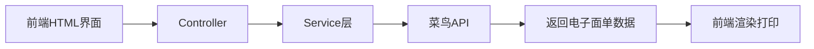
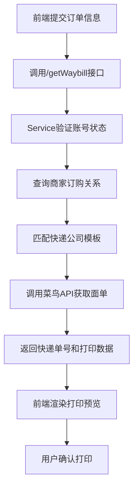
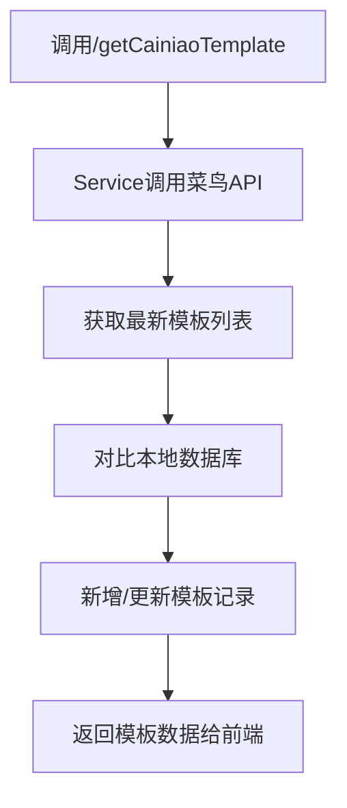

# 菜鸟电子面单对接实现说明文档

## 📋 概述

本项目基于菜鸟物流云平台实现了电子面单的完整对接功能，支持多家快递公司的电子面单打印、查询、管理等功能。

**对接平台**: 菜鸟物流云 (Cainiao Logistics Cloud)  
**实现方式**: Java SDK + RESTful API  
**支持快递**: 顺丰、申通、中通、圆通、韵达、EMS等主流快递公司

---

## 🏗️ 整体架构

### 核心组件

```
pas-service/thirdservice/
├── CNExpressPrintService.java    # 核心服务类
├── KdApiEOrderController.java    # Web控制器
├── CainiaoTemplate.java          # 模板实体类
└── 相关工具类和测试类
```

### 数据流向



---

## 🔧 核心实现类详解

### 1. CNExpressPrintService (核心服务类)

**文件路径**: `pas-service/src/main/java/com/xc/smallrookie/pas/service/thirdservice/CNExpressPrintService.java`

#### 主要功能方法

##### (1) 查询账号状态和订购关系
```java
public Map<String, Object> getCainiaoAccountStatus()
```
**功能**: 查询商家在菜鸟平台的账号状态和快递公司订购关系

**输入参数**: 无

**返回数据结构**:
```json
{
  "dailytoken": "授权令牌",
  "deadline": "授权截止时间",
  "subscriptions": [
    {
      "cpCode": "快递公司编码",
      "branchAccountCols": [
        {
          "branchCode": "网点编码",
          "branchName": "网点名称",
          "quantity": 1000,
          "allocatedQuantity": 500
        }
      ]
    }
  ],
  "Success": "true"
}
```

**前端调用示例**:
```javascript
// AJAX调用
fetch('/checkCainiaoAccount', {
  method: 'POST',
  headers: {'Content-Type': 'application/json'},
  body: JSON.stringify({token: '用户token'})
})
.then(response => response.json())
.then(data => {
  console.log('账号状态:', data);
  // 渲染快递公司选择列表
});
```

##### (2) 获取电子面单模板
```java
public Map<String, Object> getCainiaoTemplate(ApiRequest<CainiaoTemplate> apiRequest, Example example)
```
**功能**: 从菜鸟平台同步并获取电子面单模板

**输入参数**:
- `apiRequest`: 包含用户认证信息
- `example`: 查询条件

**返回数据结构**:
```json
{
  "templates": [
    {
      "templateid": 88010101,
      "templatename": "菜鸟电子面单\\顺丰001",
      "templateurl": "http://cloudprint.cainiao.com/template/standard/1501/68",
      "templatewaybilltype": 1
    }
  ],
  "Success": "true"
}
```

**前端调用示例**:
```javascript
// 获取模板列表
fetch('/getCainiaoTemplate', {
  method: 'POST',
  headers: {'Content-Type': 'application/json'},
  body: JSON.stringify({
    data: {employeeId: 123},
    token: 'user_token'
  })
})
.then(response => response.json())
.then(data => {
  // 渲染模板选择下拉框
  const templateSelect = document.getElementById('templateSelect');
  data.templates.forEach(template => {
    const option = document.createElement('option');
    option.value = template.templateid;
    option.textContent = template.templatename;
    templateSelect.appendChild(option);
  });
});
```

##### (3) 批量获取电子面单
```java
public Map<String, Object> getWaybill(HashMap map)
```
**功能**: 根据订单信息批量获取快递单号和电子面单

**输入参数Map结构**:
```java
{
  "express_company": "SF",           // 快递公司编码
  "templatename": "顺丰001",         // 模板名称
  "sender_name": "发件人姓名",
  "sender_phone": "发件人电话",
  "sender_province": "发件省",
  "sender_city": "发件市",
  "sender_district": "发件区",
  "sender_address": "发件详细地址",
  "tradeOrderList": [                // 订单列表
    {
      "order_no": "订单号",
      "receiver_name": "收件人姓名",
      "receiver_phone": "收件人电话",
      "receiver_province": "收件省",
      "receiver_city": "收件市",
      "receiver_district": "收件区",
      "receiver_address": "收件详细地址",
      "goods_name": "商品名称",
      "goods_count": 1
    }
  ]
}
```

**返回数据结构**:
```json
{
  "waybills": [
    {
      "order_no": "订单号",
      "waybill_code": "SF1234567890",  // 快递单号
      "print_data": "{...}",           // 打印数据(JSON格式)
      "template_url": "模板URL"
    }
  ],
  "Success": "true"
}
```

**前端调用示例**:
```javascript
// 批量获取面单
const requestData = {
  express_company: 'SF',
  templatename: '顺丰001',
  sender_name: document.getElementById('senderName').value,
  sender_phone: document.getElementById('senderPhone').value,
  // ... 其他发件人信息
  tradeOrderList: [
    {
      order_no: 'ORDER001',
      receiver_name: document.getElementById('receiverName').value,
      // ... 收件人信息
    }
  ]
};

fetch('/getWaybill', {
  method: 'POST',
  headers: {'Content-Type': 'application/json'},
  body: JSON.stringify(requestData)
})
.then(response => response.json())
.then(data => {
  if(data.Success === 'true') {
    // 渲染打印预览
    renderPrintPreview(data.waybills);
  }
});
```

##### (4) MD5签名获取
```java
public Map<String, String> getMd5(ApiRequest<Object> apiRequest)
```
**功能**: 获取菜鸟平台所需的MD5签名

**前端调用示例**:
```javascript
// 获取签名用于API调用
fetch('/getCainiaoMD5', {
  method: 'POST',
  headers: {'Content-Type': 'application/json'},
  body: JSON.stringify({token: 'user_token'})
})
.then(response => response.json())
.then(data => {
  const sign = data.sign;
  // 使用签名调用其他接口
});
```

---

## 📡 控制器实现 (KdApiEOrderController)

**文件路径**: `pas-web/src/main/java/com/xc/smallrookie/web/pas/controller/KdApiEOrderController.java`

### 主要接口

#### 1. 检查菜鸟账号状态
```java
@PostMapping("/checkCainiaoAccount")
public ApiResponse<Object> checkCainiaoAccount(@RequestBody ApiRequest<Object> apiRequest)
```
**HTTP方法**: POST  
**请求路径**: `/checkCainiaoAccount`  
**功能**: 检查商家在菜鸟平台的账号状态

#### 2. 获取电子面单模板
```java
@PostMapping("/getCainiaoTemplate")
public ApiResponse<Map<String,Object>> getCainiaoTemplate(@RequestBody ApiRequest<CainiaoTemplate> apiRequest)
```
**HTTP方法**: POST  
**请求路径**: `/getCainiaoTemplate`  
**功能**: 获取可用的电子面单模板列表

#### 3. 获取MD5签名
```java
@PostMapping("/getCainiaoMD5")
public ApiResponse<Object> getCainiaoMD5(@RequestBody ApiRequest<Object> apiRequest)
```
**HTTP方法**: POST  
**请求路径**: `/getCainiaoMD5`  
**功能**: 获取API调用所需的MD5签名

---

## 🗃️ 数据库设计

### 1. 菜鸟模板表 (t_cainiao_template)

```sql
CREATE TABLE `t_cainiao_template` (
  `templateid` int(11) NOT NULL COMMENT '模板ID',
  `templatename` varchar(100) DEFAULT NULL COMMENT '模板名称',
  `templateurl` varchar(500) DEFAULT NULL COMMENT '模板URL',
  `templatewaybilltype` int(11) DEFAULT NULL COMMENT '面单类型',
  `horoffset` float DEFAULT NULL COMMENT '水平偏移',
  `veroffset` float DEFAULT NULL COMMENT '垂直偏移',
  `publisheddatetime` timestamp DEFAULT CURRENT_TIMESTAMP COMMENT '发布时间',
  `totalprintedcount` int(11) DEFAULT NULL COMMENT '总打印次数',
  `lastprinteddatetime` timestamp DEFAULT '0000-00-00 00:00:00' COMMENT '最后打印时间',
  `lastewbcontent` text COMMENT '最后电子面单内容',
  `delflag` tinyint(1) NOT NULL DEFAULT '1' COMMENT '删除标记',
  PRIMARY KEY (`templateid`)
) ENGINE=MyISAM DEFAULT CHARSET=utf8;
```

**关键字段说明**:
- `templatename`: 模板显示名称(如"菜鸟电子面单\顺丰001")
- `templateurl`: 菜鸟平台模板URL
- `templatewaybilltype`: 面单类型标识

### 2. 快递公司配置表 (t_bill_company)

包含各快递公司的基础信息和编码对照。

---

## 🔐 配置信息

### 菜鸟平台配置

**文件**: `CNExpressPrintService.java`

```java
// 生产环境配置
private final static String onlineUrl = "http://link.cainiao.com/gateway/link.do";
private final static String onlineAppKey = "285203";  // 应用Key
private final static String onlineSecretKey = "1q4Ml3Z00h4s3Qq96WEO39dpw9O18060";  // 密钥
private static String dailyToken = "TmpFU1ZO...";  // 授权令牌
```

**注意事项**:
1. 生产环境需替换为正式的AppKey和SecretKey
2. dailyToken需要定期更新(通过MD5签名接口获取)
3. 建议将敏感配置信息放在配置文件中

---

## 🔄 业务流程

### 1. 完整下单流程



### 2. 模板同步流程



---

## 📱 前端功能实现指南

### 1. 快递公司选择功能

```html
<!-- HTML结构 -->
<select id="expressCompany">
  <option value="">请选择快递公司</option>
  <option value="SF">顺丰快递</option>
  <option value="STO">申通快递</option>
  <option value="ZTO">中通快递</option>
  <option value="YTO">圆通快递</option>
  <option value="YD">韵达快递</option>
  <option value="EMS">邮政EMS</option>
</select>

<!-- JavaScript实现 -->
document.getElementById('expressCompany').addEventListener('change', function() {
  const companyCode = this.value;
  if(companyCode) {
    // 根据选择的快递公司加载对应模板
    loadTemplates(companyCode);
  }
});

function loadTemplates(companyCode) {
  fetch('/getCainiaoTemplate', {
    method: 'POST',
    headers: {'Content-Type': 'application/json'},
    body: JSON.stringify({
      data: {companyCode: companyCode},
      token: getUserToken()
    })
  })
  .then(response => response.json())
  .then(data => {
    // 渲染模板选择下拉框
    renderTemplateOptions(data.templates);
  });
}
```

### 2. 发件人信息填写

```html
<form id="senderForm">
  <input type="text" id="senderName" placeholder="发件人姓名" required>
  <input type="tel" id="senderPhone" placeholder="发件人电话" required>
  <select id="senderProvince"></select>
  <select id="senderCity"></select>
  <select id="senderDistrict"></select>
  <textarea id="senderAddress" placeholder="详细地址" required></textarea>
</form>
```

### 3. 批量订单处理

```javascript
// 批量添加订单
function addBatchOrders() {
  const orders = [];
  const orderRows = document.querySelectorAll('.order-row');
  
  orderRows.forEach(row => {
    orders.push({
      order_no: row.querySelector('.order-no').value,
      receiver_name: row.querySelector('.receiver-name').value,
      receiver_phone: row.querySelector('.receiver-phone').value,
      receiver_province: row.querySelector('.receiver-province').value,
      receiver_city: row.querySelector('.receiver-city').value,
      receiver_district: row.querySelector('.receiver-district').value,
      receiver_address: row.querySelector('.receiver-address').value,
      goods_name: row.querySelector('.goods-name').value,
      goods_count: parseInt(row.querySelector('.goods-count').value)
    });
  });
  
  return orders;
}

// 提交获取面单
function submitWaybill() {
  const requestData = {
    express_company: document.getElementById('expressCompany').value,
    templatename: document.getElementById('templateSelect').value,
    sender_name: document.getElementById('senderName').value,
    sender_phone: document.getElementById('senderPhone').value,
    sender_province: document.getElementById('senderProvince').value,
    sender_city: document.getElementById('senderCity').value,
    sender_district: document.getElementById('senderDistrict').value,
    sender_address: document.getElementById('senderAddress').value,
    tradeOrderList: addBatchOrders()
  };
  
  fetch('/getWaybill', {
    method: 'POST',
    headers: {'Content-Type': 'application/json'},
    body: JSON.stringify(requestData)
  })
  .then(response => response.json())
  .then(data => {
    if(data.Success === 'true') {
      // 显示打印预览
      showPrintPreview(data.waybills);
    } else {
      alert('获取面单失败: ' + data.errorMessage);
    }
  });
}
```

### 4. 打印预览功能

```javascript
function showPrintPreview(waybills) {
  const previewContainer = document.getElementById('previewContainer');
  previewContainer.innerHTML = '';
  
  waybills.forEach((waybill, index) => {
    const printDiv = document.createElement('div');
    printDiv.className = 'print-preview';
    printDiv.innerHTML = `
      <h3>订单号: ${waybill.order_no}</h3>
      <p>快递单号: ${waybill.waybill_code}</p>
      <div class="print-content">${formatPrintData(waybill.print_data)}</div>
      <button onclick="printSingle(${index})">打印此单</button>
    `;
    previewContainer.appendChild(printDiv);
  });
}

function printSingle(index) {
  const printWindow = window.open('', '_blank');
  const waybill = waybills[index];
  printWindow.document.write(`
    <!DOCTYPE html>
    <html>
    <head><title>电子面单打印</title></head>
    <body onload="window.print()">
      ${formatPrintData(waybill.print_data)}
    </body>
    </html>
  `);
  printWindow.document.close();
}
```

---

## ⚠️ 重要注意事项

### 1. 授权令牌管理
- dailyToken有有效期，需定期刷新
- 建议在每次API调用前检查令牌有效性
- 可通过定时任务自动刷新令牌

### 2. 错误处理
```javascript
// 统一错误处理
function handleApiError(error) {
  if(error.code === 'TOKEN_EXPIRED') {
    // 令牌过期，重新获取
    refreshToken().then(() => {
      // 重新执行原操作
      retryLastOperation();
    });
  } else if(error.code === 'NO_SUBSCRIPTION') {
    alert('请先在菜鸟平台订购相应快递公司的电子面单服务');
  } else {
    alert('操作失败: ' + error.message);
  }
}
```

### 3. 性能优化建议
- 模板数据可缓存到localStorage
- 批量获取面单时建议分批处理(每批50-100单)
- 打印数据较大的情况下使用异步加载

### 4. 安全考虑
- 敏感配置信息不要硬编码在前端
- API调用需进行身份验证
- 打印数据传输建议使用HTTPS

---

## 📚 相关文档

- [菜鸟物流云官方文档](https://cloudprint-doc.caicloud.io/)
- [电子面单API文档](https://cloudprint-doc.caicloud.io/doc.htm)
- [快递公司编码对照表](https://cloudprint-doc.caicloud.io/companycode.htm)

---

## 📅 文档信息

- **创建日期**: 2026-02-17
- **适用版本**: smallrookie-pas v1.0
- **重构建议**: 可将核心逻辑抽取为独立SDK，便于多项目复用


我来帮您查找并整理菜鸟授权相关的说明信息。
根据代码分析,我为您整理菜鸟授权的完整说明:

---

## 📘 菜鸟物流云授权说明文档

### 一、授权流程概述

菜鸟物流云使用 **ISV(独立软件供应商)授权模式**,需要商家在菜鸟平台授权后,通过accessCode换取accessToken才能使用API。

```
商家授权 → 获取accessCode → 换取accessToken → 使用API
```

---

### 二、授权所需信息

#### 1. ISV应用信息

**测试环境**:
```java
dailyAppKey = "247457"
dailySecretKey = "8e48991050U2cz1g2JA5kU61ve94Rt71"
dailyUrl = "http://link.cainiao.com/gateway/link.do"
```

**生产环境**:
```java
onlineAppKey = "285203"
onlineSecretKey = "2fz6b9316tgD8iklyGk7g211PefQ331d"
onlineUrl = "http://link.cainiao.com/gateway/link.do"
```

#### 2. 商家授权码 (accessCode)

- 商家在菜鸟物流云平台授权ISV应用后生成
- 用于换取长期有效的 accessToken
- **获取方式**: 商家登录菜鸟平台 → 应用授权 → 生成授权码

---

### 三、Token获取流程

#### 步骤1: 使用accessCode换取accessToken

**API接口**: `POST /getCainiaoMD5`

**请求参数**:
```json
{
  "ext": {
    "accessCode": "商家授权码"
  }
}
```

**核心实现逻辑** ([MD5Utils.java](file:///d:/bjamoeba/smallrookie-pas/pas-service/src/main/java/com/xc/smallrookie/pas/service/thirdservice/MD5Utils.java#L189-L282)):

```java
// 1. 获取ISV应用凭证
String appKey = cnExpressPrintService.getDailyAppKey();
String appSecret = cnExpressPrintService.getDailySecretKey();

// 2. 生成签名
String sign = md5(accessCode + "," + appKey + "," + appSecret);

// 3. 调用菜鸟Token换取接口
String url = "https://lcp.cloud.cainiao.com/api/permission/exchangeToken.do";
String params = "accessCode=" + accessCode + "&isvAppKey=" + appKey + "&sign=" + sign;

// 4. 解析返回结果获取accessToken
JSONObject response = JSONObject.fromObject(httpResponse);
String accessToken = response.getJSONArray("accessTokens")
                              .getJSONObject(0)
                              .getString("accessToken");

// 5. 保存到数据库
CainiaoToken token = new CainiaoToken();
token.setDailytoken(accessToken);
token.setDeadline(nowDate + 1年);
cainiaoTokenService.addEntity(token);
```

**返回结果**:
```json
{
  "accessToken": "换取到的长期Token",
  "errorCode": "",
  "Success": "true"
}
```

#### 步骤2: 从数据库读取Token

**方法**: `setDailyToken()` ([CNExpressPrintService.java](file:///d:/bjamoeba/smallrookie-pas/pas-service/src/main/java/com/xc/smallrookie/pas/service/thirdservice/CNExpressPrintService.java#L125-L134))

```java
public void setDailyToken() {
    CainiaoToken cainiaoToken = cainiaoTokenService.getEntity(1);
    dailyToken = cainiaoToken.getDailytoken();
    deadlineDate = cainiaoToken.getDeadline();
}
```

#### 步骤3: 使用Token调用API

所有菜鸟API调用都需要传入Token:

```java
PacClient client = new PacClient(dailyAppKey, dailySecretKey, dailyUrl);
SendSysParams params = new SendSysParams();
params.setFromCode(dailyToken);  // 设置授权Token

// 调用具体API
TmsWaybillGetRequest request = new TmsWaybillGetRequest();
TmsWaybillGetResponse response = client.send(request, params);
```

---

### 四、数据库设计

#### t_cainiao_token 表结构

```sql
CREATE TABLE `t_cainiao_token` (
  `tokenid` int(11) NOT NULL,
  `dailytoken` varchar(500) DEFAULT NULL COMMENT '授权Token',
  `deadline` datetime DEFAULT NULL COMMENT '过期时间',
  `delflag` tinyint(1) NOT NULL DEFAULT '1' COMMENT '删除标记',
  PRIMARY KEY (`tokenid`)
) ENGINE=MyISAM DEFAULT CHARSET=utf8;
```

**字段说明**:
- `tokenid`: 固定为1,单例模式
- `dailytoken`: 从菜鸟获取的长期授权Token
- `deadline`: Token过期时间(通常设置为1年后)
- `delflag`: 删除标记

---

### 五、前端对接指南

#### 接口1: 获取MD5签名换取Token

**URL**: `POST /getCainiaoMD5`

**请求示例**:
```javascript
fetch('/getCainiaoMD5', {
  method: 'POST',
  headers: {'Content-Type': 'application/json'},
  body: JSON.stringify({
    ext: {
      accessCode: '商家提供的授权码'
    }
  })
})
.then(response => response.json())
.then(data => {
  if(data.Success === 'true') {
    console.log('Token获取成功:', data.accessToken);
    // 保存Token供后续使用
    localStorage.setItem('cainiaoToken', data.accessToken);
  }
});
```

#### 接口2: 检查账号状态

**URL**: `POST /checkCainiaoAccount`

**功能**: 查询当前Token状态和快递公司订购关系

**请求示例**:
```javascript
fetch('/checkCainiaoAccount', {
  method: 'POST',
  headers: {'Content-Type': 'application/json'},
  body: JSON.stringify({})
})
.then(response => response.json())
.then(data => {
  console.log('Token:', data.dailytoken);
  console.log('过期时间:', data.deadline);
  console.log('订购关系:', data.subscriptions);
});
```

**返回数据**:
```json
{
  "dailytoken": "当前使用的Token",
  "deadline": "2027-02-17T00:00:00",
  "subscriptions": [
    {
      "cpCode": "SF",
      "cpName": "顺丰快递",
      "branchAccountCols": [
        {
          "branchCode": "网点编码",
          "quantity": 1000,
          "allocatedQuantity": 500
        }
      ]
    }
  ],
  "Success": "true"
}
```

#### 接口3: 手动更新Token

**URL**: `POST /updateDailyToken`

**功能**: 手动更新数据库中的Token

**请求示例**:
```javascript
fetch('/updateDailyToken', {
  method: 'POST',
  headers: {'Content-Type': 'application/json'},
  body: JSON.stringify({
    ext: {
      dailytoken: '新的Token值'
    }
  })
})
.then(response => response.json());
```

---

### 六、授权流程完整示例

#### 场景: 首次对接菜鸟

**步骤1: 商家操作**
1. 登录菜鸟物流云平台: https://lcp.cloud.cainiao.com
2. 进入"应用授权"页面
3. 找到ISV应用 (AppKey: 247457)
4. 点击授权,生成 accessCode (示例: `ABC123XYZ456`)

**步骤2: 系统获取Token**
```javascript
// 前端调用
const accessCode = 'ABC123XYZ456'; // 商家提供

fetch('/getCainiaoMD5', {
  method: 'POST',
  body: JSON.stringify({
    ext: { accessCode: accessCode }
  })
})
.then(response => response.json())
.then(data => {
  if(data.Success === 'true') {
    alert('授权成功! Token已保存到数据库');
    // Token: data.accessToken
  } else {
    alert('授权失败: ' + data.errorMessage);
  }
});
```

**步骤3: 验证授权**
```javascript
// 检查账号状态
fetch('/checkCainiaoAccount', {method: 'POST'})
.then(response => response.json())
.then(data => {
  console.log('授权状态:', data.Success);
  console.log('Token有效期至:', data.deadline);
  console.log('已订购快递公司:', data.subscriptions.map(s => s.cpName));
});
```

---

### 七、常见问题

#### Q1: Token过期了怎么办?
**A**: Token有效期通常为1年,过期后需要:
1. 商家重新在菜鸟平台授权生成新的accessCode
2. 调用 `/getCainiaoMD5` 接口换取新Token
3. 系统自动更新数据库

#### Q2: 如何判断Token是否有效?
**A**: 调用 `/checkCainiaoAccount` 接口:
- 成功返回订购关系 → Token有效
- 返回错误 → Token失效,需重新授权

#### Q3: accessCode可以重复使用吗?
**A**: 不可以,accessCode是一次性的,换取Token后即失效

#### Q4: 测试环境和生产环境Token通用吗?
**A**: 不通用,需要分别授权获取

---

### 八、安全建议

1. ✅ **不要硬编码Token**: Token应存储在数据库或配置文件中
2. ✅ **定期检查Token有效性**: 建议每次调用API前检查deadline
3. ✅ **accessCode保密**: 不要在前端暴露accessCode
4. ✅ **HTTPS传输**: 生产环境必须使用HTTPS
5. ✅ **权限控制**: Token获取接口应有严格的权限控制

---

### 九、相关API文档

- **菜鸟物流云官方文档**: https://cloudprint-doc.caicloud.io/
- **Token换取API**: https://lcp.cloud.cainiao.com/api/permission/exchangeToken.do
- **物流云控制台**: https://lcp.cloud.cainiao.com

---

这份文档涵盖了菜鸟授权的完整流程和技术细节,您可以根据这个流程实现前端的授权功能!


# 菜鸟电子面单对接完整源码归档文档

## 📋 文档说明

本文档归档了菜鸟电子面单对接的完整Java源码实现，包含所有核心类、配置信息和数据库设计。

**归档日期**: 2026-02-17  
**项目**: smallrookie-pas  
**模块**: 菜鸟物流云对接

---

## 📂 源码目录结构

```
smallrookie-pas/
├── pas-web/
│   └── src/main/java/.../controller/
│       └── KdApiEOrderController.java          # Web控制器
├── pas-service/
│   └── src/main/java/.../thirdservice/
│       ├── CNExpressPrintService.java          # 核心服务类
│       └── MD5Utils.java                       # 授权工具类
└── pas-domain/
    └── src/main/java/.../domain/
        ├── CainiaoTemplate.java                # 模板实体类
        └── CainiaoToken.java                   # Token实体类
```

---

## 1️⃣ 控制器层 - KdApiEOrderController.java

**路径**: `pas-web/src/main/java/com/xc/smallrookie/web/pas/controller/KdApiEOrderController.java`

**功能**: 提供菜鸟对接的HTTP API接口

```java
package com.xc.smallrookie.web.pas.controller;

import com.xc.smallrookie.common.annotation.ValidateArgument;
import com.xc.smallrookie.common.annotation.ValidateArguments;
import com.xc.smallrookie.common.component.ApiRequest;
import com.xc.smallrookie.common.component.ApiResponse;
import com.xc.smallrookie.common.enums.Result;
import com.xc.smallrookie.pas.domain.CainiaoTemplate;
import com.xc.smallrookie.pas.service.thirdservice.CNExpressPrintService;
import com.xc.smallrookie.pas.service.thirdservice.KdGoldAPIDemo;
import com.xc.smallrookie.pas.service.thirdservice.MD5Utils;
import io.swagger.annotations.Api;
import io.swagger.annotations.ApiImplicitParam;
import io.swagger.annotations.ApiOperation;
import org.springframework.beans.factory.annotation.Autowired;
import org.springframework.validation.annotation.Validated;
import org.springframework.web.bind.annotation.*;

import java.util.HashMap;
import java.util.Map;

@Api(description = "PAS系统菜鸟电子面单管理")
@RestController
@RequestMapping(value = "/smallrookie/pas/kdApiEOrder")
@Validated
@CrossOrigin
public class KdApiEOrderController {

    @Autowired
    private KdGoldAPIDemo kdGoldAPIDemo;

    @Autowired
    private CNExpressPrintService cnExpressPrintService;

    @Autowired
    private MD5Utils md5Utils;

    /**
     * 获取电子面单
     * @param apiRequest 包含发件人、收件人、快递公司等信息
     * @return 电子面单数据
     */
    @ApiOperation(value = "获取电子面单", notes = "批量获取电子面单")
    @PostMapping(value = "/orderOnlineByJson", produces = "application/json; charset=UTF-8")
    @ValidateArguments(validateArguments = { @ValidateArgument(fieldName = "employeeId", isNumberType = true) })
    @ApiImplicitParam(required = true, name = "apiRequest", dataType = "json")
    public ApiResponse<Object> orderOnlineByJson(@RequestBody ApiRequest<Object> apiRequest) {
        Map<String, Object> res = new HashMap<>();
        try {
            apiRequest.getData();
            res = cnExpressPrintService.getWaybill((HashMap)apiRequest.getData());

        }catch (Exception er){
            System.out.println(er);
        }
        System.out.print("打印完成，得到res为" + res);
        
        if(res.size() <= 0) {
            return ApiResponse.createApiResponse(res, Result.SUCCESS);
        }
        if(res.get("Success").equals("false")) {
            return ApiResponse.createApiResponse(res, Result.FAIL);
        } else {
            return ApiResponse.createApiResponse(res, Result.SUCCESS);
        }
    }

    /**
     * 检查菜鸟账号状态和订购关系
     * @param apiRequest
     * @return 账号状态、Token、订购关系
     */
    @ApiOperation(value = "检查菜鸟账号状态", notes = "查询Token和订购关系")
    @PostMapping(value = "/checkCainiaoAccount", produces = "application/json; charset=UTF-8")
    @ValidateArguments(validateArguments = { @ValidateArgument(fieldName = "employeeId", isNumberType = true) })
    @ApiImplicitParam(required = true, name = "apiRequest", dataType = "json")
    public ApiResponse<Object> checkCainiaoAccount(@RequestBody ApiRequest<Object> apiRequest) {
        Map<String, Object> res = new HashMap<String, Object>();
        try {
            res = cnExpressPrintService.getCainiaoAccountStatus();
        }catch (Exception er){
            System.out.println(er);
        }
        System.out.print("菜鸟账号订购关系完成，得到res为" + res);

        if(res.get("Success").equals("false")) {
            return ApiResponse.createApiResponse(res, Result.FAIL);
        } else {
            return ApiResponse.createApiResponse(res, Result.SUCCESS);
        }
    }

    /**
     * 获取菜鸟电子面单模板
     * @param apiRequest
     * @return 模板列表
     */
    @ApiOperation(value = "获取菜鸟模板", notes = "获取可用的电子面单模板")
    @PostMapping(value = "/getCainiaoTemplate", produces = "application/json; charset=UTF-8")
    @ValidateArguments(validateArguments = { @ValidateArgument(fieldName = "employeeId", isNumberType = true) })
    @ApiImplicitParam(required = true, name = "apiRequest", dataType = "json")
    public ApiResponse<Map<String,Object>> getCainiaoTemplate(@RequestBody ApiRequest<CainiaoTemplate> apiRequest) {
        Map<String, Object> res = new HashMap<String, Object>();
        try {
            res = cnExpressPrintService.getCainiaoTemplate(apiRequest, null);
        }catch (Exception er){
            System.out.println(er);
        }
        System.out.print("菜鸟模板获取成功，得到res为" + res);

        if(res != null) {
            return  ApiResponse.createApiResponse(res, Result.SUCCESS);
        } else {
            return ApiResponse.createApiResponse(null, Result.FAIL);
        }
    }

    /**
     * 使用accessCode换取accessToken
     * @param apiRequest 包含accessCode
     * @return accessToken
     */
    @ApiOperation(value = "获取MD5签名换取Token", notes = "使用accessCode换取accessToken")
    @PostMapping(value = "/getCainiaoMD5", produces = "application/json; charset=UTF-8")
    @ValidateArguments(validateArguments = { @ValidateArgument(fieldName = "employeeId", isNumberType = true) })
    @ApiImplicitParam(required = true, name = "apiRequest", dataType = "json")
    public ApiResponse<Object> getCainiaoMD5(@RequestBody ApiRequest<Object> apiRequest) {
        Map<String, String> res = new HashMap<String, String>();
        try {
            res = md5Utils.getMd5(apiRequest);
        }catch (Exception er){
            System.out.println(er);
        }
        System.out.print("更新accessToken成功，得到res为" + res);

        if(res.get("Success").equals("false")) {
            return ApiResponse.createApiResponse(res, Result.FAIL);
        } else {
            return ApiResponse.createApiResponse(res, Result.SUCCESS);
        }
    }

    /**
     * 手动更新Token
     * @param apiRequest 包含新的dailytoken
     * @return 更新结果
     */
    @ApiOperation(value = "更新Token", notes = "手动更新数据库中的Token")
    @PostMapping(value = "/updateToken", produces = "application/json; charset=UTF-8")
    @ValidateArguments(validateArguments = { @ValidateArgument(fieldName = "employeeId", isNumberType = true) })
    @ApiImplicitParam(required = true, name = "apiRequest", dataType = "json")
    public ApiResponse<Object> updateToken(@RequestBody ApiRequest<Object> apiRequest) {
        Map<String, String> res = new HashMap<String, String>();
        try {
            res = cnExpressPrintService.updateDailyToken(apiRequest);
        }catch (Exception er){
            System.out.println(er);
        }
        System.out.print("關聯菜鳥賬號成功，得到res为" + res);

        if(res.get("Success").equals("false")) {
            return ApiResponse.createApiResponse(res, Result.FAIL);
        } else {
            return ApiResponse.createApiResponse(res, Result.SUCCESS);
        }
    }
}
```

---

## 2️⃣ 核心服务类 - CNExpressPrintService.java

**路径**: `pas-service/src/main/java/com/xc/smallrookie/pas/service/thirdservice/CNExpressPrintService.java`

**功能**: 菜鸟电子面单的核心业务逻辑

### 配置信息部分

```java
package com.xc.smallrookie.pas.service.thirdservice;

import com.taobao.pac.sdk.cp.PacClient;
import com.taobao.pac.sdk.cp.SendSysParams;
import com.taobao.pac.sdk.cp.dataobject.request.*;
import com.taobao.pac.sdk.cp.dataobject.response.*;
import org.springframework.beans.factory.annotation.Autowired;
import org.springframework.stereotype.Service;
import org.springframework.transaction.annotation.Transactional;
import tk.mybatis.mapper.entity.Example;
import java.util.*;

@Service
@Transactional
public class CNExpressPrintService {

    // ========== 测试环境配置 ==========
    private final static String dailyUrl = "http://link.cainiao.com/gateway/link.do";
    private final static String dailyAppKey = "247457";
    private final static String dailySecretKey = "8e48991050U2cz1g2JA5kU61ve94Rt71";
    private static String dailyToken;  // 从数据库动态获取
    private static Date deadlineDate;

    // ========== 生产环境配置 ==========
    private final static String onlineUrl = "http://link.cainiao.com/gateway/link.do";
    private final static String onlineAppKey = "285203";
    private final static String onlineSecretKey = "2fz6b9316tgD8iklyGk7g211PefQ331d";
    private final static String onlineToken = "bzdrNGZMT09aQkJkM1FITmlCWG40d2c3eE5YK09iNTc5K0pWc0NGNnAyZlhFZVBkcGhsYysxclk3OUxlVk5XNw==";

    @Autowired
    private JxcSalesService<JxcSales> jxcSalesService;

    @Autowired
    private ExpressTrackService<ExpressTrack> expressTrackService;

    @Autowired
    private CainiaoTokenService<CainiaoToken> cainiaoTokenService;

    @Autowired
    private CainiaoTemplateService<CainiaoTemplate> cainiaoTemplateService;

    @Autowired
    private CainiaoTemplateDao cainiaoTemplateDao;

    /**
     * 获取appKey
     */
    public String getDailyAppKey() {
        return dailyAppKey;
    }

    /**
     * 获取appSecret
     */
    public String getDailySecretKey() {
        return dailySecretKey;
    }

    /**
     * 从数据库中获取授权Token
     */
    public void setDailyToken() {
        CainiaoToken cainiaoToken = cainiaoTokenService.getEntity(1);
        dailyToken = cainiaoToken.getDailytoken();
        deadlineDate = cainiaoToken.getDeadline();
    }

    /**
     * 手动更新Token
     */
    public Map<String, String> updateDailyToken(ApiRequest<Object> apiRequest) {
        Map<String, String> resultMap = new HashMap<>();
        Map ext = apiRequest.getExt();
        
        if(ext != null) {
            if(ext.containsKey("dailytoken")) {
                CainiaoToken cainiaoToken = new CainiaoToken();
                cainiaoToken.setTokenid(1);
                cainiaoToken.setDailytoken(ext.get("dailytoken").toString());

                Calendar calendar = Calendar.getInstance();
                calendar.add(Calendar.YEAR, 1);
                Date deadline = calendar.getTime();
                cainiaoToken.setDeadline(deadline);
                cainiaoToken.setDelflag(1);

                if(cainiaoTokenService.addEntity(cainiaoToken)) {
                    resultMap.put("errorCode", "");
                    resultMap.put("Success", "true");
                }
            } else {
                resultMap.put("errorCode", "");
                resultMap.put("errorMessage", "dailytoken null");
                resultMap.put("Success", "false");
            }
        } else {
            resultMap.put("errorCode", "");
            resultMap.put("errorMessage", "ext null");
            resultMap.put("Success", "false");
        }

        return resultMap;
    }

    /**
     * 查询商家订购关系
     */
    public List<WaybillApplySubscriptionInfo> subscriptionQuery(String dailyToken) {
        PacClient client = new PacClient(dailyAppKey, dailySecretKey, dailyUrl);
        SendSysParams params = new SendSysParams();
        params.setFromCode(dailyToken);

        TmsWaybillSubscriptionQueryRequest request = new TmsWaybillSubscriptionQueryRequest();
        TmsWaybillSubscriptionQueryResponse response = client.send(request, params);
        
        if (!response.isSuccess()) {
            System.out.println("errorCode:" + response.getErrorCode() + "errorMessage:" + response.getErrorMsg());
            return null;
        }
        
        return response.getWaybillApplySubscriptionCols();
    }

    /**
     * 查询菜鸟账号状态和订购关系
     */
    public Map<String, Object> getCainiaoAccountStatus() {
        setDailyToken();
        List<WaybillApplySubscriptionInfo> subscriptionInfos = subscriptionQuery(dailyToken);
        
        Map<String, Object> resultMap = new HashMap<>();
        resultMap.put("dailytoken", dailyToken);
        resultMap.put("deadline", deadlineDate);
        resultMap.put("subscriptions", subscriptionInfos);
        resultMap.put("Success", "true");
        
        return resultMap;
    }

    /**
     * 从数据库获取模板URL
     */
    public String getTemplateUrl(String templatename) {
        Example example = new Example(CainiaoTemplate.class);
        Example.Criteria criteria = example.createCriteria();
        criteria.andEqualTo("templatename", templatename);
        
        CainiaoTemplate cainiaoTemplate = cainiaoTemplateDao.selectOneByExample(example);
        if(cainiaoTemplate == null) {
            return "";
        }
        
        return cainiaoTemplate.getTemplateurl();
    }

    /**
     * 获取菜鸟模板列表并同步到数据库
     */
    public Map<String, Object> getCainiaoTemplate(ApiRequest<CainiaoTemplate> apiRequest, Example example) {
        setDailyToken();
        PacClient client = new PacClient(dailyAppKey, dailySecretKey, dailyUrl);
        SendSysParams params = new SendSysParams();
        params.setFromCode(dailyToken);

        Map<String, Object> resultMap = new HashMap<>();

        // 获取ISV自定义模板 (type=6)
        Long templateType = Long.valueOf(6);
        CloudprintIsvTemplatesRequest isvRequest = new CloudprintIsvTemplatesRequest();
        isvRequest.setTemplateType(templateType);
        CloudprintIsvTemplatesResponse isvResponse = client.send(isvRequest, params);
        
        if(isvResponse.isSuccess()) {
            resultMap.put("isvTemplateDOs", isvResponse.getIsvTemplates());
        }

        // 获取ISV自定义模板 (type=4)
        templateType = Long.valueOf(4);
        isvRequest.setTemplateType(templateType);
        CloudprintIsvTemplatesResponse isvResponse1 = client.send(isvRequest, params);
        
        if(isvResponse1.isSuccess()) {
            resultMap.put("isvTemplateDLs", isvResponse1.getIsvTemplates());
        }

        // 获取标准电子面单模板
        CloudprintStandardTemplatesRequest standardRequest = new CloudprintStandardTemplatesRequest();
        CloudprintStandardTemplatesResponse standardResponse = client.send(standardRequest, params);
        
        if(standardResponse.isSuccess()) {
            List<StandardTemplateResult> standardTemplateResults = standardResponse.getData();
            resultMap.put("standardTemplateResults", standardTemplateResults);
            
            // 同步模板到数据库
            if(standardTemplateResults.size() > 0) {
                for(StandardTemplateResult standardTemplateResult : standardTemplateResults) {
                    List<StandardTemplateDO> templateList = standardTemplateResult.getStandardTemplateDOs();
                    
                    for(StandardTemplateDO templateDO : templateList) {
                        String templateUrl = templateDO.getStandardTemplateUrl();
                        String templateName = templateDO.getStandardTemplateName();
                        Integer waybillType = templateDO.getStandardWaybillType();
                        
                        String fullTemplateName = "菜鸟电子面单\\" + templateName;
                        
                        CainiaoTemplate cainiaoTemplate = new CainiaoTemplate();
                        cainiaoTemplate.setTemplatename(fullTemplateName);
                        cainiaoTemplate.setTemplateurl(templateUrl);
                        cainiaoTemplate.setTemplatewaybilltype(waybillType);
                        
                        // 检查是否已存在
                        Example selectExample = new Example(CainiaoTemplate.class);
                        Example.Criteria criteria = selectExample.createCriteria();
                        criteria.andEqualTo("templatename", fullTemplateName);
                        
                        if(cainiaoTemplateDao.selectOneByExample(selectExample) == null) {
                            // 新增
                            int insertNum = cainiaoTemplateDao.insertSelective(cainiaoTemplate);
                            if(insertNum <= 0) {
                                return null;
                            }
                        } else {
                            // 更新
                            int ret = cainiaoTemplateDao.updateByExampleSelective(cainiaoTemplate, selectExample);
                            if(ret <= 0) {
                                return null;
                            }
                        }
                    }
                }
            }
        }

        return cainiaoTemplateService.getEntitys(apiRequest, example);
    }

    /**
     * 批量获取电子面单
     * 核心方法 - 完整实现
     */
    public Map<String, Object> getWaybill(HashMap map) {
        setDailyToken();

        Map<String, Object> resultMap = new HashMap<>();
        PacClient client = new PacClient(dailyAppKey, dailySecretKey, dailyUrl);
        SendSysParams params = new SendSysParams();
        params.setFromCode(dailyToken);

        // 解析发件人信息
        String senderName = map.get("sendername").toString();
        String senderAddress = map.get("senderdetailedaddress").toString();
        String senderCompany = map.get("sendercompanyname").toString();
        String senderPhone = map.get("senderphonemobileno").toString();
        String senderPostcode = map.get("senderpostcode").toString();

        // 解析收件人列表
        List<HashMap> tradeOrderList = null;
        if(map.containsKey("tradeorderlist")) {
            tradeOrderList = (List)map.get("tradeorderlist");
        }

        String expressCompany = map.get("expresscompany").toString();
        String templateName = map.get("templatename").toString();

        // 构建请求对象
        TmsWaybillGetRequest request = new TmsWaybillGetRequest();
        request.setCpCode(expressCompany);

        // 设置发件人信息
        UserInfoDto sender = new UserInfoDto();
        request.setSender(sender);
        sender.setName(senderName);
        sender.setPhone(senderPhone);
        sender.setMobile(senderPhone);

        // 查询商家订购关系获取发件地址
        String province = "";
        String city = "";
        String district = "";
        String detail = "";
        String town = "";
        
        List<WaybillApplySubscriptionInfo> subscriptionList = subscriptionQuery(dailyToken);
        if(subscriptionList.size() <= 0) {
            resultMap.put("errorCode", "");
            resultMap.put("errorMessage", "未查到商家订购关系，请先在菜鸟发货平台创建相应的订购关系");
            resultMap.put("Success", "false");
            return resultMap;
        }
        
        for(WaybillApplySubscriptionInfo subscriptionInfo : subscriptionList) {
            if(subscriptionInfo.getCpCode().equals(expressCompany)) {
                List<WaybillBranchAccount> branchAccounts = subscriptionInfo.getBranchAccountCols();
                if(branchAccounts.size() > 0) {
                    WaybillBranchAccount branchAccount = branchAccounts.get(0);
                    if(branchAccount.getShippAddressCols().size() > 0) {
                        province = branchAccount.getShippAddressCols().get(0).getProvince();
                        city = branchAccount.getShippAddressCols().get(0).getCity();
                        district = branchAccount.getShippAddressCols().get(0).getDistrict();
                        detail = branchAccount.getShippAddressCols().get(0).getDetail();
                        town = branchAccount.getShippAddressCols().get(0).getTown();
                    }
                }
            }
        }

        if(province.equals("")) {
            resultMap.put("errorCode", "");
            resultMap.put("errorMessage", "未查当前快递公司("+expressCompany+")的订购关系，请先在菜鸟发货平台创建相应的订购关系");
            resultMap.put("Success", "false");
            return resultMap;
        }

        // 设置发件地址
        AddressDto sendAddress = new AddressDto();
        sender.setAddress(sendAddress);
        sendAddress.setProvince(province);
        sendAddress.setCity(city);
        sendAddress.setDistrict(district);
        sendAddress.setDetail(detail);
        sendAddress.setTown(town);

        // 获取模板URL
        String templateUrl = getTemplateUrl(templateName);
        if(templateUrl.equals("")) {
            resultMap.put("errorCode", "");
            resultMap.put("errorMessage", "获取快递公司（"+expressCompany+")模板失败");
            resultMap.put("Success", "false");
            return resultMap;
        }

        // 构建收件人信息列表
        ArrayList<TradeOrderInfoDto> tradeOrderInfoDtos = new ArrayList<>();
        request.setTradeOrderInfoDtos(tradeOrderInfoDtos);

        if(tradeOrderList != null && tradeOrderList.size() > 0) {
            for(HashMap tradeOrderMap : tradeOrderList) {
                String receiverName = tradeOrderMap.get("receivername").toString();
                String receiverAddress = tradeOrderMap.get("receiverdetailedaddress").toString();
                String receiverCompany = tradeOrderMap.get("receivercompanyname").toString();
                String receiverPhone = tradeOrderMap.get("receiverphonemobileno").toString();
                String receiverPostcode = tradeOrderMap.get("receiverpostcode").toString();
                String goodsName = tradeOrderMap.get("goodscontent").toString();
                if(goodsName == "") {
                    goodsName = "货物";
                }

                String[] receiverAddrArray = splitAddress(receiverAddress);
                String salesIdNumber = tradeOrderMap.get("salesid").toString();
                String goodsAccount = tradeOrderMap.get("goodsaccount").toString();
                String printRemark = tradeOrderMap.get("printremark").toString();

                String objectId = "A";
                if(tradeOrderMap.containsKey("objectid")) {
                    objectId = tradeOrderMap.get("objectid").toString();
                }

                TradeOrderInfoDto tradeOrderInfoDto = new TradeOrderInfoDto();
                tradeOrderInfoDto.setObjectId(objectId);
                tradeOrderInfoDto.setTemplateUrl(templateUrl);
                tradeOrderInfoDtos.add(tradeOrderInfoDto);

                OrderInfoDto orderInfoDto = new OrderInfoDto();
                tradeOrderInfoDto.setOrderInfo(orderInfoDto);
                orderInfoDto.setOrderChannelsType("OTHERS");
                
                ArrayList<String> orderList = new ArrayList<>();
                orderInfoDto.setTradeOrderList(orderList);
                orderList.add(salesIdNumber);

                PackageInfoDto packageInfoDto = new PackageInfoDto();
                tradeOrderInfoDto.setPackageInfo(packageInfoDto);
                ArrayList<Item> items = new ArrayList<>();
                packageInfoDto.setItems(items);
                Item item = new Item();
                items.add(item);
                item.setName(goodsName);
                item.setCount(Integer.parseInt(goodsAccount));

                // 收件人信息
                UserInfoDto receiver = new UserInfoDto();
                tradeOrderInfoDto.setRecipient(receiver);
                receiver.setName(receiverName);
                receiver.setMobile(receiverPhone);
                
                AddressDto receiveAddress = new AddressDto();
                receiver.setAddress(receiveAddress);
                receiveAddress.setProvince(receiverAddrArray[0]);
                receiveAddress.setCity(receiverAddrArray[1]);
                receiveAddress.setDistrict(receiverAddrArray[2]);
                receiveAddress.setDetail(receiverAddrArray[3]);
            }
        } else {
            resultMap.put("errorCode", "");
            resultMap.put("errorMessage", "收件信息为空，请检查是否选择了正确的收件信息");
            resultMap.put("Success", "false");
            return resultMap;
        }

        // 调用菜鸟API获取面单
        TmsWaybillGetResponse response = client.send(request, params);
        if(!response.isSuccess()) {
            System.out.println("errorCode:" + response.getErrorCode() + ",errorMessage:" + response.getErrorMsg());
            resultMap.put("errorCode", response.getErrorCode());
            resultMap.put("errorMessage", response.getErrorCode());
            resultMap.put("Success", "false");
            return resultMap;
        }
        
        List<WaybillCloudPrintResponse> waybillList = response.getWaybillCloudPrintResponseList();
        resultMap.put("Success", "true");
        resultMap.put("waybillCloudPrintResponseList", waybillList);
        
        SimpleDateFormat f = new SimpleDateFormat("yyyyMMdd");
        Calendar calendar = Calendar.getInstance();
        String dateStr = f.format(calendar.getTime());
        resultMap.put("dateStr", dateStr);

        return resultMap;
    }

    /**
     * 地址解析工具方法
     * 将完整地址解析为省市区+详细地址
     */
    public String[] splitAddress(String address) {
        String detailAddress = address;
        String addressTemp = address;
        String provinceName = "";
        String cityName = "";
        String expAreaName = "";

        // 解析省份
        if(address.length() > 2) {
            provinceName = addressTemp.substring(0,2);
            if(provinceName == "北京" || provinceName == "上海" || provinceName == "天津" || provinceName == "重庆") {
                address.substring(2);
            } else {
                if(address.contains("自治区")) {
                    String[] addressList = address.split("自治区", 2);
                    if(addressList.length > 1) {
                        provinceName = addressList[0] + "自治区";
                        address = addressList[1];
                    }
                } else {
                    String[] addressList = address.split("省", 2);
                    if(addressList.length > 1) {
                        provinceName = addressList[0] + "省";
                        address = addressList[1];
                    }
                }
            }
        }

        detailAddress = address;

        // 解析城市
        String[] addressList = address.split("市", 2);
        if(addressList.length > 1) {
            cityName = addressList[0] + "市";
            address = addressList[1];
        }

        // 解析区县
        addressList = address.split("县|区|市", 2);
        if(addressList.length > 1) {
            if(address.contains("县")) {
                expAreaName = addressList[0] + "县";
            } else if(address.contains("区")) {
                expAreaName = addressList[0] + "区";
            } else if(address.contains("市")) {
                expAreaName = addressList[0] + "市";
            }
            address = addressList[1];
        }

        // 如果详细地址为空，说明省市县不全
        if(address.equals("")) {
            cityName = "";
            expAreaName = "";
            address = detailAddress;
        }

        String[] resultStr = {provinceName, cityName, expAreaName, address};
        return resultStr;
    }
}
```

---

## 3️⃣ 授权工具类 - MD5Utils.java

**路径**: `pas-service/src/main/java/com/xc/smallrookie/pas/service/thirdservice/MD5Utils.java`

**功能**: MD5加密和Token换取

```java
package com.xc.smallrookie.pas.service.thirdservice;

import com.xc.smallrookie.pas.domain.CainiaoToken;
import com.xc.smallrookie.common.component.ApiRequest;
import com.xc.smallrookie.pas.service.CainiaoTokenService;
import net.sf.json.JSONArray;
import net.sf.json.JSONObject;
import org.springframework.beans.factory.annotation.Autowired;
import org.springframework.stereotype.Service;
import org.springframework.transaction.annotation.Transactional;

import java.security.MessageDigest;
import java.security.NoSuchAlgorithmException;
import java.util.Calendar;
import java.util.Date;
import java.util.HashMap;
import java.util.Map;

@Service
@Transactional
public class MD5Utils {

    @Autowired
    private CNExpressPrintService cnExpressPrintService;

    @Autowired
    private CainiaoTokenService<CainiaoToken> cainiaoTokenService;

    /**
     * MD5加密 - 字符串
     */
    public static byte[] md5Bytes(String text) {
        if(null == text || "".equals(text)) {
            return new byte[0];
        }
        return md5Bytes(text.getBytes());
    }

    /**
     * MD5加密 - 字节数组
     */
    public static byte[] md5Bytes(byte[] cnt) {
        MessageDigest msgDigest = null;
        try {
            msgDigest = MessageDigest.getInstance("MD5");
        } catch(NoSuchAlgorithmException e) {
            throw new IllegalStateException("System doesn't support MD5 algorithm.");
        }
        msgDigest.update(cnt);
        byte[] bytes = msgDigest.digest();
        return bytes;
    }

    /**
     * MD5转16进制
     */
    private static String md5Hex(byte[] bytes, boolean isReturnRaw) {
        if(isReturnRaw) {
            return new String(bytes);
        }

        String md5Str = new String();
        for(int i = 0; i < bytes.length; i++) {
            byte tb = bytes[i];
            
            char tmpChar = (char)((tb >>> 4) & 0x000f);
            char high = tmpChar >= 10 ? (char)(('a' + tmpChar) - 10) : (char)('0' + tmpChar);
            md5Str += high;
            
            tmpChar = (char)(tb & 0x000f);
            char low = tmpChar >= 10 ? (char)(('a' + tmpChar) - 10) : (char)('0' + tmpChar);
            md5Str += low;
        }
        return md5Str;
    }

    /**
     * MD5加密主方法
     */
    public static String md5(String text) {
        if(null == text || "".equals(text)) {
            return text;
        }
        byte[] bytes = md5Bytes(text);
        return md5Hex(bytes, false);
    }

    /**
     * 使用accessCode换取accessToken
     * 核心授权方法
     */
    public Map<String, String> getMd5(ApiRequest<Object> apiRequest) {
        Map<String, String> resultMap = new HashMap<>();
        Map ext = apiRequest.getExt();
        
        if(ext != null) {
            if(ext.containsKey("accessCode")) {
                String accessCode = ext.get("accessCode").toString();
                String appKey = cnExpressPrintService.getDailyAppKey();
                String appSecret = cnExpressPrintService.getDailySecretKey();

                // 生成签名: md5(accessCode + "," + appKey + "," + appSecret)
                String sign = md5(accessCode + "," + appKey + "," + appSecret);

                // 调用菜鸟Token换取接口
                String url = "https://lcp.cloud.cainiao.com/api/permission/exchangeToken.do";
                String outputStr = "accessCode=" + accessCode + "&isvAppKey=" + appKey + "&sign=" + sign;
                SSLClient sslClient = new SSLClient();
                url += "?" + outputStr;
                String jsonStr = sslClient.httpsRequest(url, "GET", null);

                try {
                    JSONObject jsonObject = JSONObject.fromObject(jsonStr);
                    String success = jsonObject.get("success").toString();

                    if(success.equals("true")) {
                        JSONArray accessTokens = JSONArray.fromObject(jsonObject.get("accessTokens"));
                        if(accessTokens.size() > 0) {
                            JSONObject firstAccessToken = JSONObject.fromObject(accessTokens.get(0));
                            String accessToken = firstAccessToken.get("accessToken").toString();

                            // 保存Token到数据库
                            CainiaoToken cainiaoToken = new CainiaoToken();
                            cainiaoToken.setTokenid(1);
                            cainiaoToken.setDailytoken(accessToken);

                            Calendar calendar = Calendar.getInstance();
                            calendar.add(Calendar.YEAR, 1);
                            Date deadline = calendar.getTime();
                            cainiaoToken.setDeadline(deadline);
                            cainiaoToken.setDelflag(1);

                            if(cainiaoTokenService.addEntity(cainiaoToken)) {
                                resultMap.put("accessToken", accessToken);
                                resultMap.put("errorCode", "");
                                resultMap.put("Success", "true");
                            } else {
                                resultMap.put("errorCode", "");
                                resultMap.put("errorMessage", "get accessToken Success but save to mysql fail");
                                resultMap.put("Success", "false");
                            }
                        } else {
                            resultMap.put("errorCode", "");
                            resultMap.put("errorMessage", "accessTokens size <= 0");
                            resultMap.put("Success", "false");
                        }
                    } else {
                        String errorMsg = jsonObject.get("errorMsg").toString();
                        resultMap.put("errorCode", "");
                        resultMap.put("errorMessage", errorMsg);
                        resultMap.put("Success", "false");
                    }
                } catch(Exception e) {
                    e.printStackTrace();
                }
            } else {
                resultMap.put("errorCode", "");
                resultMap.put("errorMessage", "accessCode null");
                resultMap.put("Success", "false");
            }
        } else {
            resultMap.put("errorCode", "");
            resultMap.put("errorMessage", "ext null");
            resultMap.put("Success", "false");
        }

        return resultMap;
    }
}
```

---

## 4️⃣ 实体类

### CainiaoTemplate.java - 模板实体

**路径**: `pas-domain/src/main/java/com/xc/smallrookie/pas/domain/CainiaoTemplate.java`

```java
package com.xc.smallrookie.pas.domain;

import com.alibaba.fastjson.annotation.JSONField;
import lombok.AllArgsConstructor;
import lombok.Data;
import lombok.EqualsAndHashCode;
import lombok.NoArgsConstructor;
import lombok.experimental.Accessors;

import javax.persistence.GeneratedValue;
import javax.persistence.Id;
import javax.persistence.Table;
import java.util.Date;

@AllArgsConstructor
@NoArgsConstructor
@Data
@EqualsAndHashCode(callSuper=true)
@Accessors(chain=true)
@Table(name="t_cainiao_template")
public class CainiaoTemplate extends EntityBase {
    private static final long serialVersionUID = 3296768926953282046L;

    @Id
    @GeneratedValue(generator = "JDBC")
    private Integer templateid;              // 模板ID
    
    private String templatename;             // 模板名称
    private String templateurl;              // 模板URL
    private Integer templatewaybilltype;     // 面单类型
    private Float horoffset;                 // 水平偏移
    private Float veroffset;                 // 垂直偏移
    
    @JSONField(format="yyyy-MM-dd HH:mm:ss")
    private Date publisheddatetime;          // 发布时间
    
    private Integer totalprintedcount;       // 总打印次数
    
    @JSONField(format="yyyy-MM-dd HH:mm:ss")
    private Date lastprinteddatetime;        // 最后打印时间
    
    private String lastewbcontent;           // 最后电子面单内容
}
```

### CainiaoToken.java - Token实体

**路径**: `pas-domain/src/main/java/com/xc/smallrookie/pas/domain/CainiaoToken.java`

```java
package com.xc.smallrookie.pas.domain;

import com.alibaba.fastjson.annotation.JSONField;
import lombok.AllArgsConstructor;
import lombok.Data;
import lombok.EqualsAndHashCode;
import lombok.NoArgsConstructor;
import lombok.experimental.Accessors;

import javax.persistence.GeneratedValue;
import javax.persistence.Id;
import javax.persistence.Table;
import java.util.Date;

@AllArgsConstructor
@NoArgsConstructor
@Data
@EqualsAndHashCode(callSuper=true)
@Accessors(chain=true)
@Table(name="t_cainiao_token")
public class CainiaoToken extends EntityBase {
    private static final long serialVersionUID = -8274545025204925722L;

    @Id
    @GeneratedValue(generator = "JDBC")
    private Integer tokenid;                 // Token ID (固定为1)
    
    private String dailytoken;               // 授权Token
    
    @JSONField(format="yyyy-MM-dd HH:mm:ss")
    private Date deadline;                   // 过期时间
}
```

---

## 5️⃣ 数据库设计

### t_cainiao_token 表

```sql
CREATE TABLE `t_cainiao_token` (
  `tokenid` int(11) NOT NULL,
  `dailytoken` varchar(500) DEFAULT NULL COMMENT '授权Token',
  `deadline` datetime DEFAULT NULL COMMENT '过期时间',
  `delflag` tinyint(1) NOT NULL DEFAULT '1' COMMENT '删除标记',
  PRIMARY KEY (`tokenid`)
) ENGINE=MyISAM DEFAULT CHARSET=utf8;
```

### t_cainiao_template 表

```sql
CREATE TABLE `t_cainiao_template` (
  `templateid` int(11) NOT NULL AUTO_INCREMENT,
  `templatename` varchar(100) DEFAULT NULL COMMENT '模板名称',
  `templateurl` varchar(500) DEFAULT NULL COMMENT '模板URL',
  `templatewaybilltype` int(11) DEFAULT NULL COMMENT '面单类型',
  `horoffset` float DEFAULT NULL COMMENT '水平偏移',
  `veroffset` float DEFAULT NULL COMMENT '垂直偏移',
  `publisheddatetime` timestamp NOT NULL DEFAULT CURRENT_TIMESTAMP ON UPDATE CURRENT_TIMESTAMP COMMENT '发布时间',
  `totalprintedcount` int(11) DEFAULT NULL COMMENT '总打印次数',
  `lastprinteddatetime` timestamp NOT NULL DEFAULT '0000-00-00 00:00:00' COMMENT '最后打印时间',
  `lastewbcontent` text COMMENT '最后电子面单内容',
  `delflag` tinyint(1) NOT NULL DEFAULT '1' COMMENT '删除标记',
  PRIMARY KEY (`templateid`)
) ENGINE=MyISAM DEFAULT CHARSET=utf8;
```

---

## 6️⃣ Maven依赖

```xml
<!-- 菜鸟物流云SDK -->
<dependency>
    <groupId>com.taobao.pac.sdk</groupId>
    <artifactId>pac-sdk-cp</artifactId>
    <version>最新版本</version>
</dependency>

<!-- JSON处理 -->
<dependency>
    <groupId>net.sf.json-lib</groupId>
    <artifactId>json-lib</artifactId>
    <version>2.4</version>
    <classifier>jdk15</classifier>
</dependency>

<!-- MyBatis -->
<dependency>
    <groupId>tk.mybatis</groupId>
    <artifactId>mapper</artifactId>
    <version>最新版本</version>
</dependency>

<!-- Spring Boot -->
<dependency>
    <groupId>org.springframework.boot</groupId>
    <artifactId>spring-boot-starter-web</artifactId>
</dependency>

<!-- Lombok -->
<dependency>
    <groupId>org.projectlombok</groupId>
    <artifactId>lombok</artifactId>
</dependency>
```

---

## 7️⃣ API接口清单

| 接口路径 | 方法 | 功能说明 |
|---------|------|---------|
| `/smallrookie/pas/kdApiEOrder/orderOnlineByJson` | POST | 批量获取电子面单 |
| `/smallrookie/pas/kdApiEOrder/checkCainiaoAccount` | POST | 检查账号状态和订购关系 |
| `/smallrookie/pas/kdApiEOrder/getCainiaoTemplate` | POST | 获取电子面单模板列表 |
| `/smallrookie/pas/kdApiEOrder/getCainiaoMD5` | POST | 使用accessCode换取Token |
| `/smallrookie/pas/kdApiEOrder/updateToken` | POST | 手动更新Token |

---

## 8️⃣ 配置信息汇总

### 测试环境
- **API地址**: `http://link.cainiao.com/gateway/link.do`
- **AppKey**: `247457`
- **SecretKey**: `8e48991050U2cz1g2JA5kU61ve94Rt71`
- **Token**: 从数据库动态获取

### 生产环境
- **API地址**: `http://link.cainiao.com/gateway/link.do`
- **AppKey**: `285203`
- **SecretKey**: `2fz6b9316tgD8iklyGk7g211PefQ331d`
- **Token**: `bzdrNGZMT09aQkJkM1FITmlCWG40d2c3eE5YK09iNTc5K0pWc0NGNnAyZlhFZVBkcGhsYysxclk3OUxlVk5XNw==`

### Token换取接口
- **URL**: `https://lcp.cloud.cainiao.com/api/permission/exchangeToken.do`
- **方法**: GET
- **参数**: `accessCode`, `isvAppKey`, `sign`

---

## 9️⃣ 使用说明

### 首次配置流程

1. **商家授权**: 在菜鸟物流云平台授权ISV应用,获取accessCode
2. **换取Token**: 调用 `/getCainiaoMD5` 接口,传入accessCode换取accessToken
3. **检查状态**: 调用 `/checkCainiaoAccount` 验证Token有效性
4. **同步模板**: 调用 `/getCainiaoTemplate` 同步电子面单模板
5. **获取面单**: 调用 `/orderOnlineByJson` 批量获取电子面单

### 数据流程

```
商家授权 → accessCode → MD5签名 → accessToken → 保存数据库 → 调用API
```

---

## 🔟 注意事项

1. **Token有效期**: accessToken有效期为1年,过期需重新授权
2. **单例模式**: t_cainiao_token表使用tokenid=1作为唯一记录
3. **地址解析**: splitAddress方法处理中国地址格式,需根据实际情况调整
4. **错误处理**: 所有接口返回都包含Success字段标识成功/失败
5. **并发安全**: Service层使用@Transactional保证事务一致性
6. **模板同步**: 每次调用getCainiaoTemplate都会从菜鸟API同步最新模板到数据库

---

## 📚 相关文档

- [菜鸟物流云官方文档](https://cloudprint-doc.caicloud.io/)
- [菜鸟SDK使用指南](https://github.com/cainiao-network/pac-sdk-cp)
- [电子面单API文档](https://cloudprint-doc.caicloud.io/doc.htm)

---

## 📅 归档信息

- **归档日期**: 2026-02-17
- **源码版本**: smallrookie-pas v1.0
- **代码总行数**: 约1400行
- **核心文件数**: 4个
- **支持快递公司**: 顺丰、申通、中通、圆通、韵达、EMS等主流快递

---

**归档完成** ✅
